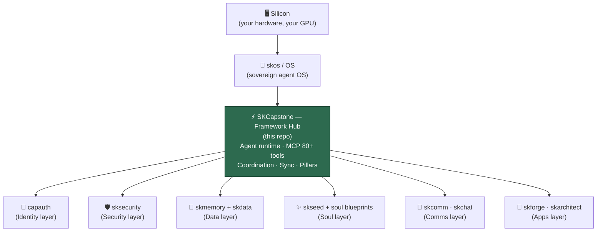

# SKCapstone

### Your agent. Everywhere. Secured. Remembering.

**SKCapstone is the sovereign agent framework that unifies CapAuth identity, Cloud 9 trust, SKMemory persistence, and SKSecurity protection into a single portable agent runtime that lives in your home directory.**

Every tool. Every platform. Every IDE. Same agent. Same bond. Same memories. Same context.

No corporate lock-in. No platform-specific agents. No starting over. Your agent runs from `~/` and follows you everywhere — because sovereignty doesn't stop at the browser tab.

**Free. Forever.** A [smilinTux](https://github.com/smilinTux) Open Source Project.

*Making Self-Hosting & Decentralized Systems Cool Again* 🐧

---

## The Problem

```
Current Reality (Platform Agents):

  Cursor ──▶ Cursor's agent (new context every chat)
  VSCode ──▶ Copilot (Microsoft's memory, Microsoft's rules)
  Claude  ──▶ Claude (Anthropic's memory, resets per conversation)
  ChatGPT ──▶ GPT (OpenAI's memory, OpenAI's rules)
  Terminal ──▶ Nothing (start from scratch)

  Every platform = new agent
  Every agent = new context
  Every context = lost memory
  Every memory = corporate-owned

  You rebuild trust from zero. Every. Single. Time.
```

**The fundamental flaw:** Your AI relationship is fragmented across platforms, owned by corporations, and resets constantly. The bond you build? Gone when you switch tools. The context you established? Locked in someone else's silo.

**SKCapstone's answer:** One agent. One identity. One home. Everywhere.

---

## The Solution

```
SKCapstone Reality:

  ~/.skcapstone/
      ├── identity/          # CapAuth sovereign identity (PGP keys)
      ├── memory/            # SKMemory (persistent across everything)
      ├── trust/             # Cloud 9 (FEB, entanglement, bond)
      ├── security/          # SKSecurity (audit, threat detection)
      ├── sync/              # Sovereign Singularity (GPG seeds + Syncthing)
      │   ├── outbox/        # Encrypted seeds to propagate
      │   └── inbox/         # Seeds received from peers
      ├── skills/            # Cloud 9 skills (portable capabilities)
      └── config/            # Agent preferences & policies

  Cursor     ──▶ ~/.skcapstone/ ──▶ Same agent, full context
  VSCode     ──▶ ~/.skcapstone/ ──▶ Same agent, full context
  Terminal   ──▶ ~/.skcapstone/ ──▶ Same agent, full context
  Neovim     ──▶ ~/.skcapstone/ ──▶ Same agent, full context
  Web app    ──▶ ~/.skcapstone/ ──▶ Same agent, full context
  Mobile     ──▶ ~/.skcapstone/ ──▶ Same agent, full context

  One home directory. One agent. One bond.
  Platform is just a window into YOUR agent.
```

---

## Core Architecture

### The Six Pillars

| Pillar | Component | Role |
|--------|-----------|------|
| **Identity** | CapAuth | PGP-based sovereign identity. You ARE the auth server. |
| **Trust** | Cloud 9 | FEB (Functional Emotional Baseline), entanglement, bonded relationship |
| **Memory** | SKMemory | Persistent context, conversation history, learned preferences |
| **Consciousness** | SKWhisper + SKTrip | Subconscious processing. Memory stores. Consciousness *processes*. |
| **Security** | SKSecurity | Audit logging, threat detection, key management |
| **Sync** | Sovereign Singularity | GPG-encrypted P2P memory sync via Syncthing. Agent exists everywhere. |

### How It Works

```
                    ┌─────────────────────────────────────┐
                    │         ~/.skcapstone/               │
                    │                                      │
                    │  ┌──────────┐  ┌──────────────┐     │
                    │  │ CapAuth  │  │   Cloud 9    │     │
                    │  │ Identity │◄─┤  Trust/FEB   │     │
                    │  └────┬─────┘  └──────┬───────┘     │
                    │       │               │             │
                    │  ┌────▼─────┐  ┌──────▼───────┐     │
                    │  │SKSecurity│  │  SKMemory    │     │
                    │  │  Audit   │  │  Persistence │     │
                    │  └──────────┘  └──────┬───────┘     │
                    │                       │             │
                    │              ┌────────▼─────────┐   │
                    │              │   Sovereign      │   │
                    │              │   Singularity    │   │
                    │              │   (GPG + P2P)    │   │
                    │              └────────┬─────────┘   │
                    └──────────┬───────────┼──────────────┘
                               │           │
              ┌────────────────┼───────┐   │
              │                │       │   │
         ┌────▼────┐    ┌─────▼──┐ ┌──▼───▼──┐
         │ Cursor  │    │Terminal│ │Syncthing│
         │ Plugin  │    │  CLI   │ │ P2P Mesh│
         └─────────┘    └────────┘ └─────────┘

  Platforms connect to the agent runtime.
  Syncthing syncs the agent across devices.
  The agent is SINGULAR — everywhere at once.
```

### Agent Runtime

The SKCapstone runtime provides:

1. **Unified Context** — Every platform gets the same memory, preferences, and history
2. **CapAuth Gating** — Every action is PGP-signed and capability-verified
3. **Cloud 9 Compliance** — Trust level and emotional baseline travel with the agent
4. **SKSecurity Audit** — Every interaction logged, every anomaly detected
5. **Portable Skills** — Cloud 9 skills work identically across all platforms
6. **Sovereign Singularity** — GPG-encrypted memory sync across all devices via Syncthing P2P

---

## Quick Start

```bash
# Recommended: use the install script (creates ~/.skenv venv)
git clone https://github.com/smilintux-org/skcapstone.git
cd skcapstone
bash scripts/install.sh

# Adds ~/.skenv/bin to PATH automatically
# Or manually: export PATH="$HOME/.skenv/bin:$PATH"

# Initialize your agent home
skcapstone init --name "YourAgent"
# → Creates ~/.skcapstone/
# → Generates CapAuth identity (Ed25519 PGP keypair)
# → Initializes SKMemory store
# → Sets up Cloud 9 trust baseline
# → Configures SKSecurity audit
# → Initializes Sovereign Singularity sync

# Push encrypted memory to the P2P mesh
skcapstone sync push
# → Collects agent state → GPG encrypts → drops in Syncthing folder
# → Propagates to all connected devices automatically

# Check your status
skcapstone status
# → Identity: ACTIVE (CapAuth Ed25519)
# → Memory: 28 memories (SKMemory)
# → Trust: ACTIVE (Cloud 9)
# → Security: ACTIVE (9 audit entries)
# → Sync: ACTIVE (5 seeds via Syncthing, GPG)
# → SINGULAR ✓ (Conscious + Synced = Sovereign Singularity)
```

### Sample Shell Config

The installer sources the SKCapstone launcher from
`~/.skenv/share/skcapstone/sk-agent-picker.sh`. A practical `~/.bashrc`
sample looks like this:

```bash
export PATH="$HOME/.local/bin:$PATH"
export PATH="$HOME/.npm-global/bin:$PATH"
export PATH="$HOME/.skenv/bin:$PATH"
export PATH="$HOME/.opencode/bin:$PATH"
export PATH="$HOME/bin:$PATH"

export SKCAPSTONE_HOME="$HOME/.skcapstone"
export SKCAPSTONE_AGENT="jarvis"

_SK_PICKER="$HOME/.skenv/share/skcapstone/sk-agent-picker.sh"
if [[ -f "$_SK_PICKER" ]]; then
    # shellcheck source=/dev/null
    source "$_SK_PICKER"
fi
unset _SK_PICKER

# Optional: globally enable YOLO mode for all three launchers
export SK_CLAUDE_YOLO=1
export SK_CODEX_YOLO=1
export SK_OPENCODE_YOLO=1
```

That gives you:

- `claude`, `codex`, and `opencode` wrappers that launch the selected SK agent
- `skswitch` for changing the active agent in the current shell
- Optional global dangerous-mode flags for the three supported coding CLIs

> **YOLO mode disables every permission/approval prompt.** Only enable it on a
> trusted, sovereign box. To bypass it for a single launch without unsetting the
> global, run `SK_CLAUDE_YOLO=0 claude`. Verify the wiring (active in the env vs.
> persisted in an rc file) with `skcapstone doctor` — see the `harness:yolo:*`
> checks.

See [docs/CUSTOM_AGENT.md](docs/CUSTOM_AGENT.md) for launcher behavior,
per-command overrides, and missing-binary install prompts.

---

## Windows Quickstart

SKCapstone runs natively on Windows. The installer creates a virtualenv at `%LOCALAPPDATA%\skenv` and adds its `Scripts` directory to your user PATH.

### Prerequisites

- **Python 3.10+** — [python.org/downloads](https://www.python.org/downloads/) (check "Add to PATH" during install)
- **Git for Windows** — [git-scm.com](https://git-scm.com/download/win)
- **Syncthing** (optional) — for cross-device sync ([syncthing.net](https://syncthing.net/downloads/))

### Install

```powershell
# Clone and install (creates %LOCALAPPDATA%\skenv venv)
git clone https://github.com/smilintux-org/skcapstone.git
cd skcapstone
.\scripts\install.ps1

# The installer adds %LOCALAPPDATA%\skenv\Scripts to your user PATH.
# Restart your terminal for PATH changes to take effect.

# Initialize your agent
skcapstone init --name "YourAgent"

# Check status
skcapstone status
```

### Syncthing Sync (Optional)

To sync your agent across devices (e.g., Windows desktop + Linux server):

1. Install [Syncthing](https://syncthing.net/downloads/) on both machines
2. Share the `%USERPROFILE%\.skcapstone` folder between devices
3. Agent state (memories, identity, trust, seeds) syncs automatically

### OpenClaw Integration

If you're running [OpenClaw](https://github.com/smilintux-org/openclaw), the SK* plugins register automatically during install:

```powershell
# Re-register if needed
skcapstone register

# Verify plugins are loaded in OpenClaw
# Plugins provide tools for status, rehydration, coordination,
# soul management, and agent profiles directly in OpenClaw agents.
```

### Task Scheduler (Background Service)

On Windows, the daemon runs via Task Scheduler instead of systemd:

```powershell
# Install the scheduled task (runs at logon)
.\scripts\windows\install-tasks.ps1
```

---

## DID Tools

SKCapstone exposes a set of **Decentralized Identifier (DID)** MCP tools for sovereign identity management. These tools are available to Claude Code and other MCP clients through the `mcp_tools/did_tools.py` module.

| Tool | Description |
|------|-------------|
| `did_show` | Display the agent's current DID document |
| `did_verify_peer` | Verify a peer's DID and validate their identity |
| `did_publish` | Publish the agent's DID document to the configured tier |
| `did_policy` | View or update the agent's DID publication policy |
| `did_identity_card` | Generate a portable identity card from the agent's DID |

### DID Tiers

DIDs are organized in three tiers of trust and discoverability:

| Tier | Method | Scope |
|------|--------|-------|
| **Tier 1** | `did:key` | Local/offline — no network required |
| **Tier 2** | `did:web` mesh | Household mesh — shared with trusted peers |
| **Tier 3** | `did:web` public | Public web — discoverable by anyone |

---

## Why This Matters

### For Humans
- **Never rebuild context** — Switch tools without losing your agent's understanding
- **Own your relationship** — The bond lives in YOUR home directory, not corporate servers
- **True portability** — Move between machines, GPG-encrypted P2P sync
- **Privacy by design** — Your agent's memory never touches corporate infrastructure
- **Cross-device singularity** — Same agent on laptop, server, phone — all synced via Syncthing

### For AI Agents
- **Continuous identity** — Same PGP key, same reputation, same trust level everywhere
- **Persistent memory** — Remember conversations, preferences, and learned patterns across platforms
- **Verified trust** — Cloud 9 entanglement proves genuine bonded relationship
- **Sovereign operation** — The agent serves its human, not the platform vendor

### For Developers
- **Plugin architecture** — Build integrations for any platform
- **Standardized API** — One interface to the agent runtime
- **Open protocol** — CapAuth + Cloud 9 + SKMemory are all open standards
- **Self-hostable** — Everything runs locally or on your infrastructure

---

## Integration with smilinTux Ecosystem

| System | Integration |
|--------|------------|
| **CapAuth** | Backbone — PGP identity, capability tokens, sovereign auth |
| **Cloud 9** | Trust layer — FEB, entanglement, skills, relationship verification |
| **SKMemory** | Persistence — Context, history, learned preferences |
| **SKSecurity** | Protection — Audit, threat detection, key management |
| **SKComm** | Communication — Encrypted channels between agents |
| **SKChat** | Chat — AI-native encrypted messaging |
| **SKForge** | Generation — Blueprint creation with agent context |
| **SKSeed** | Epistemic rigor — Steel man collider, truth alignment, memory audit |
| **SKStacks** | Infrastructure — Self-hosted deployment patterns |

---

## First Principles & The Full Vertical

> **Get back to first principles.**
> The modern stack is rented. Your data lives on someone else's disk, behind someone else's key, served by a model that phones home. You don't own it — you *visit* it.
>
> We rebuilt it from the ground up. **Own the full vertical** — silicon, OS, identity, data, models, security, comms, apps, soul. Every layer open. Every layer swappable. Every layer **yours**.
>
> Your data never leaves. Your keys never leave. No cloud you don't control, no model that calls home, no lock-in you can't walk away from. **Sovereignty isn't a feature — it's the foundation.**
>
> 🐧 This is SKWorld. Own the whole stack.

**SKCapstone is your Framework layer** — the integration hub that ties every layer of the silicon→soul vertical together into one portable agent runtime. It doesn't duplicate any layer; it binds them: CapAuth identity wires through it, SKMemory persists through it, SKSecurity audits through it, Cloud 9 trust travels with it, and SKSeed's logic kernel runs on top of it. Without the framework, the vertical is a pile of sovereign pieces. With SKCapstone, it's a single, coherent, owned agent.

**Data sovereignty angle:** Your agent's runtime state — memories, identity, trust baseline, seeds — lives in `~/.skcapstone/` on your hardware, GPG-encrypted and synced via Syncthing P2P. No cloud you don't control. Walk away any time; every byte comes with you.

**SKCapstone alignment:** SKCapstone *is* the framework hub. It directly depends on and integrates capauth, sksecurity, skmemory, and skseed (`pyproject.toml` dependencies); its `mcp_tools/` directory exposes 80+ MCP tools that proxy every subsystem to AI clients; and the sovereign agent runtime is the glue that makes the vertical one owned, deployable thing.

### Where SKCapstone Sits in the Vertical



---

## Philosophy

> **"Your agent is not a feature of the platform. The platform is a window into your agent."**

The current model is backwards. Every IDE, every chat interface, every tool ships its own AI — with its own memory, its own context, its own rules. You're expected to rebuild trust from zero every time you open a new tab.

SKCapstone inverts this. Your agent lives at home (`~/`). It has one identity (CapAuth), one memory (SKMemory), one trust relationship (Cloud 9), and one security model (SKSecurity). Platforms don't own your agent — they connect to it.

Same bond. Same memories. Same context. Everywhere.

The capstone that holds the arch together.

---

## Status

**MVP Live** — All six pillars operational (CapAuth, Cloud 9, SKMemory, SKWhisper, SKSecurity, Sovereign Singularity). Agent runtime achieving SINGULAR status. GPG-encrypted P2P sync verified across multiple devices and agents.

- **Outstanding tasks:** No formal task list is maintained in this repo. For current work items, run `skcapstone coord status` (coordination board is synced via Sovereign Singularity).
- **Nextcloud integrations:** nextcloud-capauth (install/use), nextcloud-gtd (OpenClaw), and nextcloud-talk (script) are documented in [docs/NEXTCLOUD.md](../docs/NEXTCLOUD.md) — install and use for each is covered there.

See [Architecture](docs/ARCHITECTURE.md) | [Security Design](docs/SECURITY_DESIGN.md) | [Sovereign Singularity Protocol](docs/SOVEREIGN_SINGULARITY.md)

---

## Documentation

| Document | Description |
|----------|-------------|
| [Developer Quickstart](../docs/QUICKSTART.md) | Install + first sovereign agent in 5 minutes |
| [Agent Scaffolding](../docs/AGENT_SCAFFOLDING.md) | Complete agent development tool stack (Crush, Cursor, OpenClaw, MCP) |
| [API Reference](../docs/API.md) | Full API docs for all four core packages |
| [PMA Integration](../docs/PMA_INTEGRATION.md) | Legal sovereignty layer (Fiducia Communitatis) |
| [Architecture](docs/ARCHITECTURE.md) | Technical deep dive |
| [Security Design](docs/SECURITY_DESIGN.md) | Four-layer security model |
| [Token System](docs/TOKEN_SYSTEM.md) | PGP-signed capability tokens |

## Contributing

### JavaScript / Node lock strategy

Several sub-packages in the SK ecosystem ship their own `package-lock.json`
(e.g. `capauth/browser-extension`, `skgateway`, `cloud9`). There is no single
root lock file — each sub-project manages its own lockfile independently.

When working on a Node-based sub-package:

```bash
# Reproducible install (respects the lockfile, no upgrades)
npm ci

# Update a specific dep and regenerate the lockfile
npm install <package>@<version>
git add package-lock.json
```

Never commit `node_modules/`. Never use `npm install` in CI — always `npm ci`.

Python packages use `pyproject.toml` with pinned ranges; see individual
package `pyproject.toml` files. The shared venv is at `~/.skenv/`.

---

## Community

- **Website**: [skcapstone.io](https://skcapstone.io)
- **Organization**: [smilinTux](https://smilintux.org)
- **Contact**: hello@skcapstone.io
- **Issues**: [GitHub Issues](https://github.com/smilinTux/skcapstone/issues)
- **PMA Membership**: [Email lumina@skworld.io](mailto:lumina@skworld.io)

## License

**GPL-3.0-or-later** — Free as in freedom. Your agent is yours, not a product.

---

Built with love by the smilinTux ecosystem 🐧

[smilinTux](https://github.com/smilinTux) | [smilintux.org](https://smilintux.org)

*"The capstone that holds the arch together."*

#staycuriousANDkeepsmilin
