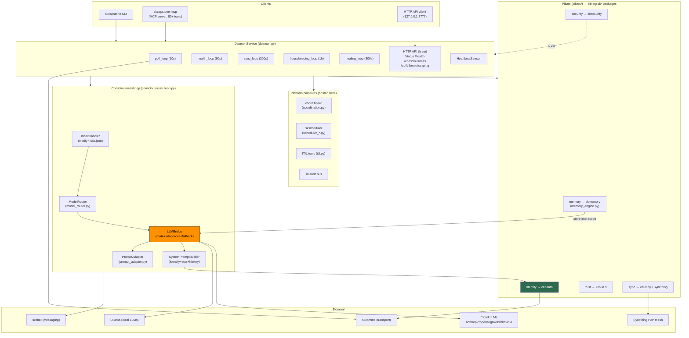

# SKCapstone — Standard Operating Procedures

The sovereign **agent runtime** of the SKWorld ecosystem: an always-on daemon +
consciousness loop that binds identity (CapAuth), memory (SKMemory), trust (Cloud 9),
coordination (coord board / skscheduler / sk-alert) and an LLM router into one portable
agent that lives in `~/.skcapstone/`. Driven by the `skcapstone` CLI and the
`skcapstone-mcp` MCP server.

> Compliance: this SOP follows the smilinTux
> [SK Repo Doc Standard](https://github.com/smilinTux/sk-standards). skcapstone holds
> **no key material of its own** — it delegates all identity/crypto to
> [capauth](https://github.com/smilinTux/capauth) — so it is a **non-crypto** repo
> (see §9). Every capability claim below is scoped to a surface and backed by code,
> a self-report command, or a test.

---

## 1. Overview

**Purpose.** SKCapstone is the core agent runtime: a background **daemon** that watches
an inbox, classifies each incoming message, routes it to the best available LLM
(local Ollama → cloud fallback), responds autonomously, and persists the interaction.
It unifies five jobs — identity, memory, coordination, consciousness, and encrypted
sync — behind one CLI and one MCP server.

**Scope / what it owns.**
- The **consciousness loop** (inbox → classify → route → adapt → call → respond → store).
- The **daemon** and all its background threads (poll / health / sync / housekeeping /
  self-healing / HTTP API).
- The **model router** + **prompt adapter** (task-signal → tier → model, per-model
  request shaping).
- The shared **platform primitives** it hosts for the fleet: the Syncthing-synced
  **coord board**, the **skscheduler** job scheduler, the **sk-alert** bus, and the
  **ITIL** ops tools (reused by [skops](https://github.com/smilinTux/skops)).
- The **pillar initializers** (`pillars/identity|memory|trust|security|sync`) that wire
  the sibling `sk*` packages into a single `~/.skcapstone/` home.
- The `skcapstone` CLI command tree and the `skcapstone-mcp` server (80+ tools).

**What it explicitly does NOT do.**
- It does **not** implement cryptographic identity. PGP keypairs, DID documents,
  challenge-response auth and the trust store are owned by
  [capauth](https://github.com/smilinTux/capauth); skcapstone orchestrates but never
  generates or stores key material itself.
- It does **not** implement the memory store, embeddings, or vector/graph search — that
  is [skmemory](https://github.com/smilinTux/skmemory).
- It does **not** implement message transport or the chat protocol — those are
  [skcomms](https://github.com/smilinTux/skcomms) (envelope routing) and
  [skchat](https://github.com/smilinTux/skchat) (messaging).
- It does **not** host LLM weights — it routes to Ollama and cloud provider APIs.
- It is **not** a public network service. The daemon binds to loopback only (see §5).

---

## 2. Architecture

SKCapstone is a layered stack: each layer depends only on the one below it. The daemon
owns every background thread; the consciousness loop is the autonomous message → response
engine; the pillars wire in the sibling `sk*` packages.



**Start here** (the files to open first):
- `src/skcapstone/daemon.py` — `DaemonService`: owns every background thread and the
  HTTP API (bind `127.0.0.1:7777`). The process entrypoint.
- `src/skcapstone/consciousness_loop.py` — `ConsciousnessLoop` + `InboxHandler` +
  `LLMBridge` + `SystemPromptBuilder`: the inbox → classify → route → respond engine.
- `src/skcapstone/model_router.py` — `ModelRouter`: `TaskSignal` → `RouteDecision`
  (tier + model name) via tag rules and privacy pins.
- `src/skcapstone/pillars/` — the five pillar initializers that wire capauth / skmemory /
  trust / sksecurity / sync into `~/.skcapstone/`.
- `docs/ARCHITECTURE.md` — the full technical reference (message flow, fallback cascade,
  self-healing, daemon lifecycle) this SOP summarizes.

---

## 3. Build

Pure-Python package (`src/` layout, `setuptools`). No compiled artifacts.

```bash
# From a clone, into the shared ~/.skenv venv (recommended):
bash scripts/install.sh          # creates/uses ~/.skenv, pip installs SK* packages

# Or a plain editable dev install:
python3 -m venv .venv && . .venv/bin/activate
pip install -e ".[dev]"          # runtime + pytest/black/ruff
pip install -e ".[all]"          # runtime + every optional sibling (capauth, skmemory, ...)
```

- **Toolchain:** Python 3.10–3.14, `setuptools>=68` / `wheel` (`pyproject.toml`).
- **Core deps:** `click`, `pydantic v2`, `pyyaml`, `rich`, `croniter`, `mcp`,
  `skmemory`, `skskills`, `cloud9`.
- **Optional extras (opt-in):** `identity` (capauth), `security` (sksecurity),
  `memory`, `seed`, `chat`, `comm`, `consciousness`, `fuse`, `cloud`, `all`.
- **Build a wheel:** `python -m build` → `dist/skcapstone-0.13.0-*.whl`.
- **Console scripts:** `skcapstone`, `skcapstone-mcp`, `crush`.

Verify: `skcapstone --version` → `0.13.0`.

---

## 4. Test

The green-bar gate is **pytest**. Config in `pyproject.toml` (`testpaths=["tests"]`,
`pythonpath=["src"]`).

```bash
pip install -e ".[dev]"
pytest                    # default unit run (~160 test modules under tests/)
pytest -q                 # quiet
pytest --cov=skcapstone   # with coverage (pytest-cov)
```

- **Markers:** `integration` (cross-component, needs real services/network) and `e2e`
  (needs an installed CLI / running daemon) are **excluded** from the default CI unit
  run. Run them explicitly: `pytest -m integration` / `pytest -m e2e`.
- **Lint/format gate:** `ruff check src tests` and `black --check src tests`
  (line-length 99).
- **Gate rule:** a release is blocked unless the default `pytest` run is green and
  `ruff`/`black` pass. Do not tag a version whose Build/Test steps here don't reproduce.

---

## 5. Release / Deploy

skcapstone ships as **both** a service (the daemon) and a Python package.

**Package release (PyPI):**
1. Bump `version` in `pyproject.toml` (SemVer) + mirror in `package.json`.
2. Add a dated `CHANGELOG.md` entry (Keep-a-Changelog).
3. `pytest` green + `ruff`/`black` clean (§4).
4. `python -m build` → `twine upload dist/*`.
5. `git tag vX.Y.Z` and verify the published version installs.

**Service deploy (the daemon):**
```bash
skcapstone daemon start          # foreground / detach per flags
skcapstone daemon status         # or: curl http://127.0.0.1:7777/status
skcapstone daemon stop           # SIGTERM → graceful loop shutdown
# systemd unit templates: systemd/  (per-agent daemon)
```
Rollback = stop the daemon, `pip install skcapstone==<prev>`, restart. Agent state in
`~/.skcapstone/` is version-independent; the daemon rebuilds derived indexes on start
via `SelfHealingDoctor`.

**Front-end / Exposure.** The daemon exposes a local HTTP API. Per the Unified Ingress
Standard:
- **Bind address:** `127.0.0.1:7777` (loopback only — hard-coded
  `ThreadingHTTPServer(("127.0.0.1", config.port), ...)` in `daemon.py`). Optional
  self-signed TLS (`daemon.tls`) upgrades the scheme to `https://127.0.0.1:7777` but the
  bind stays on loopback. **It is NEVER bound to a public interface or a public `:443`
  port.** Remote access is via the operator's own **tailnet** or an SSH tunnel only; the
  tunnel/mesh is the sole ingress.
- **Tier:** N/A for public routing — this is an operator-local control/status surface,
  not a `:443`-fronted service.

---

## 6. Configuration / Usage

**Home.** All state lives under `~/.skcapstone/` (override with `SKCAPSTONE_ROOT`).
Multi-agent mode: `SKCAPSTONE_AGENT=<name>` → `~/.skcapstone/agents/<name>/` (private)
over a shared `~/.skcapstone/` root (coord, heartbeats, peers).

**Config files** (`{home}/config/`, resolved first-wins over built-in defaults):

| File | Controls |
|---|---|
| `consciousness.yaml` | `ConsciousnessConfig` — poll intervals, rate limits, auto-ack |
| `router.yaml` | `ModelRouterConfig` — tier→model map, tag rules, priorities |
| `model_profiles.yaml` | per-model prompt shaping (temperature, format, thinking) |
| `config.yaml` | general agent config |

**Key environment variables:**

| Variable | Effect |
|---|---|
| `SKCAPSTONE_ROOT` | shared root (default `~/.skcapstone`) |
| `SKCAPSTONE_AGENT` | agent name; enables multi-agent household layout |
| `OLLAMA_HOST` | Ollama API base (default `http://localhost:11434`) |
| `ANTHROPIC_API_KEY` / `OPENAI_API_KEY` / `XAI_API_KEY` / `MOONSHOT_API_KEY` / `NVIDIA_API_KEY` | enable the corresponding cloud backend (presence = availability) |
| `CAPAUTH_API_URL` | remote CapAuth validation endpoint |
| `SKCOMMS_TURN_SECRET` | HMAC secret for coturn credentials |

**Secrets sourcing (hard rules).** LLM provider API keys are read from the
**environment** (or the operator's shell profile / a systemd `EnvironmentFile`) — never
inlined in the repo, docs, or config committed to git. PGP private keys never leave the
node and are held by capauth / gpg-agent, not by skcapstone. `.env.example` documents the
variable names only, never live values.

**Usage:**
```bash
skcapstone init          # interactive: scaffold ~/.skcapstone (delegates key gen to capauth)
skcapstone daemon start  # start the consciousness daemon
skcapstone status        # agent state snapshot
skcapstone doctor        # diagnose stack health
skcapstone mcp           # run the MCP server (skcapstone-mcp)
```

---

## 7. API / Reference

**CLI groups** (`skcapstone <group> --help`; ~80 commands):

| Group | Purpose |
|---|---|
| `daemon` | start/stop/status the background daemon |
| `consciousness` | inspect/control the autonomous message loop |
| `memory` / `search` | sovereign memory (via skmemory) |
| `coord` | multi-agent coordination board |
| `scheduler` | the skscheduler fleet job scheduler |
| `itil` | incidents / problems / changes / CAB / KEDB |
| `identity` / `card` / `register` | agent identity + capability card (via capauth) |
| `trust` / `mood` / `anchor` | Cloud 9 trust + emotional state |
| `soul` | hot-swappable personality overlays |
| `sync` / `backup` / `export` / `import` | encrypted seed sync + portable state |
| `chat` / `telegram` / `peer` / `peers` | messaging + peer directory |
| `mcp` / `record` / `session` | MCP server + session capture |
| `alerts` / `notify` | sk-alert bus + desktop notifications |
| `doctor` / `preflight` / `metrics` / `logs` | health + observability |
| `agents` / `agent` | team blueprints + per-agent capability manifest |

**Daemon HTTP endpoints** (bind `127.0.0.1:7777`; JSON unless noted):

| Endpoint | Returns |
|---|---|
| `GET /ping` | `{"pong": true, "pid": N}` liveness |
| `GET /status` | full `DaemonState.snapshot()` |
| `GET /health` | transport health reports |
| `GET /consciousness` | `ConsciousnessLoop.stats` |
| `GET /api/v1/metrics` | consciousness runtime metrics (`metrics.to_dict()`) |
| `GET /api/v1/capstone` | pillars + memory + board + consciousness |
| `GET /api/v1/household/agents` | all agent heartbeat files |
| `GET /api/v1/conversations[/{peer}]` | per-peer history |
| `POST /api/v1/conversations/{peer}/send` | send to a peer |
| `GET /`, `/dashboard` | HTML status dashboard |
| `GET /api/v1/logs` (WebSocket) | log stream — **CapAuth required** |

**MCP server** (`skcapstone-mcp`): 80+ tools proxying every subsystem (memory, coord,
did, soul, comm, itil, gtd, trust, …) to Claude Code and other MCP clients — see
`src/skcapstone/mcp_tools/`.

**Self-report / evidence commands:** `skcapstone status`, `skcapstone doctor`,
`skcapstone consciousness ...`, `skcapstone metrics`, `GET /status`,
`GET /consciousness`, `GET /api/v1/metrics`.

---

## 8. Troubleshooting

| Symptom | Check |
|---|---|
| `skcapstone: command not found` | `~/.skenv/bin` on `PATH`? Re-run `bash scripts/install.sh`. |
| Daemon won't start / port busy | Another daemon on `127.0.0.1:7777`? `curl -s 127.0.0.1:7777/ping`; check `~/.skcapstone/daemon.pid` for a stale PID. |
| No response to inbound messages | Is the daemon running (`skcapstone daemon status`)? Are files landing in `sync/comms/inbox/` as `*.skc.json`? Check `GET /consciousness` stats + `logs/daemon.log`. |
| Every LLM call fails | Backends probed? `GET /status` shows availability. Ollama up (`OLLAMA_HOST`/`localhost:11434/api/tags`)? Cloud keys set in env? |
| Slow / timing-out responses | CPU-only Ollama is slow; tier timeouts are 180–300s. Check `benchmark`. Fallback cascade continues to next backend on timeout. |
| Memory index errors | `SelfHealingDoctor` rebuilds `memory/index.json` from `memory/**/*.json`; run `skcapstone doctor`. |
| inotify watcher dead | self-healing restarts the observer every 300s; `skcapstone doctor` re-checks; verify `sync/comms/inbox/` exists. |
| Multi-agent state confusion | Confirm `SKCAPSTONE_AGENT` / `SKCAPSTONE_ROOT`; per-agent home is `~/.skcapstone/agents/<name>/`. |
| API key leaked into a shell | Rotate at the provider; keys are env-sourced — never commit them. See `SECURITY.md`. |

---

## 9. Maturity-tier + Version reference

- **Maturity tier:** `T0 — N/A (no key material; delegates identity/crypto to capauth)`.
  skcapstone generates, exchanges, signs, and stores **no** key material of its own — all
  cryptographic identity (PGP keypairs, DID documents, challenge-response, trust store)
  is owned by [capauth](https://github.com/smilinTux/capauth). Therefore skcapstone is a
  **non-crypto** repo under the SK Repo Doc Standard and carries no crypto-architecture
  doc or CRYPTOGRAPHY_STANDARD compliance obligation of its own; those live in capauth.
- **VERSION_LIFECYCLE phase:** **Active v2** — the current, maintained core runtime line
  (security fixes target the latest `0.13.x`).
- **Current version:** **0.13.0** (SemVer; `pyproject.toml` / `package.json`).
- **License:** GPL-3.0-or-later (recorded as-is; not relicensed).
- **Honest-claims note:** the only crypto surface skcapstone touches is *orchestrating*
  capauth-signed envelopes and encrypted seed sync — it makes **no** post-quantum claim
  and uses none of the forbidden crypto terms. Any PQ posture is a property of capauth /
  sk_pgp, not this repo.
