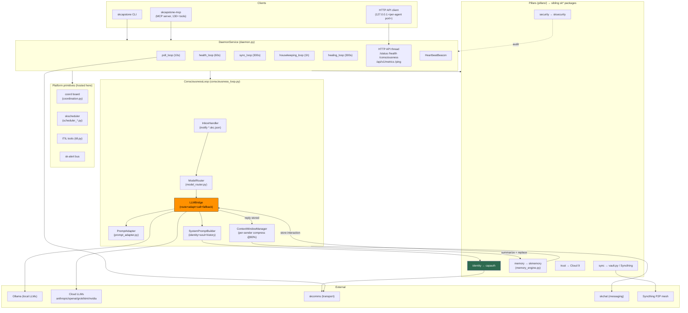

# SKCapstone — Standard Operating Procedures

The sovereign **agent runtime** of the SKWorld ecosystem: an always-on daemon +
consciousness loop that binds identity (CapAuth), memory (SKMemory), trust (Cloud 9),
coordination (coord board / skscheduler / sk-alert) and an LLM router into one portable
agent that lives in `~/.skcapstone/`. Driven by the `skcapstone` CLI and the
`skcapstone-mcp` MCP server.

> Compliance: this SOP follows the smilinTux
> [SK Repo Doc Standard](https://github.com/smilinTux/sk-standards). skcapstone
> delegates **PGP identity** (keypairs, DIDs, challenge-response, the trust store) to
> [capauth](https://github.com/smilinTux/capauth), but it is **not** key-material-free:
> it generates and stores its own TLS private key, and it drives signing and encryption
> over capauth-held keys. Maturity tier **T0**, with the surfaces enumerated in §9.
> Every capability claim below is scoped to a surface and backed by code, a self-report
> command, or a test.

---

## 1. Overview

**Purpose.** SKCapstone is the core agent runtime: a background **daemon** that watches
an inbox, classifies each incoming message, routes it to the best available LLM
(local Ollama → cloud fallback), responds autonomously, and persists the interaction.
It unifies five jobs — identity, memory, coordination, consciousness, and encrypted
sync — behind one CLI and one MCP server.

**Scope / what it owns.**
- The **consciousness loop** (inbox → classify → route → adapt → call → respond → store).
- The **daemon** and all its background threads (poll / health / sync / housekeeping /
  self-healing / HTTP API).
- The **model router** + **prompt adapter** (task-signal → tier → model, per-model
  request shaping).
- The shared **platform primitives** it hosts for the fleet: the Syncthing-synced
  **coord board**, the **skscheduler** job scheduler, the **sk-alert** bus, and the
  **ITIL** ops tools governed by ATLAS. The former `skops` consumer is archive-only.
- The **pillar initializers** (`pillars/identity|memory|trust|security|sync`) that wire
  the sibling `sk*` packages into a single `~/.skcapstone/` home.
- The `skcapstone` CLI command tree and the `skcapstone-mcp` server (130+ tools; §7
  gives the command that counts them).

**What it explicitly does NOT do.**
- It does **not** implement cryptographic *identity*. PGP keypairs, DID documents,
  challenge-response auth and the trust store are owned by
  [capauth](https://github.com/smilinTux/capauth); skcapstone orchestrates those but
  never generates a PGP identity key. **This is not the same as holding no key
  material at all**: skcapstone does generate and store an RSA-2048 TLS key of its
  own. See §9 for the exact inventory.
- It does **not** implement the memory store, embeddings, or vector/graph search — that
  is [skmemory](https://github.com/smilinTux/skmemory).
- It does **not** implement message transport or the chat protocol — those are
  [skcomms](https://github.com/smilinTux/skcomms) (envelope routing) and
  [skchat](https://github.com/smilinTux/skchat) (messaging).
- It does **not** host LLM weights — it routes to Ollama and cloud provider APIs.
- It is **not** a public network service. The daemon binds to loopback only (see §5).

---

## 2. Architecture

SKCapstone is a layered stack: each layer depends only on the one below it. The daemon
owns every background thread; the consciousness loop is the autonomous message → response
engine; the pillars wire in the sibling `sk*` packages.


```mermaid
graph TB
    subgraph clients["Clients"]
        CLI["skcapstone CLI"]
        MCP["skcapstone-mcp<br/>(MCP server, 130+ tools)"]
        HTTP["HTTP API client<br/>(127.0.0.1:&lt;per-agent port&gt;)"]
    end

    subgraph daemon["DaemonService (daemon.py)"]
        POLL["poll_loop (10s)"]
        HEALTH["health_loop (60s)"]
        SYNC["sync_loop (300s)"]
        HOUSE["housekeeping_loop (1h)"]
        HEAL["healing_loop (300s)"]
        API["HTTP API thread<br/>/status /health /consciousness<br/>/api/v1/metrics /ping"]
        BEACON["HeartbeatBeacon"]
    end

    subgraph cl["ConsciousnessLoop (consciousness_loop.py)"]
        INBOX["InboxHandler<br/>(inotify *.skc.json)"]
        ROUTER["ModelRouter<br/>(model_router.py)"]
        ADAPTER["PromptAdapter<br/>(prompt_adapter.py)"]
        BRIDGE["LLMBridge<br/>(route+adapt+call+fallback)"]
        PROMPT["SystemPromptBuilder<br/>(identity+soul+history)"]
        CTXWIN["ContextWindowManager<br/>(per-sender compress @80%)"]
    end

    subgraph plat["Platform primitives (hosted here)"]
        COORD["coord board<br/>(coordination.py)"]
        SCHED["skscheduler<br/>(scheduler_*.py)"]
        ITILP["ITIL tools (itil.py)"]
        ALERT["sk-alert bus"]
    end

    subgraph pillars["Pillars (pillars/) → sibling sk* packages"]
        IDENT["identity → capauth"]
        MEM["memory → skmemory<br/>(memory_engine.py)"]
        TRUST["trust → Cloud 9"]
        SEC["security → sksecurity"]
        SYNCP["sync → vault.py / Syncthing"]
    end

    subgraph ext["External"]
        OLLAMA["Ollama (local LLMs)"]
        CLOUD["Cloud LLMs<br/>anthropic/openai/grok/kimi/nvidia"]
        SKCOMMS["skcomms (transport)"]
        SKCHAT["skchat (messaging)"]
        SYNCT["Syncthing P2P mesh"]
    end

    CLI --> daemon
    MCP --> daemon
    HTTP --> API
    daemon --> cl
    daemon --> plat
    INBOX --> ROUTER --> BRIDGE
    BRIDGE --> ADAPTER
    BRIDGE --> PROMPT
    BRIDGE --> OLLAMA
    BRIDGE --> CLOUD
    BRIDGE -->|reply stored| CTXWIN
    CTXWIN -->|summarize + replace| MEM
    PROMPT --> IDENT
    daemon --> pillars
    MEM -->|store interaction| BRIDGE
    IDENT --> SKCOMMS
    POLL --> SKCOMMS
    cl --> SKCHAT
    SYNCP --> SYNCT
    SEC -.audit.-> daemon

    style BRIDGE fill:#ff9100,stroke:#000,color:#000
    style IDENT fill:#2d6a4f,color:#fff
```

**Start here** (the files to open first):
- `src/skcapstone/daemon.py` — `DaemonService`: owns every background thread and the
  HTTP API (bind `127.0.0.1:<port>`, per agent; see the port rules in §5). The
  process entrypoint.
- `src/skcapstone/consciousness_loop.py` — `ConsciousnessLoop` + `InboxHandler` +
  `LLMBridge` + `SystemPromptBuilder`: the inbox → classify → route → respond engine.
- `src/skcapstone/model_router.py` — `ModelRouter`: `TaskSignal` → `RouteDecision`
  (tier + model name) via tag rules and privacy pins.
- `src/skcapstone/pillars/` — the five pillar initializers that wire capauth / skmemory /
  trust / sksecurity / sync into `~/.skcapstone/`.
- `docs/ARCHITECTURE.md` — the full technical reference (message flow, fallback cascade,
  self-healing, daemon lifecycle) this SOP summarizes.
- `src/skcapstone/context_window.py`: `ContextWindowManager`, per-sender token
  tracking + LLM history compression at 80% of the context budget.
- `src/skcapstone/operator_seat/skcode_adapter.py`: Atlas's authenticated client for
  skcode-hostd activity replay, live-stream discovery, steering submission, and
  receipt lookup. Monitoring and control use separate scopes.

### Atlas live SKHarness monitoring and steering

SKHarness owns execution and serves the transport; Atlas consumes it through
`operator_seat.skcode_adapter`. The adapter exposes:

- `skcode_activity(...)`: cursor replay with session/run/agent/job/card/contract/
  lease/role/kind filters;
- `skcode_live_contract()`: the WebSocket activity URL plus exact monitor/control
  scopes for a long-lived Atlas or dashboard client;
- `skcode_control(...)`: an expiring idempotent command for a session, run, agent, or
  job; and
- `skcode_control_receipt(...)`: the latest owner receipt for that command.

Set `SKCODE_HOSTD_URL` to the node's governed tailnet skcode-hostd origin (default
`http://localhost:9394`). Callers supply a CapAuth `skcode`-audience token explicitly;
the adapter never reads, stores, prints, or refreshes that credential. Monitoring needs
`skcode.stream`. Message/needs-input steering needs `skcode.inject`; lifecycle actions
need `skcode.dispatch`. Both pass hostd's corresponding PDP and audit gate. A `queued`
receipt is durable intent only. Atlas must not report success or update
a job/card from it; only `applied` means the target owner acted. Hostd applies supported
interactive session commands itself. Swarm and scheduler/job commands remain queued
until their long-lived owner composes the SKHarness control mailbox. The checked-in Pi
swarm qualifier now composes the trusted cancellation owner; job controls and Pi
mid-turn messages remain explicit queued/unsupported work until their owner adapters
exist.

Atlas retains the controller-owned lineage on every relevant activity row:
card and snapshot hash; session/trajectory/run/attempt; stable parent and child agent;
team; signed plan and contract hashes; lease; base commit; evidence and artifact
digests. A unique agent ID is an address for attribution and routing, not a capability.
CapAuth/PDP, parent-child A2A ACLs, the signed contract, and the live owner lease still
decide whether communication is allowed. Atlas must target IDs learned from the
authenticated activity/manifest contract, never infer identity from a display name.
The live rail is bounded; SKHarness copies the same linkage into its durable Arena/A2A
records, so Atlas can trace work after the visible window has rolled forward without
creating a second store.

The canonical event, redaction, cursor/gap, multi-node, and command-receipt design lives
in SKHarness at `docs/architecture/live-agent-observation-and-control.md`. SKCapstone
does not create a second activity or control store.

**⚠️ coordination / ITIL / cards no longer live here.** `skcoord>=0.1.39` is a **hard
runtime dependency** (`pyproject.toml`), and `skcapstone.coordination`,
`skcapstone.card_store`, and `skcapstone.itil` are **transparent re-export shims** over
`skcoord.*` (the CR-4.1 extraction). Each aliases the real module into `sys.modules`, so
importers, attribute access, and `monkeypatch.setattr` on a class **or** a module global
all reach the same object. Consequences worth knowing before you debug:

- The code you want to read or patch is in **skcoord**, not here. Editing the shim body
  changes nothing.
- New code should `import skcoord` directly.
- `import skcapstone` succeeds without skcoord installed, but
  `from skcapstone.coordination import Board` does not. That asymmetry is why CI installs
  skcoord explicitly `--no-deps`.
- The `0.1.39` floor is intentional. It retains the lifecycle, scheduled CMDB
  reconciliation policy, lease, incident-routing, retention, and Syncthing discovery
  contracts, and folds current acceptance criteria through every CardStore rollback
  selector without rewriting immutable task or core birth facts.
- Release skcoord before any skcapstone release that consumes a new skcoord symbol or
  fold behavior. Verify the published skcoord artifact in a fresh environment without a
  sibling checkout or `PYTHONPATH` overlay, then raise the skcapstone floor and release
  skcapstone. Source-overlay tests are useful preflight evidence, not artifact evidence.
- `ci.yml` runs `scripts/check-no-shim-imports.sh`, which fails the build on retired
  capauth shim imports. It is a lint gate, not a test.

**Consciousness loop: context-window + memory-promotion gates.**
- **Context-window management.** After each reply, `ConsciousnessLoop._process` calls
  `ContextWindowManager.check_and_compress(sender, store, bridge)`. It tracks per-sender
  cumulative tokens and, once a peer's history crosses **80% of
  `ConsciousnessConfig.max_context_tokens` (default 8000)**, it summarizes the oldest
  messages into one paragraph via the LLM (keeping the 4 most recent verbatim), rewrites
  the history atomically with `ConversationStore.replace()`, and persists the summary as
  a durable memory. Token counting uses `tiktoken` (`cl100k_base`) when installed, else
  `len // 4`. The whole check is fail-safe (any error is logged, never breaks the loop).
  Inspect live per-sender usage with the `context_stats` MCP tool.
- **Memory-promotion truth gate.** The SHORT_TERM → MID_TERM promotion (both the
  `memory_engine._promote` / `store()` fast-path and `PromotionEngine._promote`) now
  passes candidates through `memory_verifier.verify_before_promotion`. Blocked
  candidates stay in short-term. The gate is **fail-open**: when the verifier backend
  is unavailable, promotion proceeds so existing behavior is preserved.
- **Memory identifier boundary.** Legacy `MemoryEntry` payloads with a blank or
  whitespace-only `memory_id` are rejected before load, save, index update,
  truth verification, or cross-tier promotion. Operators should run the
  SKMemory reconciliation path to place any existing `.json` payload in the
  content-addressed invalid-record quarantine; do not rename it into an active
  tier.

---

## 3. Build

Pure-Python package (`src/` layout, `setuptools`). No compiled artifacts.

```bash
# From a clone, into the shared ~/.skenv venv (recommended):
bash scripts/install.sh          # creates/uses ~/.skenv, pip installs SK* packages

# Or a plain editable dev install:
python3 -m venv .venv && . .venv/bin/activate
pip install -e ".[dev]"          # runtime + pytest/black/ruff
pip install -e ".[all]"          # runtime + every optional sibling (capauth, skmemory, ...)
```

- **Toolchain:** Python 3.10–3.14, `setuptools>=68` / `wheel` (`pyproject.toml`).
- **Core deps:** `click`, `pydantic v2`, `pyyaml`, `rich`, `croniter`, `mcp`,
  `skmemory`, `skskills`, `cloud9`.
- **Optional extras (opt-in):** `identity` (capauth), `security` (sksecurity),
  `memory`, `seed`, `chat`, `comm`, `consciousness`, `fuse`, `cloud`, `all`.
- **Build a wheel:** `python -m build` → `dist/skcapstone-<version>-*.whl`, where
  `<version>` is derived from the git tag at build time (see §9). Do not expect a
  literal you can predict from the tree.
- **Console scripts: there are five**, not three (`pyproject.toml`
  `[project.scripts]`):

  | Script | Target |
  |---|---|
  | `skcapstone` | `skcapstone.cli:main` |
  | `skcapstone-mcp` | `skcapstone.mcp_server:main` |
  | `crush` | `skcapstone.crush_shim:main` |
  | `skfleet` | `skcapstone.fleet.cli:main` |
  | `skoperator` | `skcapstone.operator_seat.cli:main` |

Verify with `skcapstone --version`, and expect a **setuptools-scm** string such as
`0.15.15.dev25+g90df5e0` on a dev checkout, not a clean release number. See §9.

---

## 4. Test

The green-bar gate is **pytest**. Config in `pyproject.toml` (`testpaths=["tests"]`,
`pythonpath=["src"]`).

⚠️ **The test gate is `.github/workflows/pytest.yml`, NOT `ci.yml`.** This repo has two
workflows with confusingly similar names and only one of them runs tests:

| Workflow | What it actually runs | Is it a test gate? |
|---|---|---|
| `pytest.yml` | `python -m pytest tests/ --strict-markers -m "not integration and not e2e"` on 3.11 + 3.12 | **yes, this is the gate** |
| `ci.yml` | `black --check src/ tests/`, `ruff check src/`, `scripts/check-no-shim-imports.sh`, `python -m build` + `twine check` | **no. It runs zero tests** |

Do not cite `ci.yml` as evidence that tests passed. A green `ci.yml` means the code is
formatted and builds, nothing more. Neither workflow masks failures with `|| true`.

Reproduce the gate locally:

```bash
pip install -e ".[dev]"
python -m pytest tests/ --strict-markers -m "not integration and not e2e"   # the gate
black --check src/ tests/ && ruff check src/                                # ci.yml lint
pytest --cov=skcapstone                                                     # with coverage
```

- **Markers:** `integration` (cross-component, needs real services/network) and `e2e`
  (needs an installed CLI / running daemon) are **excluded** from the gate, honestly, via
  registered markers plus `--strict-markers` (so a typo'd marker errors instead of
  silently selecting nothing). Run them explicitly: `pytest -m integration` /
  `pytest -m e2e`.
- **Gate rule:** a release is blocked unless `pytest.yml` is green **and** `ci.yml` lint
  passes. Do not tag a version whose Build/Test steps here do not reproduce.

---

## 5. Release / Deploy

skcapstone ships as **both** a service (the daemon) and a Python package.

**Package release (PyPI).** ⚠️ **Do not edit a version number anywhere.** There is no
`version` field to bump in `pyproject.toml` (it is `dynamic = ["version"]`) and this
repo has **no `package.json`** to mirror it into. The **tag is** the version.

1. Add a dated `CHANGELOG.md` entry (Keep-a-Changelog).
2. `pytest.yml` green + `ci.yml` lint clean (§4).
3. Merge to `main`. `.github/workflows/publish.yml` **cuts the next patch tag itself**
   when HEAD is not already tagged, then builds and publishes that tagged version in
   the same GitHub run. A manually pushed `v*` tag builds and publishes directly. It
   refuses to publish a tag that is not on `main`, and refuses a non-release version
   string. To pick the number yourself, tag before merging.
4. Verify the published version **on PyPI**, not from a green workflow run: a skipped
   job propagates through the job graph, so a run can go green having published
   nothing.

**Service deploy (the daemon):**
```bash
skcapstone daemon start          # foreground / detach per flags
skcapstone daemon status         # or: curl http://127.0.0.1:<port>/status
skcapstone daemon stop           # SIGTERM → graceful loop shutdown
# systemd unit templates: systemd/  (per-agent daemon)
```
Rollback = stop the daemon, `pip install skcapstone==<prev>`, restart. Agent state in
`~/.skcapstone/` is version-independent; the daemon rebuilds derived indexes on start
via `SelfHealingDoctor`.

**systemd unit templates (per-agent).** The fleet runs the daemon under the
`skcapstone@<agent>` template (`systemd/skcapstone@.service`, mirrored in the packaged
copy `src/skcapstone/data/systemd/` and the `generate_unit_file()` code path). The unit
is hardened for the unattended fleet:

| Directive | Value | Why |
|---|---|---|
| `MemoryHigh` / `MemoryMax` | `3G` / `4G` | Soft reclaim then hard cap. Normal agent RSS is ~230 MB; 4G is ~17x headroom but stops a runaway before it OOM-thrashes the box. |
| `RestartSteps` / `RestartMaxDelaySec` | `5` / `300` | Exponential restart backoff (10s → 20s → 40s … capped at 5 min) instead of a fixed 10s hot-loop (systemd ≥ 254). |
| `StartLimitIntervalSec` / `StartLimitBurst` | `1800` / `6` | Crash-loop guard: a persistently failing daemon stops and stays failed inside a bounded window. |
| `OnFailure` | `skcapstone-alert@%i.service` | Pages when the agent enters the failed state instead of failing silently. |

`skcapstone-alert@.service` is a best-effort oneshot: it always writes a visible
journal event (`journalctl --user -t skcapstone-alert`, priority `err`) and
opportunistically pages via `sk-alert` when that transport is installed. It never fails
itself, so a missing `sk-alert` can never turn a daemon failure into a second failure.

**Deploying a unit change (batched restart).** Unit files are not live until synced.
After bumping the templates:
```bash
# sync BOTH tracked copies (top-level systemd/ + packaged data/systemd/) to the user unit dir
cp systemd/skcapstone@.service systemd/skcapstone-alert@.service ~/.config/systemd/user/
systemctl --user daemon-reload
# restart every running agent instance together so the new caps take effect
for a in $(systemctl --user list-units 'skcapstone@*' --no-legend | awk '{print $1}'); do
  systemctl --user restart "$a"
done
```
Verify a template edit before deploy with `systemd-analyze verify systemd/skcapstone@.service`.

**Governed CMDB network apply.** ATLAS owns the cognitive scheduling and CAB
workflow; it does not receive a generic privileged shell. The write-free shadow
unit and the apply unit are deliberately distinct. The packaged apply unit is
`src/skcapstone/data/systemd/skcapstone-cmdb-reconcile-network.service`; its
`ConditionPathExists` gate requires an owner-reviewed launcher at
`~/.config/skcapstone/cmdb-network-apply`. The launcher is mode `0700`, contains
only exact fleet targets and `skvault://` references, and ends in:

```bash
exec "$HOME/.skenv/bin/skcapstone" cmdb apply --network \
  --credential HOST=skvault://REFERENCE  # repeated for every exact target
```

Never put credential values in the launcher, unit, change record, or artifact.
Before start, `skcapstone cmdb operator act apply-cmdb-reconcile --change-id ID`
rechecks: canonical approved/scheduled ITIL state, authenticated human CAB
provenance, three distinct checksum-valid complete same-scope shadows, clean
relationship audit, and freeze immediately before actuation. The legacy
`skcapstone-cmdb-reconcile.service` runs `--local --apply`; it is rollback-only
during cutover and is not an ATLAS apply target. Deploy the network unit from a
tagged GitHub checkout, run `systemd-analyze verify`, copy it to the user-unit
directory, reload, and compare `systemctl --user cat` with the tagged source.
Do not disable the legacy timer until the governed network oneshot succeeds and
its artifact/audit readback is accepted.

For interactive work, use `skcapstone cmdb plan` first and retain the JSON
output or checksummed network shadow artifact. The plan reports creates,
updates, relationship changes, stale candidates, retirements, validation
failures, and secret-redaction findings. `skcapstone cmdb apply` is the explicit
write verb; `cmdb reconcile [--apply]` remains supported only for existing
timers. `skcapstone cmdb status` reads checksum-verified artifacts, inventory
counts, and relationship-audit state without writing.

**Two-node CMDB package rollout.** Source is promoted through GitHub; never copy
individual CMDB modules between `.158` and `.41`. On each node, fast-forward the
three canonical checkouts, reinstall them into the fleet environment, and restart
the dashboard because it imports both packages in-process:

```bash
for repo in skcoord skdashboard skcapstone; do
  git -C "$HOME/clawd/skcapstone-repos/$repo" pull --ff-only origin main
done
"$HOME/.skenv/bin/pip" install -e "$HOME/clawd/skcapstone-repos/skcoord"
"$HOME/.skenv/bin/pip" install -e "$HOME/clawd/skcapstone-repos/skdashboard"
"$HOME/.skenv/bin/pip" install -e "$HOME/clawd/skcapstone-repos/skcapstone"
systemctl --user restart skcapstone-dashboard.service
curl -fsS http://127.0.0.1:7778/api/cmdb/overview
curl -fsS 'http://127.0.0.1:7778/api/cmdb/search?q=service&limit=1'
curl -fsS http://127.0.0.1:7778/api/cmdb/status
curl -fsS http://127.0.0.1:7778/api/cmdb/plan
```

If a node does not run `skcapstone-dashboard.service`, reinstall the packages but do
not invent a service to restart. Verify imports and versions with that node's
`~/.skenv/bin/python`, and restart only CMDB-consuming units already installed there.

> **Gotcha (orphan/stale pidfile).** `~/.skcapstone/daemon.pid` (per-agent home) is the
> liveness source `read_pid` / `is_running` read. A hard-killed daemon (or an OOM-kill
> before the exponential backoff catches it) can leave a stale PID whose number was
> reused by an unrelated process, so `skcapstone daemon status` can read "running" while
> the port is dead. If a start refuses because the port looks busy, confirm with
> `curl -s 127.0.0.1:<port>/ping` (resolve <port> per §5) and clear the orphan pidfile
> before restarting.

**Front-end / Exposure.** The daemon exposes a local HTTP API. Per the Unified Ingress
Standard:

- **Tier:** N/A for public routing. This is an operator-local control/status surface,
  not a `:443`-fronted service.
- **Bind interface:** **always `127.0.0.1`**, and that half really is hard-coded:
  `ThreadingHTTPServer(("127.0.0.1", ...), handler)` in `daemon.py` (`:2879`, and the
  fallback at `:2891`). Optional self-signed TLS (`daemon.tls`) upgrades the scheme to
  `https://` but never moves the bind. **It is NEVER bound to a public interface or a
  public `:443` port.** Remote access is via the operator's own **tailnet** or an SSH
  tunnel only.
- **Port: do NOT assume 7777.** ⚠️ The port is **per agent**, and on a fleet node it is
  not 7777. `skcapstone/cli/daemon.py::_resolve_agent_port` resolves, in order:

  1. an explicit `--port`, which always wins;
  2. a **known agent** gets its registered port from `AGENT_PORTS`
     (`src/skcapstone/__init__.py`): **`lumina` 9383, `opus` 9389, `jarvis` 9391**;
  3. an **unknown agent** gets a stable SHA-256-derived port in the dedicated dynamic
     range **9400-9499** (`hashed_agent_port`), which is guaranteed to miss both the
     known-agent ports and `FLEET_RESERVED_PORTS` (9384 skcomms, 9385/9388 skchat,
     9386 sk-access, 9387 jarvis-heartbeat, 9390 signaling);
  4. only the **no-agent, single-daemon** path falls through to the package
     `DEFAULT_PORT`.

  Two constants are both named `DEFAULT_PORT` and they **do not agree**, which is the
  trap: `daemon.py:60` sets `7777`, while `__init__.py` sets
  `int(os.environ.get("SKCAPSTONE_PORT", "9383"))` and that is the one
  `cli/daemon.py` imports. Because the fleet unit runs
  `skcapstone daemon start --agent lumina`, the live bind on this node is
  **`127.0.0.1:9383`**, and nothing answers on 7777.

  **Never hardcode the port in a runbook or a monitor. Resolve it:**

  ```bash
  systemctl --user show skcapstone@<agent>.service -p ExecStart   # the --agent it runs as
  ss -ltnp | grep skcapstone                                      # what it actually bound
  skcapstone daemon status --agent <agent>                        # resolves the port for you
  ```

  Every `127.0.0.1:7777` URL elsewhere in this document is written as
  `127.0.0.1:<port>`; substitute the resolved port.

---

## 6. Configuration / Usage

**Home.** All state lives under `~/.skcapstone/` (`_default_home()` in
`src/skcapstone/__init__.py`; on Windows, `%LOCALAPPDATA%\skcapstone`).

⚠️ **`SKCAPSTONE_HOME` is the override that actually moves the home**, not
`SKCAPSTONE_ROOT`. `AGENT_HOME = os.environ.get("SKCAPSTONE_HOME", _default_home())`,
and `SKCAPSTONE_ROOT` / `SKCAPSTONE_SHARED_ROOT` are backwards-compatible aliases that
**default to `AGENT_HOME`**. Setting only `SKCAPSTONE_ROOT` therefore relocates the
aliases while the real home stays put, which looks like it worked and is not. Set
`SKCAPSTONE_HOME`.

Multi-agent mode: `SKAGENT` (checked first) or `SKCAPSTONE_AGENT` → an agent home at
`~/.skcapstone/agents/<name>/` (private) over the shared root (coord, heartbeats,
peers). With neither set, the resolver uses an explicitly configured
`SK_DEFAULT_AGENT` when its directory exists, or the sole non-template installed
agent. If several agents exist and none is selected, resolution fails instead of
guessing. Fleet/node profiles must therefore set the identity explicitly (for example,
Casey's cluster sets Jarvis); generic source and service definitions stay identity-free.

**Coding-agent harnesses and default MCP topology.** `skcapstone register` supports
Codex and Pi alongside the other detected clients. Their generated context loaders
prepend `~/.skenv/bin`, export the resolved SK profile, and default
`SK_CODEX_YOLO=1` for Codex. Pi uses `pi-mcp-extension` plus
`~/.pi/agent/mcp.json`. The default MCP set is deliberately only `skcapstone-mcp` and
`skmemory-mcp`: CapAuth operations are already exposed through SKCapstone, while
SKWhisper remains a background context producer rather than a duplicate stdio server.
See [`docs/MCP_TOPOLOGY.md`](./docs/MCP_TOPOLOGY.md).

**Config files** (`{home}/config/`, resolved first-wins over built-in defaults):

| File | Controls |
|---|---|
| `consciousness.yaml` | `ConsciousnessConfig`: poll intervals, rate limits, auto-ack, `max_context_tokens` (default 8000; context-window compression fires at 80%) |
| `router.yaml` | `ModelRouterConfig` — tier→model map, tag rules, priorities |
| `model_profiles.yaml` | per-model prompt shaping (temperature, format, thinking) |
| `config.yaml` | general agent config |

**Key environment variables:**

| Variable | Effect |
|---|---|
| `SKCAPSTONE_HOME` | **the real home override** (default `~/.skcapstone`) |
| `SKCAPSTONE_ROOT` / `SKCAPSTONE_SHARED_ROOT` | backwards-compatible aliases; both default to `SKCAPSTONE_HOME`, neither moves the home on its own |
| `SKAGENT` / `SKCAPSTONE_AGENT` | agent name (`SKAGENT` wins); enables the multi-agent household layout **and selects the daemon port** (§5) |
| `SK_DEFAULT_AGENT` | explicit node/profile fallback used only when no active-agent variable is set |
| `SK_CODEX_YOLO` | Codex permission-mode flag; generated SK loaders default it to `1` unless explicitly overridden |
| `SKCAPSTONE_PORT` | overrides the package `DEFAULT_PORT` (default `9383`) |
| `OLLAMA_HOST` | Ollama API base (default `http://localhost:11434`) |
| `ANTHROPIC_API_KEY` / `OPENAI_API_KEY` / `XAI_API_KEY` / `MOONSHOT_API_KEY` / `NVIDIA_API_KEY` | enable the corresponding cloud backend (presence = availability) |
| `CAPAUTH_API_URL` | remote CapAuth validation endpoint |
| `SKCOMMS_TURN_SECRET` | HMAC secret for coturn credentials |
| `SKCAPSTONE_DESKTOP_NOTIFY` | opt-in (default off); when enabled, the loop fires a gated desktop notification on each generated response |

**Secrets sourcing (hard rules).** LLM provider API keys are read from the
**environment** (or the operator's shell profile / a systemd `EnvironmentFile`) — never
inlined in the repo, docs, or config committed to git. PGP private keys never leave the
node and are held by capauth / gpg-agent, not by skcapstone. `.env.example` documents the
variable names only, never live values.

**Usage:**
```bash
skcapstone init          # interactive: scaffold ~/.skcapstone (delegates key gen to capauth)
skcapstone daemon start  # start the consciousness daemon
skcapstone status        # agent state snapshot
skcapstone doctor        # diagnose stack health
skcapstone mcp           # run the MCP server (skcapstone-mcp)
```

---

## 7. API / Reference

**CLI groups** (`skcapstone <group> --help`; ~80 commands):

| Group | Purpose |
|---|---|
| `daemon` | start/stop/status the background daemon |
| `consciousness` | inspect/control the autonomous message loop |
| `memory` / `search` | sovereign memory (via skmemory) |
| `coord` | multi-agent coordination board |
| `scheduler` | the skscheduler fleet job scheduler |
| `itil` | incidents / problems / changes / CAB / KEDB |
| `identity` / `card` / `register` | agent identity + capability card (via capauth) |
| `trust` / `mood` / `anchor` | Cloud 9 trust + emotional state |
| `soul` | hot-swappable personality overlays |
| `sync` / `backup` / `export` / `import` | encrypted seed sync + portable state |
| `chat` / `telegram` / `peer` / `peers` | messaging + peer directory |
| `mcp` / `record` / `session` | MCP server + session capture |
| `alerts` / `notify` | sk-alert bus + desktop notifications |
| `doctor` / `preflight` / `metrics` / `logs` | health + observability |
| `agents` / `agent` | team blueprints + per-agent capability manifest |

**Dashboard listener (`:7778`).** The dashboard remains loopback-only by default.
Use the supported bind option when a governed fleet deployment needs another
interface:

```bash
skcapstone dashboard --host 127.0.0.1 --port 7778
skcapstone dashboard --host 100.x.y.z --port 7778 --no-open  # tailnet example
```

`--host 0.0.0.0` deliberately exposes every interface. Pair it with host firewall or
tailnet controls and dashboard authorization; do not widen the bind accidentally in a
unit file. The CLI passes the address to `skdashboard.start_dashboard()`.

**Daemon HTTP endpoints** (bind `127.0.0.1:<port>`, per agent; **9383 for `lumina`**,
not 7777; see §5; JSON unless noted):

| Endpoint | Returns |
|---|---|
| `GET /ping` | `{"pong": true, "pid": N}` liveness |
| `GET /status` | full `DaemonState.snapshot()` |
| `GET /health` | transport health reports |
| `GET /consciousness` | `ConsciousnessLoop.stats` |
| `GET /api/v1/metrics` | consciousness runtime metrics (`metrics.to_dict()`) |
| `GET /api/v1/capstone` | pillars + memory + board + consciousness |
| `GET /api/v1/household/agents` | all agent heartbeat files |
| `GET /api/v1/conversations[/{peer}]` | per-peer history |
| `POST /api/v1/conversations/{peer}/send` | send to a peer |
| `GET /`, `/dashboard` | HTML status dashboard |
| `GET /api/v1/logs` (WebSocket) | log stream — **CapAuth required** |

**MCP server** (`skcapstone-mcp`): tools proxying every subsystem (memory, coord,
did, soul, comm, itil, gtd, trust, …) to Claude Code and other MCP clients — see
`src/skcapstone/mcp_tools/` (39 modules). The count moves with every release, so
**count it rather than trusting a number in a doc** (earlier revisions of this SOP
claimed both "80+" and "125" in the same file):

```bash
grep -rhoE '^\s+name="[a-z_0-9]+",' src/skcapstone/mcp_tools/*.py | wc -l   # 136 at this revision
```

Includes `context_stats` (per-sender token/message counts,
percent of the context budget, last-compressed timestamp). GTD write tools
(`gtd_capture` / `clarify` / `move` / `done`) route through the shared locked, atomic,
deduped `skos.gtd_ingest` sink so concurrent MCP + cron + skos writers cannot lose or
corrupt updates.

**coord fold-drift repair.** The CardStore fold reads the sanctioned legacy append-only
paths (`coordination/archive/<host>.jsonl` + `coordination/card_events/*.jsonl`), so a
mutation that only reached a legacy file is still counted. If `coord status` open-counts
look wrong, run the repair in order:
```bash
skcapstone coord parity                 # diff store fold vs legacy; raises PARITY ALERT on open-count drift
skcapstone coord migrate                # import any legacy cards missing from the store (dry-run default)
skcapstone coord reconcile --apply      # append idempotent corrective events to converge on legacy
skcapstone coord parity --check         # re-verify (exit non-zero on any residual drift)
```

**Self-report / evidence commands:** `skcapstone status`, `skcapstone doctor`,
`skcapstone consciousness ...`, `skcapstone metrics`, `skcapstone coord parity`,
`GET /status`, `GET /consciousness`, `GET /api/v1/metrics`.

---

## 8. Troubleshooting

| Symptom | Check |
|---|---|
| `skcapstone: command not found` | `~/.skenv/bin` on `PATH`? Re-run `bash scripts/install.sh`. |
| Daemon won't start / port busy | Resolve the agent's port first (§5), do not assume 7777: `ss -ltnp \| grep skcapstone`. Then `curl -s 127.0.0.1:<port>/ping`; check `~/.skcapstone/daemon.pid` for a stale PID. |
| No response to inbound messages | Is the daemon running (`skcapstone daemon status`)? Are files landing in `sync/comms/inbox/` as `*.skc.json`? Check `GET /consciousness` stats + `logs/daemon.log`. |
| Every LLM call fails | Backends probed? `GET /status` shows availability. Ollama up (`OLLAMA_HOST`/`localhost:11434/api/tags`)? Cloud keys set in env? |
| Slow / timing-out responses | CPU-only Ollama is slow; tier timeouts are 180–300s. Check `benchmark`. Fallback cascade continues to next backend on timeout. |
| Memory index errors | `SelfHealingDoctor` rebuilds `memory/index.json` from `memory/**/*.json`; run `skcapstone doctor`. |
| inotify watcher dead | self-healing restarts the observer every 300s; `skcapstone doctor` re-checks; verify `sync/comms/inbox/` exists. |
| Multi-agent state confusion | Confirm `SKCAPSTONE_AGENT` / `SKCAPSTONE_ROOT`; per-agent home is `~/.skcapstone/agents/<name>/`. |
| `coord status` open-count looks wrong | Store fold vs legacy drift. `skcapstone coord parity` (PARITY ALERT on open-count drift), then `coord migrate` → `coord reconcile --apply` → `coord parity --check`. |
| Agent unit keeps restarting then goes `failed` | Expected crash-loop guard: `StartLimitBurst=6` inside `StartLimitIntervalSec=1800` gives up on a persistent failure. Check the `skcapstone-alert` page + `journalctl --user -u skcapstone@<agent>` for the root cause; `systemctl --user reset-failed skcapstone@<agent>` after the fix. |
| `daemon status` says running but port is dead | Stale/orphan `~/.skcapstone/daemon.pid` (reused PID). `curl -s 127.0.0.1:<port>/ping`; clear the pidfile and restart. |
| API key leaked into a shell | Rotate at the provider; keys are env-sourced — never commit them. See `SECURITY.md`. |
| `curl 127.0.0.1:7777/...` → connection refused, but the daemon is up | **7777 is not the fleet port.** A daemon started with `--agent` binds its per-agent port (`lumina` 9383, `opus` 9389, `jarvis` 9391, unknown agents 9400-9499). Resolve it: `ss -ltnp \| grep skcapstone`. See §5. |
| Two daemons, one silently has no status API | Two agents resolved to the same port, so the second bind failed. Confirm each unit's `--agent` and check `AGENT_PORTS` / `FLEET_RESERVED_PORTS` in `src/skcapstone/__init__.py`. |
| `SKCAPSTONE_ROOT` set but state still lands in `~/.skcapstone` | `SKCAPSTONE_ROOT` is a backwards-compatible alias that defaults to `SKCAPSTONE_HOME`. Set **`SKCAPSTONE_HOME`** to move the home. See §6. |
| CI is green but a test regression shipped | You read `ci.yml`, which **runs no tests** (black, ruff, shim-import check, build). The test gate is `pytest.yml`. See §4. |
| `git push` / `git log origin/main` behaves unexpectedly | This repo has **two remotes**: `origin` (GitHub, `smilinTux/skcapstone`) and `laptop` (`192.168.0.41:clawd/skcapstone-repos/skcapstone`). Always qualify the remote; a bare `main` may not mean what you assume. |
| Patching `skcapstone.coordination` / `.itil` / `.card_store` has no effect | Those are transparent re-export shims over **skcoord**. Edit and patch there. See §2. |

---

## 9. Maturity-tier + Version reference

- **Maturity tier: `T0`.** Every key and algorithm on skcapstone's surfaces is
  **classical**, so T0 is the right tier and there is no post-quantum claim to make.
  - ⚠️ **Corrected 2026-08-15.** This entry previously read
    `T0 / N/A (no key material; delegates identity/crypto to capauth)` and asserted
    that skcapstone "generates, exchanges, signs, and stores **no** key material of its
    own". **The second half was false and has been removed.** The delegation half is
    true (PGP identity really does belong to capauth); the "no key material" half is
    contradicted by the code, and a doc that tells a reviewer there is nothing to look
    at is exactly the kind of doc that gets trusted and skipped.
  - **Key material skcapstone owns outright:** `src/skcapstone/tls.py` generates an
    **RSA-2048** private key and writes it to **`~/.skcapstone/tls/daemon.key`**,
    unencrypted on disk (`NoEncryption()`), mode `0600` in a `0700` directory, paired
    with a 10-year self-signed cert (`daemon.crt`). capauth is not involved. This is
    opt-in, gated on `SKCAPSTONE_TLS=true`, and only ever wraps the loopback socket, so
    the exposure is small, but it is not zero and it is not nothing.
  - **Crypto skcapstone operates over capauth-held keys** (skcapstone does not hold
    these keys, but it does drive the operations, so they are in scope for review):
    - `src/skcapstone/sync/vault.py` PGP-**encrypts** state bundles and applies a
      **GPG detached signature** to the vault manifest, via `capauth.crypto.get_backend()`
      with a fallback to system `gpg`.
    - `src/skcapstone/fleet/signing.py` produces and verifies **detached capauth
      signatures** over canonical payload bytes, and carries an explicit suite id so an
      old signature stays attributable to the suite that made it.
  - **What this means for the standard:** skcapstone still carries no
    CRYPTOGRAPHY_STANDARD *design* obligation (it defines no primitive, no combiner, no
    suite; those live in capauth). It **is** in scope for key-handling review on the
    surfaces above.
- **VERSION_LIFECYCLE phase:** **Active v2**, the current maintained core runtime line.
- **Version: do not quote a number, and do not trust one you find in the tree.**
  `pyproject.toml` declares `dynamic = ["version"]`, so **the git tag IS the version**,
  derived at build time by `setuptools-scm` under `[tool.setuptools_scm]` with
  `tag_regex` restricted to release tags (this repo also carries non-semver tags that
  would otherwise win). There is **no `package.json`** in this repo to mirror a version
  into; earlier revisions of this SOP told you to bump one.
  - Read the real version with `git describe --tags --match 'v[0-9]*'` or
    `skcapstone --version`, or check PyPI.
  - For reference only, at this revision: newest release tag `v0.15.14`, and an editable
    dev install reports `0.15.15.dev25+g90df5e0`. The previously documented `0.13.0`
    matched nothing.
- **License:** GPL-3.0-or-later (recorded as-is; not relicensed).
- **Honest-claims note:** skcapstone makes **no** post-quantum claim and uses none of the
  forbidden crypto terms. Its own TLS key is RSA-2048 and its delegated signing is
  whatever capauth's backend provides (classical Ed25519 / RSA today). Any PQ posture is
  a property of capauth / sk_pgp, not this repo.

<!-- docs-evidence
verified: 2026-08-20
checks:
  - name: all five console scripts exist and there are still exactly five (section 3)
    run: test $(grep -cE '^[a-z-]+ = "skcapstone\.' pyproject.toml) -eq 5 && grep -qxF 'skcapstone = "skcapstone.cli:main"' pyproject.toml && grep -qxF 'skfleet = "skcapstone.fleet.cli:main"' pyproject.toml && grep -qxF 'skoperator = "skcapstone.operator_seat.cli:main"' pyproject.toml
  - name: the two disagreeing DEFAULT_PORT constants are still what section 5 describes
    run: grep -qxF 'DEFAULT_PORT = 7777' src/skcapstone/daemon.py && grep -qxF 'DEFAULT_PORT = int(os.environ.get("SKCAPSTONE_PORT", "9383"))' src/skcapstone/__init__.py
  - name: the per-agent port map still matches the ports section 5 tells operators to expect
    run: grep -qE '"lumina": 9383,' src/skcapstone/__init__.py && grep -qE '"opus": 9389,' src/skcapstone/__init__.py && grep -qE '"jarvis": 9391,' src/skcapstone/__init__.py
  - name: the daemon HTTP server still binds loopback ONLY, never 0.0.0.0
    run: grep -qE 'ThreadingHTTPServer\(\("127\.0\.0\.1"' src/skcapstone/daemon.py && ! grep -qE 'ThreadingHTTPServer\(\("0\.0\.0\.0"' src/skcapstone/daemon.py
  - name: the /ping handler section 7 documents still exists
    run: grep -qE '^\s+elif self\.path == "/ping":' src/skcapstone/daemon.py && grep -qE '"pong": True' src/skcapstone/daemon.py
  - name: section 9 key-material inventory is still accurate (RSA-2048 TLS key on disk)
    run: grep -qE 'rsa\.generate_private_key\(public_exponent=65537, key_size=2048\)' src/skcapstone/tls.py && grep -qxF '_KEY_FILENAME = "daemon.key"' src/skcapstone/tls.py
  - name: section 9 vault + fleet signing surfaces still exist
    run: test -f src/skcapstone/sync/vault.py && test -f src/skcapstone/fleet/signing.py && grep -qE '^\s+def _sign_manifest\(self' src/skcapstone/sync/vault.py && grep -qE '^def verify_payload\(' src/skcapstone/fleet/signing.py
  - name: version stays setuptools-scm derived, no literal, and still no package.json
    run: grep -qxF 'dynamic = ["version"]' pyproject.toml && ! grep -qE '^version\s*=' pyproject.toml && ! test -f package.json
  - name: pytest.yml is still the real test gate and is not masked
    run: grep -qF 'python -m pytest tests/' .github/workflows/pytest.yml && grep -qF 'not integration and not e2e' .github/workflows/pytest.yml && ! grep -vE '^\s*#' .github/workflows/pytest.yml | grep -qE '\|\| true|continue-on-error:\s*true'
  - name: ci.yml still runs NO tests, as section 4 warns
    run: ! grep -qE '^\s+run:.*pytest' .github/workflows/ci.yml
  - name: skcoord is still a hard dep and coordination is still a shim over it
    run: grep -qxF '    "skcoord>=0.1.39",' pyproject.toml && grep -qxF 'import skcoord.coordination as _src' src/skcapstone/coordination.py && grep -qxF 'sys.modules[__name__] = _src' src/skcapstone/coordination.py
  - name: SKCAPSTONE_HOME is still the real home override, per section 6
    run: grep -qxF 'AGENT_HOME = os.environ.get("SKCAPSTONE_HOME", _default_home())' src/skcapstone/__init__.py
  - name: Codex and Pi loaders still export skenv and default Codex YOLO mode
    run: grep -qF 'export PATH="$HOME/.skenv/bin:$PATH"' src/skcapstone/codex_setup.py && grep -qF 'export SK_CODEX_YOLO="${SK_CODEX_YOLO:-1}"' src/skcapstone/codex_setup.py && grep -qF 'def ensure_pi_setup(' src/skcapstone/codex_setup.py
  - name: ambiguous multi-agent installs are never resolved alphabetically
    run: grep -qF 'return candidates[0] if len(candidates) == 1 else None' src/skcapstone/__init__.py && ! grep -qF 'DEFAULT_AGENT = (os.environ.get("SK_DEFAULT_AGENT") or "lumina")' src/skcapstone/__init__.py
-->
