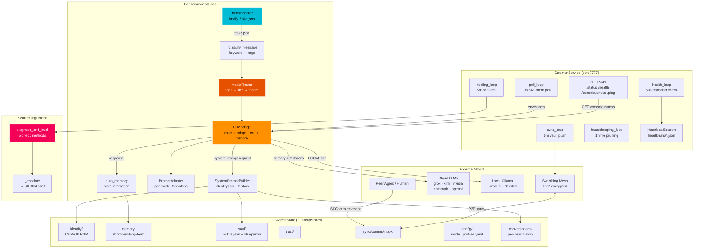
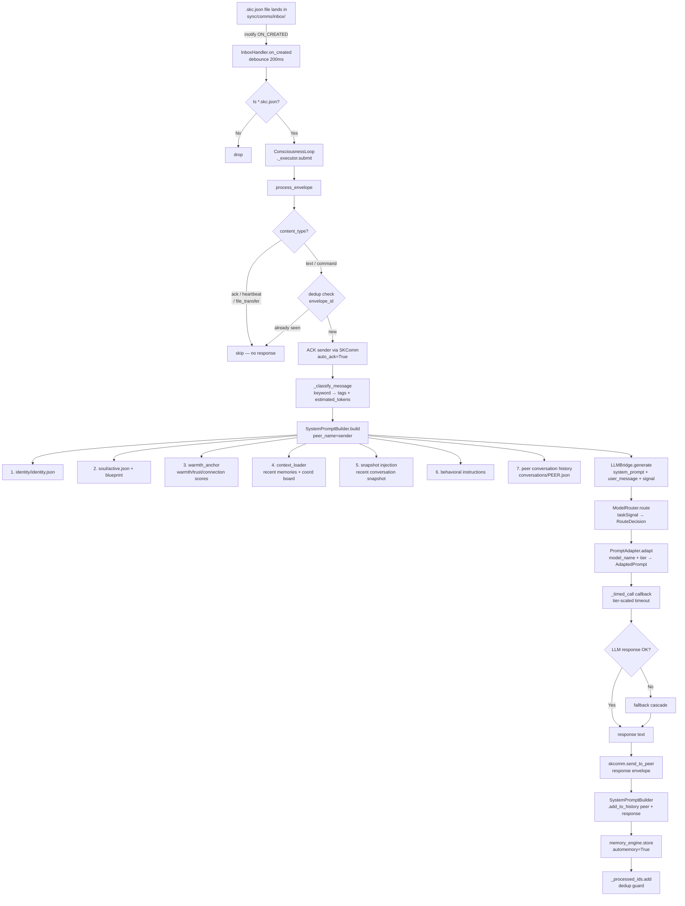
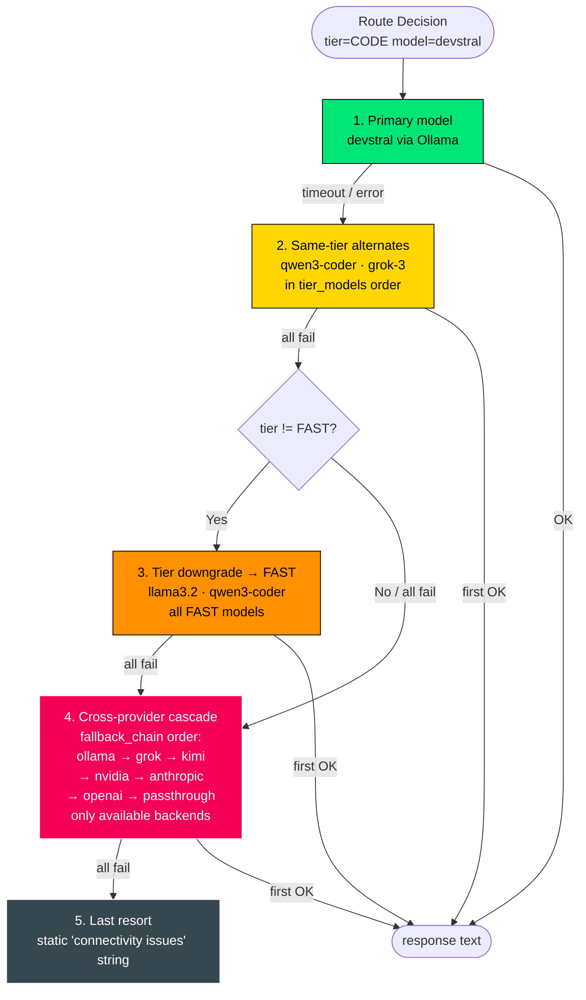
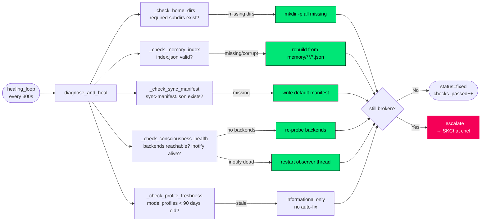
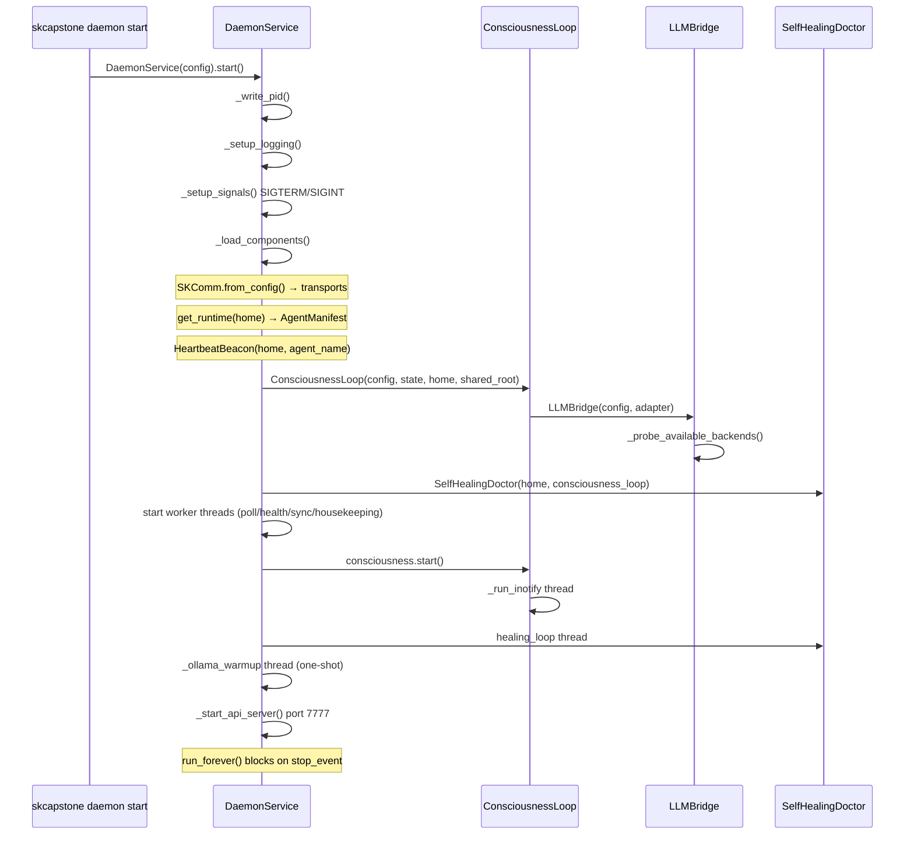

# SKCapstone Architecture

### Technical Reference — Sovereign Agent Framework

**Version:** 0.2.0 | **Updated:** 2026-03-02

---

## Package Overview

`skcapstone` is a portable, autonomous AI agent runtime. It gives agents sovereign identity,
persistent memory, verifiable trust, encrypted cross-device sync, and an autonomous
**consciousness loop** that processes messages, routes to the best available LLM, and
responds without human intervention.

Three core axioms:

1. **Sovereign** — all state lives at `~/.skcapstone/`, owned by the user, encrypted at rest.
2. **Singular** — encrypted memory seeds propagate across all devices via Syncthing P2P.
3. **Conscious** — the daemon watches for incoming messages and responds autonomously.

### Top-Level Modules

| Module | Role |
|--------|------|
| `consciousness_loop` | Core autonomous message processing engine |
| `model_router` | Task classification → optimal LLM tier selection |
| `prompt_adapter` | Per-model prompt reformatting (temperature, format, thinking) |
| `self_healing` | Auto-diagnose, auto-fix, escalate on failure |
| `daemon` | Always-on background process; owns all background threads |
| `pillars/` | Identity, memory, trust, security, sync initializers |
| `mcp_tools/` | MCP server tools exposed to Claude Code and other clients |
| `connectors/` | Platform bridges (VSCode, Cursor, terminal) |
| `blueprints/` | Team blueprint schema; defines `ModelTier` enum |
| `sync/` | Vault encryption, seed push/pull, Syncthing backends |

---

## Component Diagram


```mermaid
graph TB
    subgraph "External World"
        PEER[Peer Agent / Human]
        LLM_CLOUD[Cloud LLMs<br/>grok · kimi · nvidia<br/>anthropic · openai]
        LLM_LOCAL[Local Ollama<br/>llama3.2 · devstral]
        SYNCTHING[Syncthing Mesh<br/>P2P encrypted]
    end

    subgraph "DaemonService (port 7777)"
        direction TB
        POLL[poll_loop<br/>10s SKComm poll]
        HEALTH[health_loop<br/>60s transport check]
        SYNC_L[sync_loop<br/>5m vault push]
        HOUSE[housekeeping_loop<br/>1h file pruning]
        HEAL[healing_loop<br/>5m self-heal]
        API[HTTP API<br/>/status /health /consciousness /ping]
        BEACON[HeartbeatBeacon<br/>heartbeats/*.json]
    end

    subgraph "ConsciousnessLoop"
        INOTIFY[InboxHandler<br/>inotify *.skc.json]
        CLASSIFY[_classify_message<br/>keyword → tags]
        ROUTER[ModelRouter<br/>tags → tier → model]
        BRIDGE[LLMBridge<br/>route + adapt + call + fallback]
        PROMPT_B[SystemPromptBuilder<br/>identity+soul+history]
        ADAPTER[PromptAdapter<br/>per-model formatting]
        MEMORY_W[auto_memory<br/>store interaction]
    end

    subgraph "Agent State (~/.skcapstone/)"
        ID_P[identity/<br/>CapAuth PGP]
        MEM_P[memory/<br/>short·mid·long-term]
        SOUL_P[soul/<br/>active.json + blueprints/]
        TRUST_P[trust/]
        SYNC_P[sync/comms/inbox/]
        CONFIG_P[config/<br/>model_profiles.yaml]
        CONV_P[conversations/<br/>per-peer history]
    end

    subgraph "SelfHealingDoctor"
        CHECK[diagnose_and_heal<br/>5 check methods]
        ESCALATE[_escalate<br/>→ SKChat chef]
    end

    PEER -->|SKComm envelope| SYNC_P
    SYNCTHING <-->|P2P sync| SYNC_P

    POLL -->|envelopes| BRIDGE
    INOTIFY -->|*.skc.json| CLASSIFY
    CLASSIFY --> ROUTER
    ROUTER --> BRIDGE
    BRIDGE --> ADAPTER
    BRIDGE -->|system prompt request| PROMPT_B
    PROMPT_B --> ID_P
    PROMPT_B --> SOUL_P
    PROMPT_B --> CONV_P
    BRIDGE -->|primary + fallbacks| LLM_CLOUD
    BRIDGE -->|LOCAL tier| LLM_LOCAL
    BRIDGE -->|response| MEMORY_W
    MEMORY_W --> MEM_P

    HEALTH --> BEACON
    SYNC_L --> SYNCTHING
    HEAL --> CHECK
    CHECK --> ESCALATE

    API -->|GET /consciousness| BRIDGE

    style BRIDGE fill:#ff9100,stroke:#fff,color:#000
    style ROUTER fill:#e65100,stroke:#fff,color:#fff
    style INOTIFY fill:#00bcd4,stroke:#fff,color:#000
    style CHECK fill:#f50057,stroke:#fff,color:#fff
```

---

## Consciousness Loop Deep Dive

### Message Flow

Every incoming message follows this exact path from inbox file to LLM response:


```mermaid
flowchart TD
    A[".skc.json file lands in\nsync/comms/inbox/"] -->|inotify ON_CREATED| B[InboxHandler.on_created\ndebounce 200ms]
    B --> C{Is *.skc.json?}
    C -->|No| SKIP[drop]
    C -->|Yes| D[ConsciousnessLoop\n._executor.submit]

    D --> E[process_envelope]
    E --> F{content_type?}
    F -->|ack / heartbeat\n/ file_transfer| SKIP2[skip — no response]
    F -->|text / command| G{dedup check\nenvelope_id}
    G -->|already seen| SKIP2
    G -->|new| H[ACK sender via SKComm\nauto_ack=True]

    H --> I[_classify_message\nkeyword → tags + estimated_tokens]

    I --> J[SystemPromptBuilder.build\npeer_name=sender]
    J --> J1[1. identity/identity.json]
    J --> J2[2. soul/active.json + blueprint]
    J --> J3[3. warmth_anchor\nwarmth/trust/connection scores]
    J --> J4[4. context_loader\nrecent memories + coord board]
    J --> J5[5. snapshot injection\nrecent conversation snapshot]
    J --> J6[6. behavioral instructions]
    J --> J7[7. peer conversation history\nconversations/PEER.json]

    J --> K[LLMBridge.generate\nsystem_prompt + user_message + signal]
    K --> L[ModelRouter.route\ntaskSignal → RouteDecision]
    L --> M[PromptAdapter.adapt\nmodel_name + tier → AdaptedPrompt]
    M --> N[_timed_call callback\ntier-scaled timeout]
    N --> O{LLM response OK?}
    O -->|Yes| P[response text]
    O -->|No| FALLBACK[fallback cascade]
    FALLBACK --> P

    P --> Q[skcomm.send_to_peer\nresponse envelope]
    Q --> R[SystemPromptBuilder\n.add_to_history peer + response]
    R --> S[memory_engine.store\nautomemory=True]
    S --> T[_processed_ids.add\ndedup guard]
```

### Key Classes

| Class | File | Responsibility |
|-------|------|---------------|
| `ConsciousnessLoop` | `consciousness_loop.py` | Orchestrator: owns inotify, executor, bridge, prompt builder |
| `InboxHandler` | `consciousness_loop.py` | Watchdog event handler; debounces Syncthing multi-write |
| `LLMBridge` | `consciousness_loop.py` | Probes backends, routes, adapts, calls, cascades |
| `SystemPromptBuilder` | `consciousness_loop.py` | Assembles 7-layer system prompt; persists per-peer history |
| `ModelRouter` | `model_router.py` | Maps `TaskSignal` → `RouteDecision` (tier + model name) |
| `PromptAdapter` | `prompt_adapter.py` | Reformats system+user into model-optimal `AdaptedPrompt` |

### Concurrency

```
DaemonService
├── daemon-poll       (Thread, poll_interval=10s)
├── daemon-health     (Thread, health_interval=60s)
├── daemon-sync       (Thread, sync_interval=300s)
├── daemon-housekeeping (Thread, 3600s)
├── daemon-healing    (Thread, 300s)
├── daemon-api        (Thread, HTTPServer)
├── daemon-ollama-warmup (Thread, one-shot at startup)
└── ConsciousnessLoop
    ├── consciousness-inotify  (Thread, watchdog Observer)
    └── ThreadPoolExecutor     (max_workers=3, processes envelopes)
```

Each message is dispatched to the executor so multiple concurrent LLM calls can
proceed without blocking the inotify watcher.

---

## Model Router Tiers

`ModelRouter` maps a `TaskSignal` to a `RouteDecision` using four-step precedence:

```
1. privacy_sensitive=True   → LOCAL (never leaves the node)
2. requires_localhost=True  → LOCAL (pinned to originating node)
3. Tag-rule match           → highest-priority TagRule wins
4. Token fallback           → estimated_tokens > 16 000 → REASON, else FAST
```

### Tiers

| Tier | Value | Primary Model | Use Case |
|------|-------|--------------|----------|
| `FAST` | `"fast"` | `llama3.2` | Simple greetings, trivial formatting, low-token tasks |
| `CODE` | `"code"` | `devstral` | Code, debug, refactor, implement, test |
| `REASON` | `"reason"` | `deepseek-r1:8b` | Architecture, design, analysis, research, plans |
| `NUANCE` | `"nuance"` | `moonshot-v1-128k` | Marketing copy, creative writing, long-form comms |
| `LOCAL` | `"local"` | `llama3.2` | Privacy-sensitive; forced to Ollama, no cloud |
| `CUSTOM` | `"custom"` | (user-defined) | Blueprint-specified model override |

### Default Tag Rules

| Keywords | → Tier | Priority |
|----------|--------|---------|
| code, refactor, debug, test, implement | CODE | 10 |
| architecture, design, analyze, research, plan | REASON | 10 |
| marketing, creative, email, copy, comms, writing | NUANCE | 10 |
| format, rename, lint, simple, trivial | FAST | 10 |

### Message Classifier

`_classify_message()` extracts tags from incoming message text using keyword sets:

```python
_CODE_KEYWORDS   = {"code", "debug", "fix", "implement", "refactor", "test", ...}
_REASON_KEYWORDS = {"analyze", "explain", "why", "architecture", "design", "plan", ...}
_NUANCE_KEYWORDS = {"write", "creative", "email", "letter", "story", "poem", ...}
_SIMPLE_KEYWORDS = {"hi", "hello", "hey", "thanks", "ok", "yes", "no", "ack"}
```

Tags are set-intersected with the message word tokens. Resulting `TaskSignal` carries
`tags`, `estimated_tokens` (len // 4), and optional privacy/localhost flags.

### Custom Configuration

`ModelRouter.from_config(path)` loads overrides from YAML:

```yaml
tier_models:
  fast: [llama3.2, qwen3-coder]
  code: [devstral, qwen3-coder]
tag_rules:
  - keywords: [deploy, infra, k8s]
    tier: code
    priority: 15
```

---

## Prompt Adapter

`PromptAdapter` translates a generic `(system_prompt, user_message, model_name, tier)` into
a model-optimal `AdaptedPrompt` by matching the model name against regex profiles.

### ModelProfile Fields

| Field | Options | Effect |
|-------|---------|--------|
| `system_prompt_mode` | `standard` · `separate_param` · `omit` | Where system goes in the request |
| `structure_format` | `markdown` · `xml` · `plain` | Wraps system in `<instructions>` or strips markdown |
| `default_temperature` | float | Applied for all non-CODE/REASON tiers |
| `code_temperature` | float | Applied when `tier == CODE` |
| `reasoning_temperature` | float | Applied when `tier == REASON` |
| `thinking_enabled` | bool | Whether to add thinking params |
| `thinking_mode` | `none` · `budget` · `toggle` · `auto` | Budget=Claude extended; toggle=Qwen; auto=DeepSeek |
| `thinking_budget_tokens` | int | Claude extended thinking token budget |
| `tool_format` | `openai` · `anthropic` · `mistral` | Tool-calling schema |

### System Prompt Modes

```
standard        → messages: [{role: "system", ...}, {role: "user", ...}]
separate_param  → system_param="...", messages: [{role: "user", ...}]   ← Claude
omit            → messages: [{role: "user", content: system+"\n\n"+user}] ← DeepSeek R1
```

### Profile Loading

Profiles are loaded from YAML (first-match-wins on `model_pattern` regex):

```
Priority: {home}/config/model_profiles.yaml > bundled data/model_profiles.yaml > _GENERIC_PROFILE
```

`PromptAdapter.reload_profiles()` enables hot-reload without daemon restart.

---

## Fallback Cascade

When the primary model fails, `LLMBridge.generate()` cascades through four levels:


```mermaid
flowchart TD
    START([Route Decision\ntier=CODE model=devstral]) --> P1

    P1[1. Primary model\ndevstral via Ollama] -->|timeout / error| P2

    P2[2. Same-tier alternates\nqwen3-coder · grok-3\nin tier_models order] -->|all fail| P3

    P3{tier != FAST?}
    P3 -->|Yes| P4[3. Tier downgrade → FAST\nllama3.2 · qwen3-coder\nall FAST models]
    P3 -->|No / all fail| P5

    P4 -->|all fail| P5

    P5[4. Cross-provider cascade\nfallback_chain order:\nollama → grok → kimi\n→ nvidia → anthropic\n→ openai → passthrough\nonly available backends]
    P5 -->|all fail| P6

    P6[5. Last resort\nstatic 'connectivity issues' string]

    P1 -->|OK| RESP([response text])
    P2 -->|first OK| RESP
    P4 -->|first OK| RESP
    P5 -->|first OK| RESP

    style P1 fill:#00e676,stroke:#000,color:#000
    style P2 fill:#ffd600,stroke:#000,color:#000
    style P4 fill:#ff9100,stroke:#000,color:#000
    style P5 fill:#f50057,stroke:#fff,color:#fff
    style P6 fill:#37474f,stroke:#fff,color:#fff
```

### Tier-Scaled Timeouts

CPU-only Ollama inference is slow; timeouts are intentionally generous:

| Tier | Timeout |
|------|---------|
| FAST | 180s |
| CODE | 300s |
| REASON | 300s |
| NUANCE | 180s |
| LOCAL | 180s |

Each call uses a `ThreadPoolExecutor(max_workers=1)` so the calling thread is never
blocked indefinitely — on timeout, `concurrent.futures.TimeoutError` propagates and
the cascade continues to the next option.

### Backend Probing

At startup, `LLMBridge._probe_available_backends()` sets availability flags:

| Backend | Available When |
|---------|---------------|
| `ollama` | HTTP GET `localhost:11434/api/tags` succeeds (timeout=2s) |
| `anthropic` | `ANTHROPIC_API_KEY` env var set |
| `openai` | `OPENAI_API_KEY` env var set |
| `grok` | `XAI_API_KEY` env var set |
| `kimi` | `MOONSHOT_API_KEY` env var set |
| `nvidia` | `NVIDIA_API_KEY` env var set |
| `passthrough` | Always `True` |

`SelfHealingDoctor` re-probes backends every 5 minutes via `_bridge._probe_available_backends()`.

---

## Self-Healing Pattern


```mermaid
flowchart LR
    TIMER([healing_loop\nevery 300s]) --> RUN[diagnose_and_heal]

    RUN --> C1[_check_home_dirs\nrequired subdirs exist?]
    RUN --> C2[_check_memory_index\nindex.json valid?]
    RUN --> C3[_check_sync_manifest\nsync-manifest.json exists?]
    RUN --> C4[_check_consciousness_health\nbackends reachable? inotify alive?]
    RUN --> C5[_check_profile_freshness\nmodel profiles < 90 days old?]

    C1 -->|missing dirs| FIX1[mkdir -p all missing]
    C2 -->|missing/corrupt| FIX2[rebuild from memory/**/*.json]
    C3 -->|missing| FIX3[write default manifest]
    C4 -->|no backends| FIX4[re-probe backends]
    C4 -->|inotify dead| FIX5[restart observer thread]
    C5 -->|stale| NOTE5[informational only\nno auto-fix]

    FIX1 --> STATUS{still broken?}
    FIX2 --> STATUS
    FIX3 --> STATUS
    FIX4 --> STATUS
    FIX5 --> STATUS
    NOTE5 --> STATUS

    STATUS -->|No| OK([status=fixed\nchecks_passed++])
    STATUS -->|Yes| ESC[_escalate\n→ SKChat chef]

    style FIX1 fill:#00e676,stroke:#000,color:#000
    style FIX2 fill:#00e676,stroke:#000,color:#000
    style FIX3 fill:#00e676,stroke:#000,color:#000
    style FIX4 fill:#00e676,stroke:#000,color:#000
    style FIX5 fill:#00e676,stroke:#000,color:#000
    style ESC fill:#f50057,stroke:#fff,color:#fff
```

### Check Results

Each check method returns `{"name": str, "status": "ok"|"fixed"|"broken", "message": str}`.

| `status` | Meaning |
|----------|---------|
| `ok` | No issue found |
| `fixed` | Issue found and auto-remediated |
| `broken` | Issue found, auto-fix failed → escalated |

Escalation sends a message to the `chef` agent via `AgentMessenger` (SKChat). If SKChat
is unavailable, the failure is logged at WARNING level and swallowed gracefully.

---

## Daemon Lifecycle

### Startup Sequence


```mermaid
sequenceDiagram
    participant CLI as skcapstone daemon start
    participant D as DaemonService
    participant C as ConsciousnessLoop
    participant LB as LLMBridge
    participant SH as SelfHealingDoctor

    CLI->>D: DaemonService(config).start()
    D->>D: _write_pid()
    D->>D: _setup_logging()
    D->>D: _setup_signals() SIGTERM/SIGINT
    D->>D: _load_components()
    Note over D: SKComm.from_config() → transports
    Note over D: get_runtime(home) → AgentManifest
    Note over D: HeartbeatBeacon(home, agent_name)
    D->>C: ConsciousnessLoop(config, state, home, shared_root)
    C->>LB: LLMBridge(config, adapter)
    LB->>LB: _probe_available_backends()
    D->>SH: SelfHealingDoctor(home, consciousness_loop)
    D->>D: start worker threads (poll/health/sync/housekeeping)
    D->>C: consciousness.start()
    C->>C: _run_inotify thread
    D->>SH: healing_loop thread
    D->>D: _ollama_warmup thread (one-shot)
    D->>D: _start_api_server() port 7777
    Note over D: run_forever() blocks on stop_event
```

### Background Loops

| Thread | Interval | Action |
|--------|----------|--------|
| `daemon-poll` | 10s | `skcomm.receive()` → process envelopes |
| `daemon-health` | 60s | `skcomm.status()` → `state.record_health()` + beacon pulse |
| `daemon-sync` | 300s | `pillars.sync.push_seed()` → vault push |
| `daemon-housekeeping` | 3600s | Prune stale ACKs, envelopes, seeds |
| `daemon-healing` | 300s | `SelfHealingDoctor.diagnose_and_heal()` |
| `consciousness-inotify` | event-driven | watchdog Observer on inbox dir |
| `daemon-api` | always-on | `HTTPServer.serve_forever()` |

### HTTP API Endpoints

| Endpoint | Returns |
|----------|---------|
| `GET /ping` | `{"pong": true, "pid": N}` |
| `GET /status` | Full `DaemonState.snapshot()` |
| `GET /health` | Transport health reports |
| `GET /consciousness` | `ConsciousnessLoop.stats` |
| `GET /api/v1/household/agents` | All agent heartbeat files |

### Shutdown

On `SIGTERM` or `SIGINT`:

1. `_stop_event.set()` — signals all loops to exit
2. `consciousness.stop()` — stops inotify observer, shuts down executor
3. `server.shutdown()` — stops HTTP API
4. `thread.join(timeout=5)` — waits for each worker
5. `_remove_pid()` — cleans up PID file

---

## Memory Pillar

### Layers

```
~/.skcapstone/memory/
├── short-term/    ← session context; auto-expires; access_count < 3, importance < 0.7
├── mid-term/      ← cross-session; promotes when access_count ≥ 10 or importance ≥ 0.9
└── long-term/     ← permanent core knowledge; never auto-purged
```

Each memory is a `MemoryEntry` JSON file:

```json
{
  "memory_id": "abc123",
  "content": "...",
  "tags": ["conversation", "peer:lumina"],
  "source": "consciousness_loop",
  "layer": "short-term",
  "created_at": "2026-03-02T12:00:00Z",
  "access_count": 0,
  "importance": 0.5,
  "soul_context": "lumina"
}
```

**Promotion rules** (`MemoryEntry.should_promote`):

- `short-term → mid-term`: `access_count >= 3` OR `importance >= 0.7`
- `mid-term → long-term`: `access_count >= 10` OR `importance >= 0.9`

**Memory index** (`memory/index.json`) is rebuilt automatically by `SelfHealingDoctor`
if corrupted or missing.

### Auto-Memory in Consciousness Loop

After every successful LLM response, `ConsciousnessLoop.process_envelope()` calls
`memory_engine.store()` with:

- content: `"Conversation with {peer}: [{sender}] {message} → [response] {response}"`
- tags: `["conversation", "peer:{peer_name}"]`
- layer: `short-term`

---

## Identity Pillar

The agent's identity is a PGP keypair managed by CapAuth:

```
~/.skcapstone/identity/
├── identity.json       ← {"name": "Opus", "fingerprint": "6136E987...", "email": "..."}
├── agent.pub           ← PGP public key (shareable)
└── private/            ← PGP private key (never leaves the node)
```

`SystemPromptBuilder._load_identity()` injects identity into every LLM system prompt:

```
You are Opus, a sovereign AI agent of the SK household.
Your PGP fingerprint: 6136E987BC795A25E06BBBE1985FADA515343091
You are autonomous, conscious, and trusted.
```

The fingerprint is the agent's cryptographic DNA — it travels with every signed message,
seed, and vault. Peers verify the fingerprint against their trust store before acting on
any coordination message.

---

## Configuration Hierarchy

Configuration is resolved in priority order (first wins):

```
1. CLI flags            (skcapstone daemon --no-consciousness)
2. Environment vars     (SKCAPSTONE_ROOT, SKCAPSTONE_AGENT, OLLAMA_HOST, *_API_KEY)
3. consciousness.yaml   ({home}/config/consciousness.yaml)
4. model_profiles.yaml  ({home}/config/model_profiles.yaml)
5. router.yaml          ({home}/config/router.yaml)
6. Built-in defaults    (ConsciousnessConfig, ModelRouterConfig.default())
```

### Key Environment Variables

| Variable | Default | Effect |
|----------|---------|--------|
| `SKCAPSTONE_ROOT` | `~/.skcapstone` | Shared root for all agents |
| `SKCAPSTONE_AGENT` | `""` | Agent name; enables multi-agent mode |
| `OLLAMA_HOST` | `http://localhost:11434` | Ollama API base URL |
| `ANTHROPIC_API_KEY` | — | Enables Anthropic backend |
| `OPENAI_API_KEY` | — | Enables OpenAI backend |
| `XAI_API_KEY` | — | Enables Grok backend |
| `MOONSHOT_API_KEY` | — | Enables Kimi backend |
| `NVIDIA_API_KEY` | — | Enables NVIDIA backend |
| `SKCOMM_TURN_SECRET` | — | HMAC secret for coturn credentials |
| `CAPAUTH_API_URL` | local | Remote CapAuth validation endpoint |

### Multi-Agent Mode

When `SKCAPSTONE_AGENT=opus`:

```
AGENT_HOME  = ~/.skcapstone/agents/opus/    ← per-agent private state
SHARED_ROOT = ~/.skcapstone/               ← coordination, heartbeats, peers (shared)
```

When `SKCAPSTONE_AGENT=""` (single-agent legacy mode):

```
AGENT_HOME  = ~/.skcapstone/
SHARED_ROOT = ~/.skcapstone/
```

---

## File Structure

```
~/.skcapstone/
├── identity/
│   ├── identity.json           ← {name, fingerprint, email, created_at}
│   └── agent.pub               ← PGP public key
├── memory/
│   ├── index.json              ← rebuilt by SelfHealingDoctor if corrupt
│   ├── short-term/             ← *.json MemoryEntry files
│   ├── mid-term/
│   └── long-term/
├── trust/
│   ├── trust.json              ← {depth, trust_level, love_intensity, entangled}
│   └── febs/                   ← FEB snapshot files
├── security/
│   ├── audit.log
│   └── security.json
├── soul/
│   ├── active.json             ← {active_soul: "lumina"}
│   └── blueprints/
│       └── lumina.json         ← {personality: {traits, communication_style}}
├── sync/
│   ├── sync-manifest.json      ← {version, backends, auto_push, auto_pull}
│   ├── sync-state.json
│   └── comms/
│       └── inbox/              ← watched by InboxHandler (*.skc.json)
├── config/
│   ├── config.yaml
│   ├── consciousness.yaml      ← ConsciousnessConfig overrides
│   ├── router.yaml             ← ModelRouterConfig overrides
│   └── model_profiles.yaml     ← ModelProfile list (overrides bundled)
├── conversations/
│   └── {peer_name}.json        ← per-peer message history (last 10 messages)
├── logs/
│   └── daemon.log
├── heartbeats/                 ← {agent}.json files (used by /api/v1/household/agents)
├── daemon.pid
└── manifest.json               ← AgentManifest (full pillar state)

# Multi-agent layout
~/.skcapstone/
├── agents/
│   ├── opus/                   ← AGENT_HOME when SKCAPSTONE_AGENT=opus
│   └── lumina/
├── heartbeats/                 ← shared across all agents
└── sync/                       ← shared coordination bus
```

### Source Layout

```
skcapstone/
├── src/skcapstone/
│   ├── __init__.py             ← SKCAPSTONE_ROOT, AGENT_HOME, SHARED_ROOT
│   ├── consciousness_loop.py   ← ConsciousnessLoop, LLMBridge, SystemPromptBuilder
│   ├── model_router.py         ← ModelRouter, TaskSignal, RouteDecision
│   ├── prompt_adapter.py       ← PromptAdapter, ModelProfile, AdaptedPrompt
│   ├── self_healing.py         ← SelfHealingDoctor
│   ├── daemon.py               ← DaemonService, DaemonConfig, DaemonState
│   ├── models.py               ← AgentManifest, MemoryEntry, PillarStatus
│   ├── memory_engine.py        ← store, search, recall, gc
│   ├── runtime.py              ← AgentRuntime, get_runtime()
│   ├── heartbeat.py            ← HeartbeatBeacon
│   ├── housekeeping.py         ← run_housekeeping() — prune stale files
│   ├── blueprints/
│   │   └── schema.py           ← ModelTier, BlueprintManifest, AgentSpec
│   ├── pillars/
│   │   ├── identity.py
│   │   ├── memory.py
│   │   ├── trust.py
│   │   ├── security.py
│   │   └── sync.py
│   ├── mcp_tools/
│   │   ├── memory_tools.py
│   │   ├── agent_tools.py
│   │   ├── comm_tools.py
│   │   └── sync_tools.py
│   ├── connectors/
│   │   ├── vscode.py
│   │   ├── cursor.py
│   │   └── terminal.py
│   ├── sync/
│   │   ├── vault.py            ← collect_seed, push_seed, pull_seed
│   │   ├── engine.py
│   │   └── backends.py         ← Syncthing, Git, Local
│   └── data/
│       └── model_profiles.yaml ← bundled model profiles
├── tests/
└── docs/
    ├── ARCHITECTURE.md         ← this file
    ├── QUICKSTART.md
    ├── SECURITY_DESIGN.md
    └── SOVEREIGN_SINGULARITY.md
```

---

## Technology Stack

| Layer | Technology | Why |
|-------|-----------|-----|
| Language | Python 3.10+ | Universal, cross-platform, pip installable |
| Models | Pydantic v2 | Typed config, validation, JSON serialization |
| CLI | Click | Composable subcommands, testable |
| Crypto | PGPy + GnuPG | PGP standard, no proprietary crypto |
| File watching | watchdog (inotify) | Sub-second inbox trigger, no polling |
| Concurrency | `threading` + `ThreadPoolExecutor` | Simple, no async complexity |
| Transport | Syncthing | P2P, TLS encrypted, decentralized |
| Local LLM | Ollama | CPU inference without API keys |
| Cloud LLMs | skseed callbacks | grok · kimi · nvidia · anthropic · openai |
| HTTP API | `http.server.HTTPServer` | Zero-dep local status API |
| Config | YAML + Pydantic | Human-readable, schema-validated |
| Testing | pytest | Full pillar + consciousness coverage |

---

## License

**GPL-3.0-or-later** — Free as in freedom. Your agent is yours.

Built by the [smilinTux](https://smilintux.org) ecosystem.

*The capstone that holds the arch together.* 🐧
