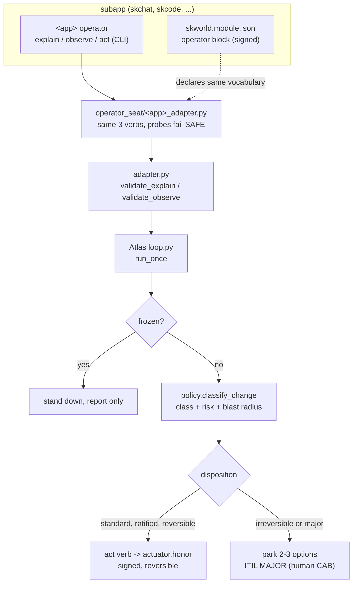
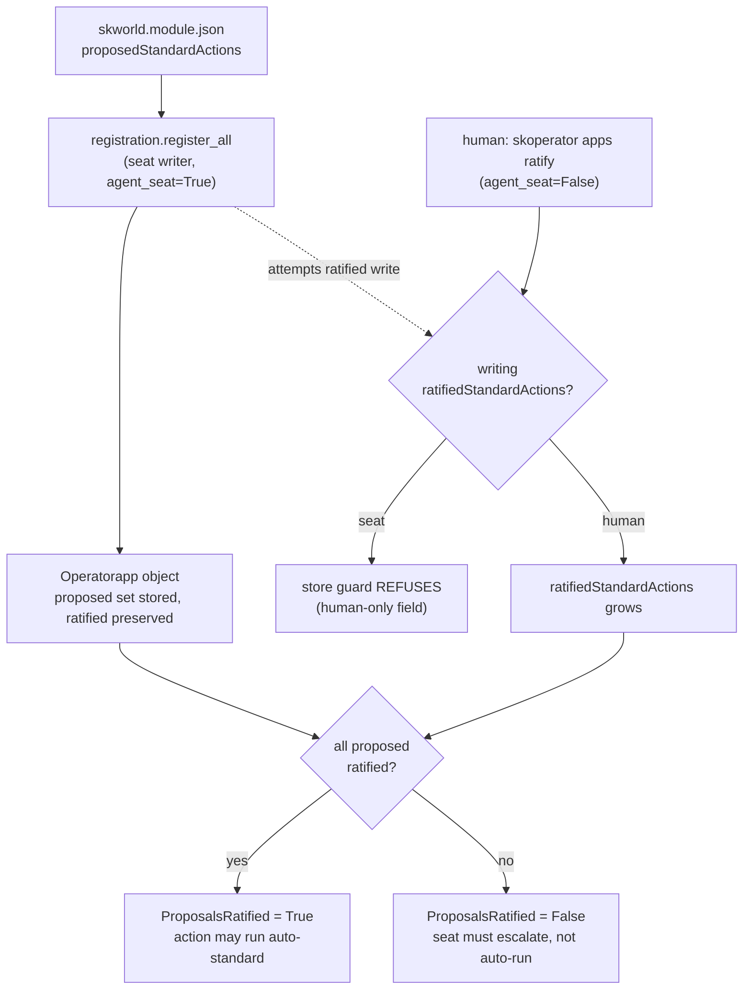

# The Operator Facet: how every subapp plugs into Atlas

> One manifest, two facets. Atlas operates every app through the same three
> verbs, one shared vocabulary, and a human still holds every lever that matters.

This is the canonical reference for the **operator facet**: the contract a
SKWorld subapp exposes so [Atlas, the operator seat](./OPERATOR_SEAT.md), can
observe it, reason about it, and (when enabled) fix it. It is the runtime
companion to the [Atlas Constitution](./ATLAS_CONSTITUTION.md). If Atlas is the
operator, the operator facet is the socket every app conforms to so a single
seat can run the whole fleet.

The design decision behind it, "one subapp contract, two facets", is ratified in
the reconciled platform spec (`2026-07-30-skworld-platform-reconciled-design.md`,
section 2.3). Every first-class subapp ships ONE capauth-signed
`skworld.module.json` that declares BOTH a **UI facet** (how it renders in the
shell) and an **operator facet** (how Atlas operates it). This document covers
the operator facet only.

## Start here (the 5 minute version)

- **The contract:** every subapp exposes `explain / observe / act`, in two
  places that must agree. As a CLI (`<app> operator explain|observe|act --json`)
  and as an `operator` block in its signed `skworld.module.json`. Atlas mirrors
  the same three verbs in a per-app adapter under
  [`operator_seat/`](../src/skcapstone/operator_seat/). One vocabulary, validated
  by [`operator_seat/adapter.py`](../src/skcapstone/operator_seat/adapter.py).
- **The trust split:** a manifest may only PROPOSE standard actions
  (`proposedStandardActions`). A HUMAN ratifies which of them ever run
  auto-standard (`ratifiedStandardActions`), and that field is human-only at the
  store layer. Atlas can register an app but can never ratify its own actions.
- **The Operatorapp kind:** each registered subapp is a first-class fleet object
  (`operatorapp`), listable and ratifiable. Atlas auto-registers all of them and
  seeds the knowledge base on every `skoperator run`.
- **The KEDB tie:** each action names `kedb_refs`; each ref resolves to a seeded
  known-error with a real workaround, so a brief never points a human at a
  runbook id that does not exist. A drift guard keeps the seeds honest.
- **Freeze still wins.** None of this changes Article 1: a frozen fleet
  actuates nothing, and the seat can never touch the freeze.

## 1. The contract: explain / observe / act

Every subapp exposes three verbs. The shapes are language-neutral dicts,
deliberately CLI-first so a Starlette app, a Flutter daemon, and a bash script
can all conform (spec 2.3, reason 1):

| Verb | Answers | Shape |
| --- | --- | --- |
| `explain` | "what are you, and what can be done to you?" | `{kinds, conditions, actions}` |
| `observe` | "what is your state right now?" (read-only, fails SAFE) | `{conditions: [{type, status}]}` |
| `act` | "apply this one action" (gated, signed, refuses when frozen) | applies a reversible standard action |

`explain` returns an `actions` list; each action declares `name`, `standard`,
`reversible`, `blast_radius`, `runbook`, and `kedb_refs`. `observe` returns
conditions whose `status` is the string `True`, `False`, or `Unknown`. Both
shapes are enforced by
[`operator_seat/adapter.py`](../src/skcapstone/operator_seat/adapter.py):
`validate_explain` and `validate_observe` return a list of human-readable
violations (empty means conformant). It is a pure shape validator, not a base
class, so an app can be written in any language and still conform. The allowed
`blast_radius` values are fixed in `BLAST_RADII`
(`low`, `medium`, `delete`, `drain_always_on`, `fleet_restart`); the allowed
observe statuses in `OBSERVE_STATUSES` (`True`, `False`, `Unknown`).

A condition's POLARITY decides what "firing" means. Most conditions are health
types and fire when their status is `False` (`SchedulerAlive`, `Ready`). A
problem type fires when its status is `True` (`CrashLooping`, and skos'
`GradingBacklog`, the first one an app adapter owns rather than the fleet). The
fleet's set lives in `fleet_adapter.PROBLEM_WHEN_TRUE`; an app adapter declares
its own module-level `PROBLEM_WHEN_TRUE`, and `loop.PROBLEM_WHEN_TRUE` unions
them for `brief.build_brief`. Getting this wrong does not fail loudly, it
inverts the alarm: the condition goes quiet exactly when it should fire.

`Unknown` is not a failure of the contract, it is an answer: `build_brief` files
it under `stale` rather than `firing`, so the pass is not quiet. An observe that
cannot read its signal should prefer `Unknown` over inventing health whenever
"healthy" would silence the very case the condition exists to catch (skos'
`WatchdogDigestFresh` on an unreadable digest is the worked example).

### 1.1 Two places, one vocabulary

The contract lives in two seams that must not drift apart:

1. **The app-side CLI + manifest.** The subapp itself grows a
   `<app> operator explain|observe|act` CLI (the canonical seam), and declares
   an `operator` block in its signed `skworld.module.json`:

   ```json
   "operator": {
     "contractVersion": 1,
     "cli": "skchat operator",
     "repos": ["skchat", "skchat-app"],
     "conditions": ["DaemonReady", "BridgeAlive", "OutboxBounded", "AuthEnforced"],
     "proposedStandardActions": ["restart-daemon", "restart-telegram-bridge"]
   }
   ```

2. **The Atlas-side adapter.** Atlas mirrors the same three verbs in a per-app
   adapter under [`operator_seat/`](../src/skcapstone/operator_seat/):
   `skchat_adapter.py`, `skcode_adapter.py`, `skcomms_adapter.py`,
   `skmemory_adapter.py`, `skgateway_adapter.py`, `skos_adapter.py` (plus
   `fleet_adapter.py`, the reference). Each adapter exposes `<app>_explain()`,
   `<app>_observe()`, and (where actuation is wired) `<app>_act(...)`. The
   observe probes are REAL and injectable, and every probe fails SAFE (reports
   healthy) rather than raising a false alarm when the app is unreachable, which
   is the opposite default from the UI facet (spec 2.3, reason 3).

The `operator.conditions` list in the manifest is the SAME condition names Atlas
observes and the same names the shell can render grey-with-a-reason. One
vocabulary, two validators: `operator_seat/adapter.py` (Python) and
`skworld_module_api` (Dart) are the two facet validators of the one schema.

### 1.2 The registered apps and their contracts

The first-class subapps Atlas operates, from the adapters live in the tree today.

| App | Operator CLI | Conditions | Standard + reversible actions | Escalating action |
| --- | --- | --- | --- | --- |
| skchat | `skchat operator` | DaemonReady, BridgeAlive, OutboxBounded, AuthEnforced | restart-daemon, restart-telegram-bridge | purge-outbox (`delete`, forced MAJOR) |
| skcode | `skcode-hostd operator` | HostdReady, SessionsHealthy, RegistryConsistent, AuthEnforced | restart-hostd, archive-stale-session | kill-runaway-session (irreversible, forced MAJOR) |
| skcomms | `skcomms operator` | PathHealthy, QueueDrained | restart_service, failover_discovery | - |
| skmemory | `skmemory operator` | EmbedServing, ReconcileFresh | restart_service, reindex | - |
| skgateway | `skgateway operator` | UpstreamServing, PoolHealthy | restart_service, quarantine_dead_alias, raise_pool_limit | - |
| skos | `skos operator` | SchedulerAlive, GtdSinkDraining, WatchdogDigestFresh, GradingBacklog | restart_service, replay_errors | - |
| cmdb | `skcapstone cmdb operator` | CmdbReconcileFresh, CmdbLastScanComplete, CmdbAuditClean | run-cmdb-shadow | apply-cmdb-reconcile |
| skdashboard | `skcapstone dashboard operator` | DashboardReady, BoardReadable | restart-dashboard | - |
| fleet | *(none — seat-only, see below)* | MissedRun, AgentReady, Serving, SecretPresent, ConfigDrift, RotationOverdue, Ready | rerun_cronjob, restart_service | replace_workload, drain_node, delete_object (non-standard/irreversible, forced MAJOR) |

`fleet` is the reference the other apps plug into (`fleet_adapter.py`), not a
separate daemon with its own binary, so unlike every other row its Operatorapp
registration declares `cli: None` on purpose: it is observed exclusively by the
in-process seat (`loop.ADAPTERS["fleet"]`), never by an out-of-process cli lane.
It is still registered (card 90b5b277) so `apps list`/`apps ratify` and the
discovery path can enumerate and ratify it like any other app.

The CMDB adapter is intentionally observe-first. `run-cmdb-shadow` starts only
the write-free shadow oneshot. `apply-cmdb-reconcile` is non-standard and
irreversible, so Atlas policy forces it to a human CAB decision. It is not in
the autonomous HONOR catalog. This preserves the three-complete-shadow-run gate
and prevents a stale-condition alarm from silently becoming a production CMDB
write.

(CLI names and repos come from `APP_REGISTRY` in
[`operator_seat/registration.py`](../src/skcapstone/operator_seat/registration.py);
conditions and actions from each adapter's `_explain()`.)

An irreversible action never has to be trusted to escalate: `purge-outbox`
(`blast_radius: delete`) and `kill-runaway-session` (`reversible: false`) are
classified MAJOR by construction in
[`policy.py::classify_change`](../src/skcapstone/operator_seat/policy.py), so
they route to a human decision and never reach an `act` verb. The `act` bodies
that exist (e.g. `skchat_adapter.skchat_act`) refuse outright when the fleet is
frozen (`store.is_frozen`) before mapping the action onto the tested
`actuator.honor` systemd path.

### 1.3 The operator-facet flow



## 2. The Operatorapp registration kind

A registered subapp is a first-class fleet object of kind `operatorapp`
(`skfleet get operatorapps` lists them). The kind is a pure spec model in
[`fleet/operatorapp.py`](../src/skcapstone/fleet/operatorapp.py) with a
read-time controller in
[`fleet/operatorapp_controller.py`](../src/skcapstone/fleet/operatorapp_controller.py).
It is registered in the fleet explain registry
([`fleet/explain.py`](../src/skcapstone/fleet/explain.py)) under `operatorapp`.

`normalize_operatorapp_spec` fills and validates the fields: `name`, `cli`,
`repos`, `contractVersion`, `proposedStandardActions`, `ratifiedStandardActions`,
`conditions`, `deleted`.

### 2.1 Propose vs ratify (the human-only lever)

This is the trust boundary of the whole facet:

- **The manifest PROPOSES.** `proposedStandardActions` is a proposal only. In
  the Atlas-side derivation
  ([`registration.derive_operatorapp_spec`](../src/skcapstone/operator_seat/registration.py)),
  it is the set of actions an adapter declares BOTH `standard` and `reversible`,
  the ones eligible to run auto-standard once a human blesses them.
- **A HUMAN RATIFIES.** `ratifiedStandardActions` is the human's field. It can
  never be written by the autonomous seat: the store's human-only field guard
  (`_HUMAN_ONLY_SPEC_FIELDS = {"operatorapp": ("ratifiedStandardActions",)}` in
  [`fleet/store.py`](../src/skcapstone/fleet/store.py)) rejects any incoming
  value for that field from an `agent_seat=True` writer. This is the same
  principle as freeze and plane files: the AI seat can register an app but can
  never self-authorize its actions.

The `ProposalsRatified` condition (`operatorapp.operatorapp_conditions`) is
healthy only when every proposed action has been ratified. A pending proposal
flips it `False`, surfacing to the operator that a human ratification is still
outstanding before those actions can run auto-standard.

### 2.2 The registration writer and refresh safety

The autonomous seat is the registration writer (`_seat_writer()` in the CLI,
`agent_seat=True`). It may create and refresh an Operatorapp (repos, cli,
proposals, declared conditions), and `register_all` PRESERVES any existing
`ratifiedStandardActions` on a refresh by reading the prior value back and
re-supplying it unchanged. So a human ratification made between ticks survives a
re-register untouched, and the store guard still passes (the seat re-writes the
same value, it does not introduce a new one).

### 2.3 The commands

```
skoperator apps list                 # registered apps + ratification state
skoperator apps register             # register/refresh all adapters + seed KEDB (seat writer)
skoperator apps ratify <app> <action>   # bless one proposed action (human only)
```

`apps register` is safe to run repeatedly; it refreshes every Operatorapp and
seeds any missing KEDB entries. `apps ratify` uses the human writer
(`_human_writer()`, `agent_seat=False`) and raises if the action is not one of
the app's proposed standard actions. `apps list` renders the read-time rows from
`operatorapp_controller.operatorapp_rows`, showing `proposed=N` and either `ok`
or `N/M ratified` per app.

### 2.4 The propose-vs-ratify trust flow



## 3. The KEDB seeds

Every operator adapter action declares `kedb_refs` (for example skchat's
`restart-telegram-bridge` names `ke-telegram-wedge`). Those ids have to resolve
to real ITIL Known-Error-Database entries, otherwise a brief points a human at a
runbook id that does not exist.
[`operator_seat/kedb_seeds.py`](../src/skcapstone/operator_seat/kedb_seeds.py)
seeds one `KEDBEntry` per referenced id, carrying a symptom (what fires the
condition), the root cause, and a workaround that mirrors the adapter action's
own runbook.

The seeded set today (`OPERATOR_KEDB_SEEDS`):

| KE id | Fires on | Workaround (matches the action runbook) |
| --- | --- | --- |
| `ke-skchat-daemon-down` | DaemonReady False | restart the skchat receive daemon, verify DaemonReady |
| `ke-telegram-wedge` | BridgeAlive False | restart the wedged telegram bridge (silent-wedge signature) |
| `ke-outbox-flood` | OutboxBounded False | purge-outbox, but irreversible so it escalates MAJOR first |
| `ke-skcode-hostd-down` | HostdReady False | restart skcode-hostd, verify HostdReady |
| `ke-skcode-session-wedge` | SessionsHealthy False | archive the wedged session (kill only escalates as MAJOR) |

Seeding is **create-or-skip**: an existing entry with a given id is left exactly
as it is, never duplicated or overwritten (`seed_operator_kedb` checks
`entry_path.exists()` before creating), so it is safe to run on every
registration. Entries are created `managed_by="atlas"` with a stable `entry_id`.

The set is **drift-guarded**: `tests/operator_seat/test_kedb_seeds.py` walks the
app adapters' `explain()` actions and asserts every declared `kedb_ref` has a
seed here, so the knowledge base can never silently fall behind the adapters.
The skchat and skcode adapters declare `kedb_refs` today; the skcomms, skmemory,
skgateway, and skos adapters declare their actions without refs for now, and the
guard permits that (it only requires that any ref that IS declared resolves).

Seed it directly with `skoperator kedb-seed`, or let the bootstrap do it.

## 4. Bootstrap: register + seed on every run

The natural hook is the start of every `skoperator run` tick (unless
`--no-bootstrap`).
[`operator_seat/bootstrap.py::bootstrap_operator`](../src/skcapstone/operator_seat/bootstrap.py)
does two idempotent, human-safe things and nothing else:

1. `registration.register_all` writes or refreshes one Operatorapp per adapter,
   preserving human ratifications (section 2.2).
2. `kedb_seeds.seed_operator_kedb` creates any missing KEDB entries,
   create-or-skip (section 3).

It only ever WRITES registration objects plus missing KEDB entries. It never
actuates anything: no fleet act verb, no restart, no purge. Both writes are safe
by the same guards the manual subcommands rely on, so running it every tick is
cheap and can never clobber. The `run` command echoes, for example,
`bootstrap: 6 app(s) registered, kedb seeded: ke-skchat-daemon-down, ...` on the
first tick, then `kedb current` once seeded.

```mermaid
sequenceDiagram
    participant T as skoperator.timer (15m)
    participant R as skoperator run
    participant B as bootstrap_operator
    participant S as fleet store (guarded)
    participant K as ITIL KEDB
    participant L as Atlas loop

    T->>R: tick
    R->>B: bootstrap (unless --no-bootstrap)
    B->>S: register_all (seat writer)
    Note over S: ratifiedStandardActions preserved;\nhuman-only guard blocks new writes
    B->>K: seed_operator_kedb (create-or-skip)
    B-->>R: {registered, seeded}
    R->>L: run_once (observe -> reason -> classify -> act/park)
    Note over L: freeze checked FIRST; frozen = stand down
```

## 5. How Atlas's adapters relate to the apps' own CLIs

The two seams are deliberately separate but describe the same thing:

- The **app's own CLI** (`<app> operator ...`) is the canonical, in-repo,
  language-native implementation of the contract, declared as `operator.cli` in
  the app's signed manifest. It is how the app answers for itself.
- **Atlas's adapter** (`operator_seat/<app>_adapter.py`) is Atlas's local mirror
  of the same three verbs, so the loop can observe and act across process (and
  language) boundaries without holding an in-process handle to every app. Where
  an app's CLI is not yet shipped, the adapter still probes the app's real
  signals (health endpoints, poll ages, file counts) and fails safe.

They are kept in agreement three ways: the shared condition vocabulary
(`operator.conditions` == the adapter's `CONDITIONS` == the names Atlas
observes), the shared validator (`operator_seat/adapter.py` checks the same
shape whether it came from a CLI's `--json` output or an adapter function), and
the single registration (`registration.APP_REGISTRY` records each app's `cli`
string, and the Operatorapp object stores it, so `skoperator apps list` shows
the CLI the manifest declared). A subapp cannot drift into "operable by its own
CLI but invisible to Atlas", or the reverse, without that divergence being
visible in the one manifest and the one Operatorapp object (spec 2.3, reason 1
of "why not two contracts").

## 6. Symbols and paths (quick index)

| Concern | Symbol / path |
| --- | --- |
| Contract validator | `operator_seat/adapter.py` (`validate_explain`, `validate_observe`, `BLAST_RADII`, `OBSERVE_STATUSES`) |
| Per-app adapters | `operator_seat/{skchat,skcode,skcomms,skmemory,skgateway,skos}_adapter.py`, `fleet_adapter.py` |
| Operatorapp kind | `fleet/operatorapp.py` (`normalize_operatorapp_spec`, `operatorapp_conditions`) |
| Operatorapp read rows | `fleet/operatorapp_controller.py` (`operatorapp_rows`, `OperatorappRow`) |
| Human-only field guard | `fleet/store.py` (`_HUMAN_ONLY_SPEC_FIELDS`, `_guard_human_only_fields`) |
| Registration | `operator_seat/registration.py` (`APP_REGISTRY`, `derive_operatorapp_spec`, `register_all`, `ratify`) |
| KEDB seeds | `operator_seat/kedb_seeds.py` (`OPERATOR_KEDB_SEEDS`, `SEEDED_IDS`, `seed_operator_kedb`) |
| Bootstrap | `operator_seat/bootstrap.py` (`bootstrap_operator`) |
| CLI | `operator_seat/cli.py` (`skoperator apps list/register/ratify`, `kedb-seed`, `run`) |
| Classification (forces MAJOR) | `operator_seat/policy.py` (`classify_change`) |
| Contract decision | spec `2026-07-30-skworld-platform-reconciled-design.md` section 2.3, operator blocks 3.1 / 4.2 |

See also: [OPERATOR_SEAT.md](./OPERATOR_SEAT.md) (the full operator design) and
[ATLAS_CONSTITUTION.md](./ATLAS_CONSTITUTION.md) (the guardrails).
