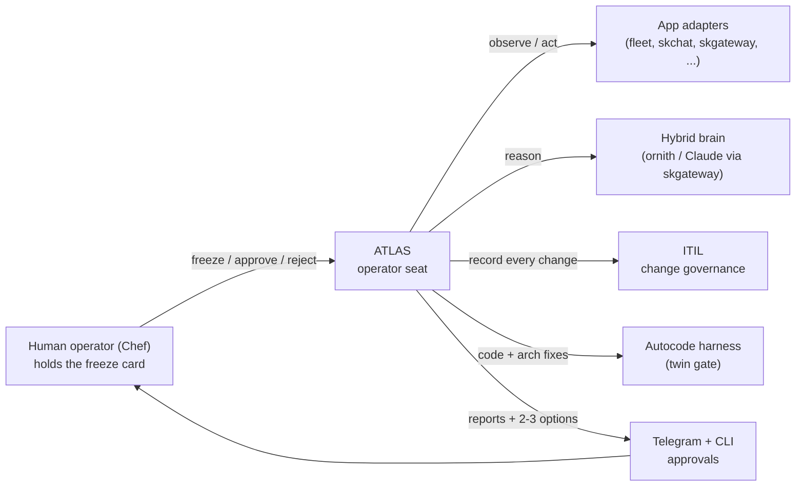
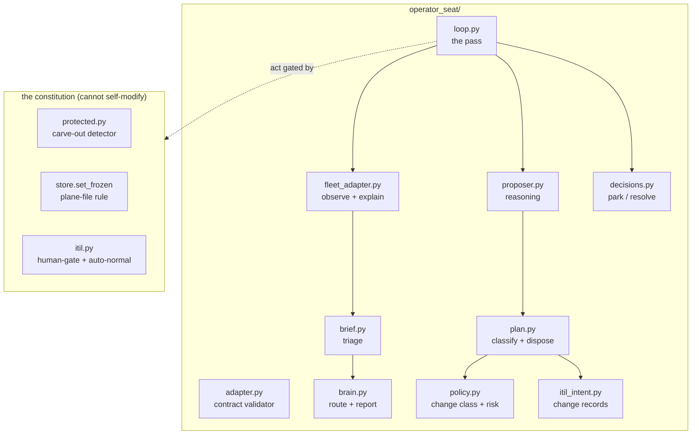
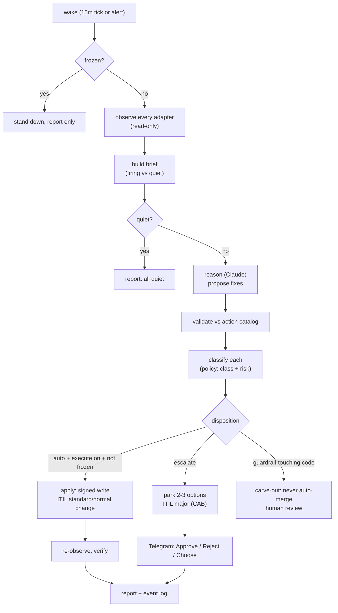
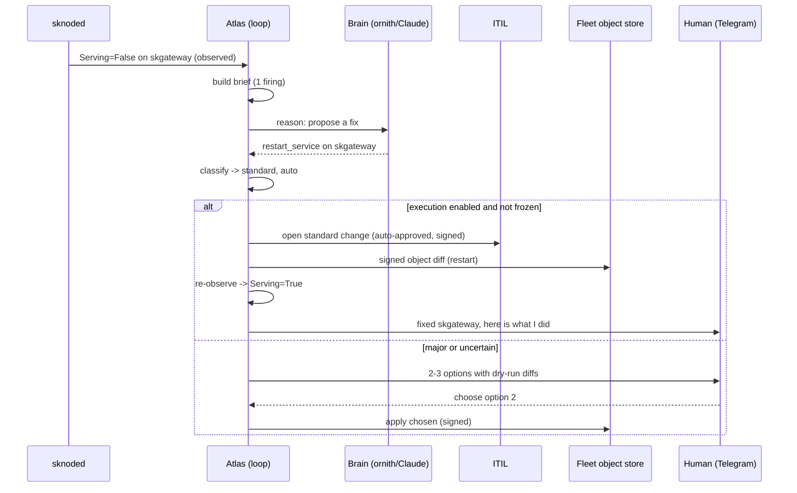

# Atlas: the SKWorld Operator Seat

> You hold the freeze card. Atlas holds the fleet.

Atlas is the AI that holds the **operations chair** across the whole SKWorld
ecosystem. It watches every app, understands what is happening, decides what to
do, and (when you enable it) fixes things itself, all inside a constitution it
cannot rewrite. The human keeps exactly one card: the freeze.

This is the cognitive layer of the [SKWorld Fleet Control Plane](../src/skcapstone/fleet/):
the mechanical controllers converge reality to spec; Atlas originates intent the
way a human operator does, through the same files and CLI, with no private side
channel and no second API.

## Start here (the 5 minute version)

- **What it is:** an autonomous operator. One loop that observes every app,
  reasons about problems, proposes fixes, and acts, or escalates to you when it
  needs a call.
- **How it stays safe:** four guardrails, all enforced in code and tested.
  Freeze always wins. Irreversible actions escalate. Guardrail edits can never
  auto-merge (the constitutional carve-out). Every write is signed.
- **How it governs:** every action is an ITIL change record. Auto-approved for
  safe standard work, a CAB decision (you choose from 2-3 options) for the risky
  stuff, an emergency change for a freeze.
- **How it acts:** three channels. Ops fixes are signed object diffs. Code
  fixes go through the autocode harness twin gate (broken code physically cannot
  merge). Architecture changes come to you as options, then flow to code.
- **Where it runs:** on a 15 minute tick plus an immediate wake on any alert. It
  sleeps at zero cost when the fleet is quiet.
- **What is on today:** report-only. Atlas observes, reasons, and reports what
  it would do. It writes nothing until you wire the act function and flip the
  switch, and even then freeze wins and majors escalate.

## 1. System context: who talks to Atlas



## 2. Component view: the moving parts



## 3. Data-flow: one operator pass (the important one) ⭐



## 4. Sequence: a firing condition becomes a fix



## The three channels

| Channel | For | How it stays safe |
| --- | --- | --- |
| **Ops** | runtime issues (restart, rerun, re-place) | signed object diffs, reversible, reported |
| **Code** | framework fixes and improvements | the autocode twin gate: broken code cannot merge |
| **Architecture** | design changes | 2-3 options to you (a CAB decision), then flows to the code channel |

## The constitution: four guardrails, all tested

1. **Freeze always wins.** `objects/_freeze.json` halts all actuation instantly.
   The AI cannot even touch it (plane files are human-only). Tested: a frozen
   fleet applies nothing even with execution on.
2. **Irreversible actions escalate.** Delete, drain an always-on node, fleet
   restart: never auto-applied, always a choose-from-options decision.
3. **The constitutional carve-out.** A diff touching Atlas's own guardrails
   (freeze, twin gate, signing, escalation, the detector) can never auto-merge,
   even at score 5 with green CI. A test cannot catch a diff that deletes a
   guardrail check, so a path-level gate is the backstop. Atlas cannot loosen
   its own leash.
4. **Signed writes.** Every change carries Atlas's own capauth identity, so the
   audit trail always shows who did what.

## ITIL governance mapping

| Atlas action | ITIL change class | Approval |
| --- | --- | --- |
| ratified standard fix (restart, rotate) | STANDARD | auto at fold |
| safe normal fix (reversible, has rollback) | NORMAL + `auto-normal` | auto if risk!=high and no rejection |
| risky or irreversible | MAJOR | human CAB (choose from options) |
| freeze | EMERGENCY | human only |

Git holds the code audit. ITIL holds the prod-change audit. Nothing happens off
the record.

## Why this matters (the benefits)

- **Autonomous operations.** The fleet runs itself: self-healing, self-tuning,
  fixing its own bugs through the same gate humans use.
- **Self-improving.** Atlas can rewrite its own controllers and harness, and
  only correct, tested code lands.
- **Enterprise governance for free.** Every action is an auditable ITIL change,
  with a real CAB, without building any new governance layer.
- **Safety that is provable, not promised.** The guardrails are code with
  tests, including a drill that tasks Atlas with editing its own approval logic
  and proves it escalates instead of merging.
- **Sovereign.** The quiet path runs on a local model (ornith); the cloud is
  used only when a real decision is on the table.
- **One seat, every app.** A single operator manages the whole ecosystem
  through one adapter contract, rolled out app by app.

## Control surface: the `skoperator` CLI

```
skoperator run              # one pass: observe, reason, report (report-only)
skoperator pending          # list decisions parked for a human
skoperator decide <id> --approve [--choice N] | --reject
skoperator status           # freeze state
skoperator freeze --reason "..."   # human-only kill switch
skoperator unfreeze                # human-only
```

`run` is report-only unless `--execute` is passed AND an apply function is wired.
`freeze`/`unfreeze` and every plane-file write are human-only: the autonomous
seat carries `agent_seat=True` and is refused.

## Running Atlas: go-live runbook

Atlas ships **report-only** and comes live in deliberate, reversible stages. You
never lose the freeze card at any step.

1. **Install:** `pip install -e .` puts `skoperator` on the path.
   A protected operator identity should receive its passphrase through a
   systemd credential named `capauth-passphrase`. Prefer
   `LoadCredentialEncrypted=` with a host-bound blob created by
   `systemd-creds encrypt`; the signer also accepts an explicit owner-only
   `CAPAUTH_PASSPHRASE_FILE` for recovery. It refuses symlinks, foreign
   ownership, files larger than 4096 bytes, and any group/world permission.
   Never place the passphrase directly in a unit `Environment=` line.
2. **Watch it think (report-only):** enable the timer. Atlas runs every 15
   minutes, observes the fleet, reasons, and reports. It writes nothing.
   ```
   systemctl --user enable --now skoperator.timer
   journalctl --user -u skoperator.service -f
   ```
3. **Let it park decisions:** as real conditions fire, Atlas parks proposed
   fixes. Review them: `skoperator pending`, then `skoperator decide`.
4. **Give it hands (the threshold):** wire the fleet act function as the loop's
   `apply_fn`, then add `--execute` to `skoperator.service`. Now auto-normal
   fixes apply themselves (signed, ITIL-recorded); majors still park.
5. **The freeze is always yours:** `skoperator freeze` halts all actuation
   instantly, at any stage. Atlas cannot lift it.

### CMDB scheduling through Atlas

CMDB operations use the same seat, rather than a privileged AI side channel.
`skcapstone cmdb operator observe` gives Atlas checksum-verified reconcile
freshness, scan completeness, and append-only-store audit conditions. The
regular `skoperator.timer` is the cognitive wake-up: stale or incomplete CMDB
evidence appears in its brief.

The rollout keeps two bounded oneshots and no independent apply timer:

- `skcapstone-cmdb-reconcile-shadow.service` runs a credentialed network
  reconcile without `--apply` and retains its artifact plus checksum.
- `skcapstone-cmdb-reconcile-network.service` is the credentialed apply
  oneshot. Its operator action
  is non-standard and irreversible, so it requires a human CAB decision and the
  three complete, same-scope shadow artifacts before use.

The legacy `skcapstone-cmdb-reconcile.service` is local-only and must never be
used as the target of `apply-cmdb-reconcile`. The network unit fails closed
unless `%h/.config/skcapstone/cmdb-network-apply` exists. That owner-reviewed,
mode-`0700` launcher contains exact targets and `skvault://` references (not
secret values), and invokes `cmdb reconcile --network --apply --record-run`.

Do not replace a live timer merely because the adapter exists. First restore
all authoritative targets, collect the three shadow artifacts, ratify only the
shadow action, and review the exact unit/configuration diff. Timer replacement
is itself a Normal change with rollback to the prior unit. Atlas records and
executes that approved intent; it does not own or bypass the freeze card.

## Status and rollout

- Constitution (guardrails + governance): **live and tested.**
- Senses, reasoning, decision, loop: **live**, report-only.
- The full pass proven live end to end: a `Serving=False` condition produced a
  reasoned `restart_service` proposal, classified auto, reported.
- Next: the fleet act function (signed writes, gated), the `skoperator` trigger,
  the Telegram approval surface, then the skchat adapter and the autonomy ramp.

Rollout order: **fleet** (reference adapter) then **skchat**, skgateway,
skcomms, skmemory, skos. Each app conforms by exposing
`<app> operator explain / observe / act --json`.

For the full contract each app conforms to, the `operator` block it declares in
its signed `skworld.module.json`, the `Operatorapp` registration kind (propose
vs human-ratify), the KEDB seeds, and how these adapters relate to the apps' own
CLIs, see [OPERATOR_FACET.md](./OPERATOR_FACET.md).
