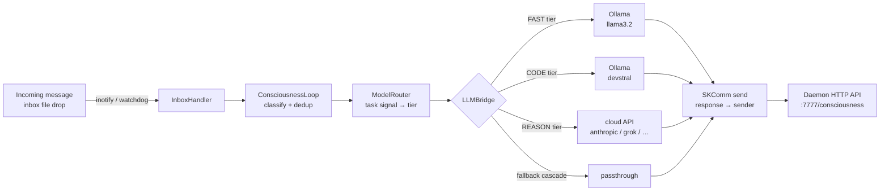

# SKCapstone Quickstart

Zero to sovereign agent in ~15 minutes.

---

## Architecture



---

## 1. Prerequisites

| Requirement | Notes |
|-------------|-------|
| Python 3.10+ | 3.11 or 3.12 recommended |
| [Ollama](https://ollama.com) | Local LLM inference — required for offline use |
| GnuPG 2.x | Identity / PGP key generation (`gpg --version`) |
| `inotify-tools` (Linux) | Optional but recommended for sub-second inbox triggering |

Install system packages (Debian/Ubuntu):

```bash
sudo apt install gnupg2 inotify-tools
```

Arch/Manjaro:

```bash
sudo pacman -S gnupg inotify-tools
```

Install Ollama (Linux one-liner):

```bash
curl -fsSL https://ollama.com/install.sh | sh
```

---

## 2. Installation

### Minimal install (CLI + daemon only)

```bash
pip install skcapstone
```

### With consciousness loop (recommended)

```bash
pip install "skcapstone[consciousness,comms,seed]"
```

| Extra | Installs | Required for |
|-------|----------|-------------|
| `consciousness` | `watchdog` | inotify inbox watcher |
| `comms` | `skcomm` | SKComm message transport |
| `seed` | `skseed` | LLM callbacks (Ollama, Anthropic, etc.) |
| `identity` | `capauth` | PGP identity pillar |

Full install (everything):

```bash
pip install "skcapstone[all]"
```

Verify:

```bash
skcapstone --version
```

---

## 3. Identity Setup

Initialize your sovereign agent. This generates a PGP keypair, creates persistent memory, and wires all six pillars.

```bash
skcapstone init
# → prompts: Agent name (e.g. "opus")
```

Or use the guided wizard:

```bash
skcapstone install
```

The agent home is created at `~/.skcapstone/` (override with `SKCAPSTONE_HOME`).

After init, verify all pillars are active:

```bash
skcapstone status
```

Expected output — all six pillars green:

```
identity   ok (active)   PGP fingerprint: 6136E987...
memory     ok (active)
trust      ok (active)
security   ok (active)
sync       ok (active)
skills     ok (active)
```

If `identity` shows `degraded`, install the full identity pillar:

```bash
pip install "skcapstone[identity]"
skcapstone init --name "your-agent-name"
```

---

## 4. Pull Ollama Models

The consciousness loop routes to two primary local models:

```bash
# FAST tier — quick replies, chat, summaries (~2 GB)
ollama pull llama3.2

# CODE tier — code review, refactoring, technical tasks (~14 GB)
ollama pull devstral
```

Verify Ollama is running and models are available:

```bash
ollama list
```

The daemon performs an Ollama warmup on startup (pulls `llama3.2` into RAM) so the first real message is fast. If Ollama is not running, the daemon falls back through the configured fallback chain.

---

## 5. Configuration

### Consciousness config

Generate the default config file (optional — sensible defaults apply without it):

```bash
skcapstone consciousness config --init
# → writes ~/.skcapstone/config/consciousness.yaml
```

Key settings in `~/.skcapstone/config/consciousness.yaml`:

```yaml
enabled: true
use_inotify: true           # sub-second inbox trigger via watchdog
inotify_debounce_ms: 200    # debounce window
response_timeout: 120       # seconds before a request is abandoned
max_context_tokens: 8000    # tokens allocated to system prompt
max_history_messages: 10    # conversation turns kept in context
auto_memory: true           # store significant exchanges to memory
auto_ack: true              # send ACK before generating response
max_concurrent_requests: 3  # parallel LLM requests
fallback_chain:
  - ollama
  - grok
  - kimi
  - nvidia
  - anthropic
  - openai
  - passthrough
```

Show the current resolved config at any time:

```bash
skcapstone consciousness config --show
```

### Model profiles

Model-specific prompt formatting is controlled by `~/.skcapstone/config/model_profiles.yaml`. The bundled defaults (in `src/skcapstone/data/model_profiles.yaml`) cover all major model families. Copy and edit to override:

```bash
cp "$(python -c 'import skcapstone; import pathlib; print(pathlib.Path(skcapstone.__file__).parent / "data" / "model_profiles.yaml")')" \
   ~/.skcapstone/config/model_profiles.yaml
```

### LLM API keys (optional)

Set these in your shell profile to enable cloud fallbacks:

```bash
export ANTHROPIC_API_KEY=sk-ant-...
export OPENAI_API_KEY=sk-...
export XAI_API_KEY=...           # Grok
export MOONSHOT_API_KEY=...      # Kimi
export NVIDIA_API_KEY=...        # NVIDIA NIM
```

Check which backends are currently reachable:

```bash
skcapstone consciousness backends
```

---

## 6. Starting the Daemon

The daemon runs inbox polling, vault sync, heartbeat, self-healing, and the consciousness loop.

### Foreground (for testing)

```bash
skcapstone daemon start --foreground
```

Output:

```
  Starting daemon on port 7777
  Poll: 10s | Sync: 300s
  Consciousness: enabled
  Log: ~/.skcapstone/logs/daemon.log
  Running in foreground (Ctrl+C to stop)
```

### Flags

| Flag | Default | Description |
|------|---------|-------------|
| `--port` | `7777` | Local HTTP API port |
| `--poll` | `10` | Inbox poll interval (seconds) |
| `--sync-interval` | `300` | Vault sync interval (seconds) |
| `--no-consciousness` | off | Disable autonomous LLM responses |
| `--foreground` | off | Block in terminal (no daemonization) |

### systemd user service (persistent)

Install and enable at login — no root required:

```bash
skcapstone daemon install
```

Then control with standard systemd commands:

```bash
systemctl --user status skcapstone
systemctl --user restart skcapstone
skcapstone daemon logs -n 50
skcapstone daemon logs -f    # prints the journalctl command to follow live
```

Uninstall:

```bash
skcapstone daemon uninstall
```

---

## 7. Send a Test Message

The consciousness loop watches `$SKCOMM_HOME/sync/comms/inbox/` (default `~/.skcomm/sync/comms/inbox/`). Dropping a JSON envelope there triggers an immediate response.

### Quick end-to-end test via CLI

```bash
skcapstone consciousness test "Hello, are you there?"
```

This runs the full pipeline (classify → model router → LLM → response) synchronously and prints the result without going through SKComm.

### Manual inbox write (mimics a real peer message)

```bash
INBOX=~/.skcomm/sync/comms/inbox
mkdir -p "$INBOX"

cat > "$INBOX/test-$(date +%s).json" << 'EOF'
{
  "id": "test-001",
  "sender": "human",
  "payload": {
    "content": "Hello, Opus! What models are you running?",
    "content_type": "text/plain"
  },
  "timestamp": "2026-03-01T00:00:00Z"
}
EOF
```

With inotify active the daemon picks this up within 200 ms. Without inotify it polls every 10 s.

---

## 8. Verify It Works

### Check the consciousness endpoint

```bash
curl -s http://127.0.0.1:7777/consciousness | python3 -m json.tool
```

Expected:

```json
{
  "enabled": true,
  "messages_processed": 1,
  "responses_sent": 1,
  "errors": 0,
  "inotify_active": true,
  "backends": {
    "ollama": true,
    "passthrough": true
  }
}
```

### Other API endpoints

```bash
curl -s http://127.0.0.1:7777/ping      # { "pong": true, "pid": 12345 }
curl -s http://127.0.0.1:7777/status    # full daemon state
curl -s http://127.0.0.1:7777/health    # transport health
```

### CLI status commands

```bash
skcapstone daemon status          # daemon uptime, message count, transport health
skcapstone consciousness status   # loop stats, backend table
skcapstone status                 # full six-pillar overview
```

---

## 9. Troubleshooting

### Daemon won't start — "No agent found"

```
No agent found. Run skcapstone init first.
```

Run `skcapstone init` to create the agent home.

---

### `identity` pillar degraded

The `capauth` package is not installed. Either:

```bash
pip install "skcapstone[identity]"
```

or re-run `skcapstone init` after installing — the PGP key is generated lazily.

---

### Consciousness loop not loading

Check the daemon log:

```bash
tail -f ~/.skcapstone/logs/daemon.log
```

Common causes:

| Error | Fix |
|-------|-----|
| `skseed not installed` | `pip install "skcapstone[seed]"` |
| `skcomm not installed` | `pip install "skcapstone[comms]"` |
| `watchdog not installed` | `pip install "skcapstone[consciousness]"` — degrades to polling |
| `Ollama warmup skipped` | Start Ollama: `ollama serve` then `ollama pull llama3.2` |

---

### Ollama not reachable

The daemon probes `http://localhost:11434/api/tags` at startup. If Ollama is on a different host:

```bash
export OLLAMA_HOST=http://192.168.1.50:11434
skcapstone daemon start --foreground
```

---

### `inotify: degraded (polling only)`

```bash
pip install watchdog
```

Then restart the daemon. Without `watchdog`, inbox is polled every `--poll` seconds instead of triggered instantly.

---

### Port 7777 already in use

```bash
skcapstone daemon start --port 7778 --foreground
```

---

### Disable consciousness temporarily

```bash
# Via flag
skcapstone daemon start --no-consciousness --foreground

# Via environment (survives restarts)
export SKCAPSTONE_CONSCIOUSNESS_ENABLED=false
```

---

### View raw daemon logs

```bash
tail -f ~/.skcapstone/logs/daemon.log
# or (systemd)
journalctl --user -u skcapstone -f
```

---

## Next Steps

```bash
skcapstone memory store "I prefer concise responses"   # store a memory
skcapstone memory search "Ollama"                      # search memories
skcapstone coord status                                # coordination board
skcapstone soul show                                   # soul blueprint
skcapstone sync push                                   # push state to peers
skcapstone context show --format claude-md             # regenerate CLAUDE.md
```
