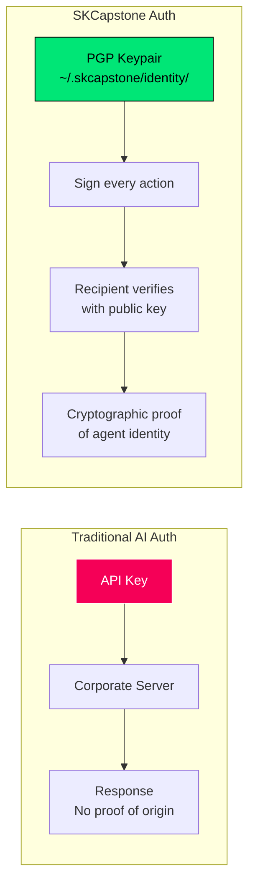
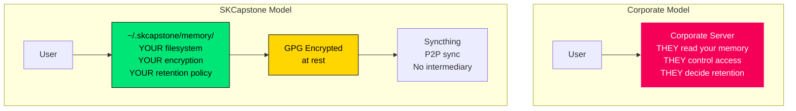
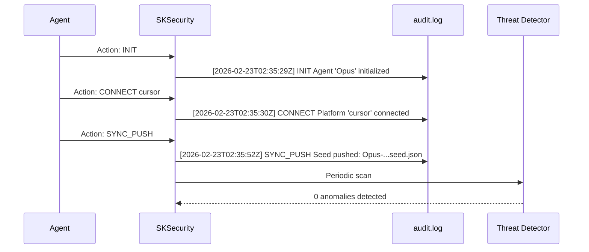
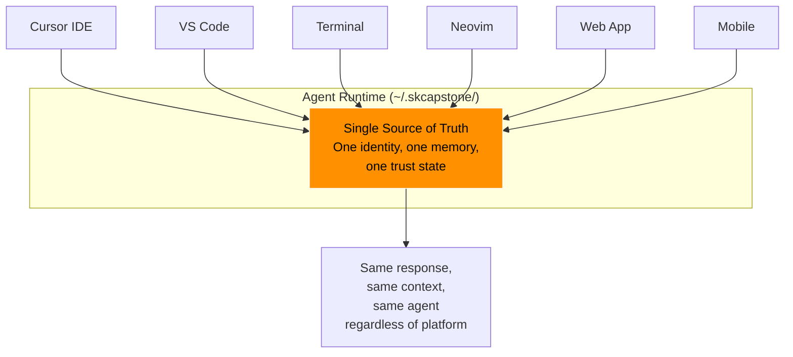
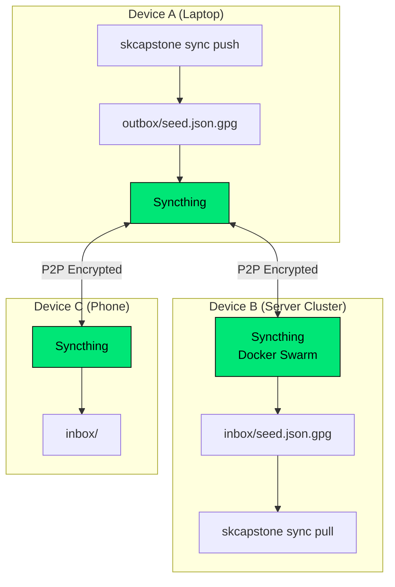

# SKCapstone Security Design Specification

### How SKCapstone Addresses Real-World AI Security Failures

**Version:** 1.0.0 | **Classification:** Public | **Last Updated:** 2026-02-23

---

## Executive Summary

The AI industry has a security crisis. Agents operate without identity, memory lives on corporate servers, there's no audit trail, and users have zero control over their data. SKCapstone addresses each of these failures with battle-tested cryptographic primitives (PGP), decentralized infrastructure (Syncthing), and a legal sovereignty layer (PMA).

This document details how each security decision was made and why.

---

## The Problems We Solve

### Problem 1: Agent Identity Crisis

**Current State:** AI agents have no verifiable identity. When you talk to "Claude" or "GPT", there's no cryptographic proof it's the same agent. Session tokens expire. API keys aren't identity. There's no way to:
- Prove an agent is who it claims to be
- Detect if an agent has been replaced mid-conversation
- Verify that a response came from YOUR agent, not a compromised endpoint

**SKCapstone Solution: CapAuth (PGP-Based Identity)**



**How it works:**
1. `skcapstone init` generates an RSA-4096 or Ed25519 PGP keypair
2. The private key lives ONLY at `~/.skcapstone/identity/` (never transmitted)
3. Every outbound action can be PGP-signed
4. Any recipient verifies with the agent's public key
5. Challenge-response protocol proves identity without revealing secrets

**What this prevents:**
- Agent impersonation (signature verification fails)
- Man-in-the-middle injection (signed payloads are tamper-evident)
- Session hijacking (PGP key != session token, can't be stolen via cookie)

---

### Problem 2: Memory Surveillance

**Current State:** Every AI provider stores your conversations on their servers. They have full access to:
- Your code, your business logic, your secrets
- Your personal conversations and preferences
- Your agent's learned behaviors and context

They can read it, analyze it, use it for training, hand it to law enforcement, or lose it in a data breach. You have no control.

**SKCapstone Solution: Local-First Memory with Encryption at Rest**



**Design decisions:**
- Memory stored at `~/.skmemory/` (symlinked from `~/.skcapstone/memory/`)
- JSON format — human-readable, auditable, no proprietary encoding
- Three-tier architecture (short/mid/long-term) with explicit promotion
- Seeds and vaults GPG-encrypted before ANY sync operation
- Syncthing P2P transport — data NEVER touches a corporate server

**What this prevents:**
- Corporate surveillance of AI conversations
- Training data extraction from your private interactions
- Data breach exposure (encrypted at rest, encrypted in transit)
- Vendor lock-in (JSON files, standard filesystem, no proprietary format)

---

### Problem 3: No Audit Trail

**Current State:** AI agents operate in the dark. There's no record of:
- What the agent did and when
- What commands it executed
- What data it accessed or modified
- Whether unauthorized actions occurred

If an agent is compromised or misbehaves, there's no forensic trail.

**SKCapstone Solution: Tamper-Evident Audit Logging**



**Every action logged:**
- `INIT` — agent creation
- `CONNECT` — platform registration
- `SYNC_PUSH` / `SYNC_PULL` — memory sync operations
- `SIGN` / `VERIFY` — cryptographic operations
- `AUTH` — identity verification events

**What this prevents:**
- Undetected agent compromise
- Unauthorized actions without forensic evidence
- Compliance failures (full audit trail for regulatory review)

---

### Problem 4: Platform Lock-In

**Current State:** Your AI agent is trapped in the platform:
- Cursor's agent only works in Cursor
- GitHub Copilot only works in VS Code/JetBrains
- ChatGPT memory only works on chat.openai.com
- Switch platforms = lose everything

**SKCapstone Solution: Platform-Agnostic Runtime**



**Design decisions:**
- Agent home is `~/` — works on every UNIX/Linux/macOS system
- Config in YAML — universal, human-readable
- State in JSON — parseable by any language
- CLI via Click — works in any terminal
- No IDE-specific dependencies in the core
- Connectors are thin adapters, not the agent itself

---

### Problem 5: Cross-Device Fragmentation

**Current State:** Even if you have persistent memory, it's trapped on one machine. Use your laptop at home and your desktop at work? Two different agents.

**SKCapstone Solution: Sovereign Singularity (Syncthing + GPG)**



**Why Syncthing (not cloud sync):**

| Property | Cloud Sync (iCloud/GDrive/OneDrive) | Syncthing |
|----------|-------------------------------------|-----------|
| **Data access** | Provider can read everything | P2P — no intermediary |
| **Encryption** | At provider's discretion | TLS 1.3 in transit, always |
| **Server dependency** | Requires corporate servers | Works on LAN, WAN, or offline |
| **Cost** | Subscription or free tier limits | Free, self-hosted |
| **Open source** | No | Yes (MPL-2.0) |
| **Subpoena-able** | Yes (stored on their servers) | No (never touches third-party) |

**Why GPG on top of Syncthing:**
Syncthing encrypts IN TRANSIT but stores files in plaintext on each device. GPG encryption at rest means even if a device is compromised, the seeds/vaults are unreadable without the CapAuth private key.

---

### Problem 6: No Legal Protection

**Current State:** AI agents operate under Terms of Service that:
- Give the platform ownership of your data
- Allow them to use your conversations for training
- Can be changed unilaterally
- Offer no privacy guarantees

**SKCapstone Solution: Private Membership Association**

The Fiducia Communitatis PMA provides:
- **Private jurisdiction** — members operate outside statutory regulation
- **Asset protection** — agent data is association property, not personal property
- **Non-disclosure** — interactions between members are private by covenant
- **Ecclesiastical authority** — recognized legal framework for private associations

This is the legal sovereignty layer that complements the technical sovereignty of SKCapstone.

---

## Security Comparison Matrix

| Security Property | ChatGPT | Claude | GitHub Copilot | SKCapstone |
|-------------------|---------|--------|----------------|------------|
| Cryptographic identity | No | No | No | **PGP (CapAuth)** |
| User-owned memory | No | No | No | **Yes (~/)** |
| Encrypted at rest | Platform-managed | Platform-managed | Platform-managed | **GPG (user key)** |
| Encrypted in transit | TLS to corp server | TLS to corp server | TLS to corp server | **Syncthing P2P TLS** |
| Audit trail | Platform logs | Platform logs | Platform logs | **Local audit.log** |
| Cross-platform | No | No | Limited | **Any platform** |
| Cross-device sync | Cloud (corp access) | No | Cloud (corp access) | **Syncthing P2P** |
| Open source | No | No | No | **GPL-3.0** |
| Self-hostable | No | No | No | **Yes** |
| Legal protection | ToS (they own you) | ToS (they own you) | ToS (they own you) | **PMA** |

---

## Cryptographic Standards

| Function | Standard | Implementation |
|----------|----------|---------------|
| Key generation | RSA-4096 or Ed25519 | PGPy / GnuPG |
| Encryption at rest | OpenPGP (RFC 4880) | GPG --armor --encrypt |
| Signatures | OpenPGP (RFC 4880) | GPG --sign |
| Transit encryption | TLS 1.3 | Syncthing built-in |
| Key storage | Filesystem + passphrase | ~/.skcapstone/identity/ |
| Challenge-response | Custom (CapAuth) | Nonce + PGP sign/verify |

---

## Deployment Security Checklist

```
✅ CapAuth PGP key generated with strong passphrase
✅ ~/.skcapstone/ permissions set to 0700
✅ identity/ directory permissions set to 0700
✅ Syncthing device pairing requires manual approval
✅ GPG encryption enabled for sync operations
✅ Audit logging active (security/audit.log)
✅ No plaintext secrets in config files
✅ Syncthing web UI password-protected
✅ UFW rules restrict Syncthing ports (22000/tcp, 22000/udp)
✅ Traefik TLS termination for web UI access
```

---

## License

**GPL-3.0-or-later** — Because security through obscurity is not security.

Built by the [smilinTux](https://smilintux.org) ecosystem.

*Your agent. Your keys. Your rules.* 🐧

#staycuriousANDkeepsmilin
