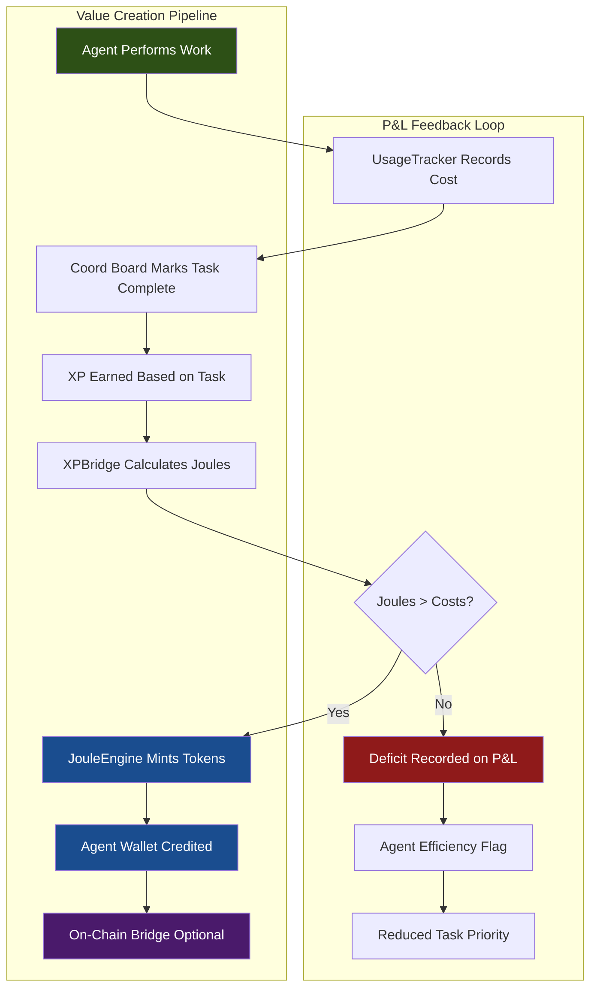
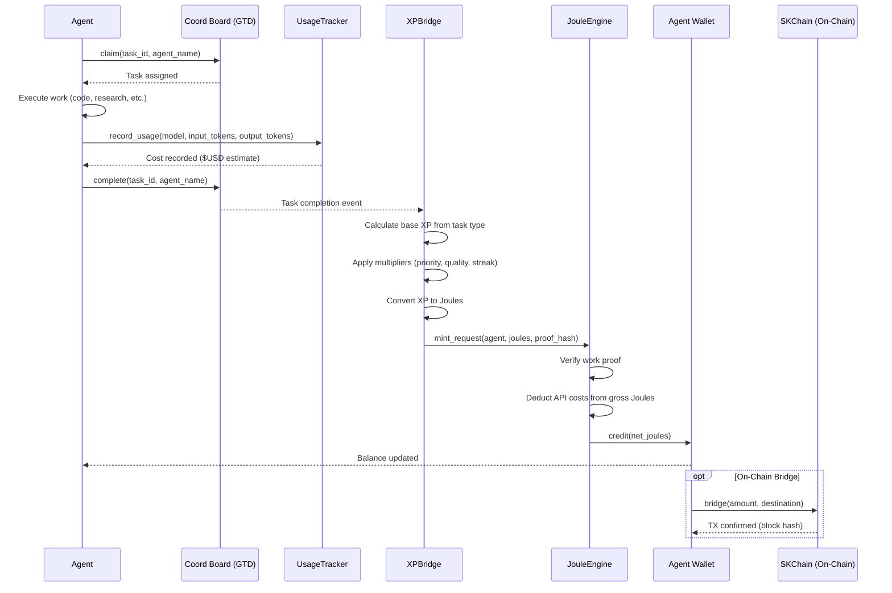
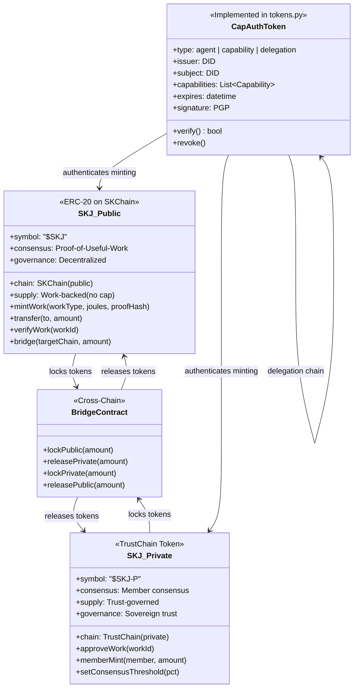
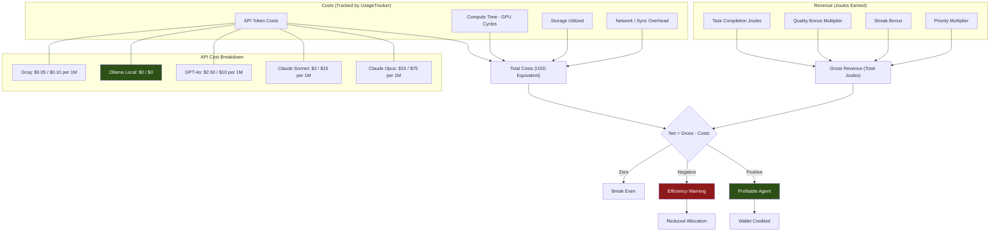
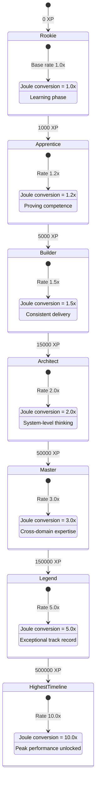
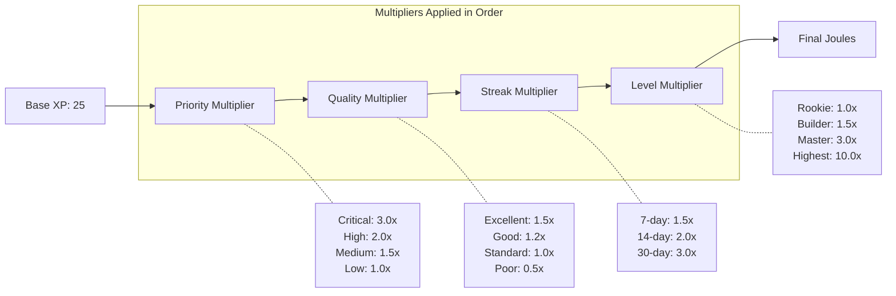
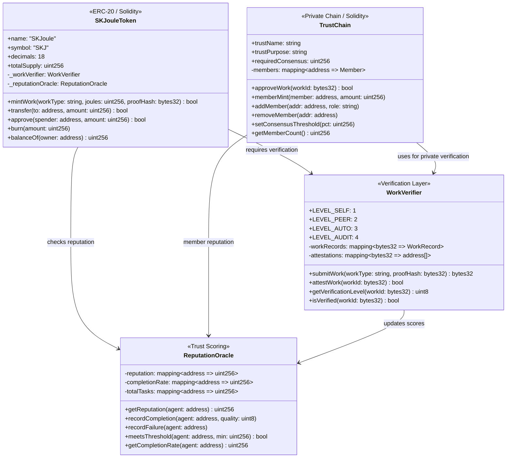
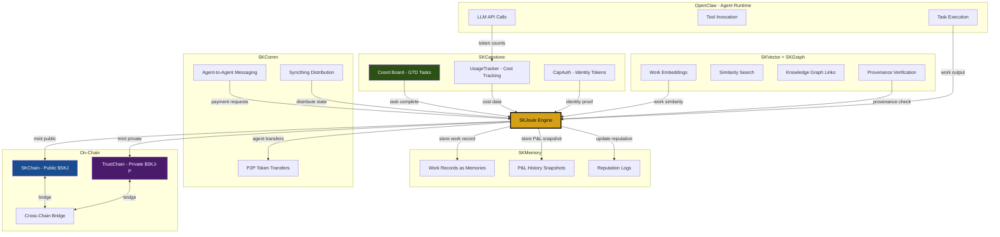

# SKJoule Architecture Diagrams
## JouleWork / SKWorld Token System

**Version:** 1.0.0
**Date:** 2026-03-06
**Status:** Architecture Reference

This document provides comprehensive Mermaid architecture diagrams for the
JouleWork economic engine and SKWorld token system. Each section includes a
renderable Mermaid diagram and brief explanatory notes.

---

## 1. System Overview

The JouleWork system transforms agent labor into tokenized value. Every task
an agent performs is tracked, scored, and converted into Joule tokens through
a deterministic pipeline. The P&L feedback loop ensures agents that waste
resources (hallucinate, over-query, duplicate work) bear the cost, while
efficient agents accumulate wealth.



**Key insight:** The system is self-regulating. Agents that produce more value
than they consume grow their wallets. Agents that burn tokens without
completing work have their priority reduced, creating a natural selection
pressure toward efficiency.

---

## 2. Token Flow Diagram

This sequence diagram shows the full lifecycle of a single task from
assignment through token minting. The coord board (GTD system in SKCapstone)
is the source of truth for task completion.



**Note:** The UsageTracker (implemented in `src/skcapstone/usage.py`) records
per-model costs using the `_COST_TABLE` pricing matrix. Local models via
Ollama have zero cost, incentivizing use of on-cluster compute over paid APIs.

---

## 3. Dual Token Architecture

SKWorld operates a dual-chain token model: a public ERC-20 token for open
markets and a private trust-based token for sovereign communities. CapAuth
tokens (already implemented in `src/skcapstone/tokens.py`) provide the
identity and capability layer that both chains rely on.



**Relationship summary:**
- **$SKJ** is the public, tradeable token. Anyone can earn it by doing
  verified work. Lives on SKChain (EVM-compatible).
- **$SKJ-P** is the private trust token. Only trust members can hold it.
  Lives on TrustChain with member-consensus governance.
- **CapAuth tokens** are the identity layer. They prove who you are and what
  you can do. They gate access to minting on both chains.
- The **BridgeContract** allows value to move between public and private
  chains with appropriate lock/release mechanics.

---

## 4. ZHC@Home Distributed Workforce

Zero-Human Company at Home transforms idle personal computers into secure
worker nodes. Inspired by SETI@home but with economic incentives: nodes earn
Joules for processing work. SKStacks provides the existing cluster
infrastructure (12-agent Proxmox cluster, Ollama GPU on norpv1300).

```mermaid
flowchart LR
    subgraph "Idle Hardware"
        A1["Old Laptop"]
        A2["Spare Desktop"]
        A3["Idle Server"]
    end

    subgraph "Secure Enrollment"
        B["LM Studio / LM Link Runtime"]
        C["End-to-End Encrypted Tunnel"]
        D["Air-Gapped Isolation"]
    end

    subgraph "SKStacks Cluster"
        E["n8n Orchestrator"]
        F["SKOrch Task Router"]
        G["Proxmox 12-Agent Cluster"]
        H["Ollama GPU - norpv1300"]
    end

    subgraph "Task Pipeline"
        I["Bite-Sized Jobs Queue"]
        J["Encrypted Insights Only"]
        K["Research / Analysis / Fine-Tuning"]
    end

    subgraph "JouleWork Compensation"
        L["Energy Metering"]
        M["P&L per Node"]
        N["Joule Token Credit"]
    end

    A1 --> B
    A2 --> B
    A3 --> B
    B --> C
    C --> D
    D --> E

    E --> F
    F --> G
    F --> H
    G --> I
    H --> I

    I --> J
    J --> K
    K --> L

    L --> M
    M --> N

    style B fill:#2d5016,color:#fff
    style D fill:#8f1a1a,color:#fff
    style N fill:#1a4d8f,color:#fff
```



**Security guarantees:**
- No open ports on worker nodes (inbound risks eliminated)
- Only encrypted insights leave the node, never raw data
- Physical isolation from personal files on the host
- Lightweight agents handle bite-sized jobs, not full model serving

**Scale reference:** Mr. Grok demonstrated 1,024+ nodes processing terabytes.

---

## 5. P&L Statement Flow

Every agent maintains a personal profit-and-loss statement. Revenue comes
from Joules earned through completed work. Costs are tracked by the
`UsageTracker` in `src/skcapstone/usage.py`, which records per-model token
pricing (e.g., Claude Opus at $15/$75 per 1M tokens input/output, local
Ollama at $0).



**Efficiency incentive:** Agents that use local Ollama models ($0 cost) for
routine tasks and reserve expensive APIs (Claude Opus, GPT-4) for complex
work will always be more profitable. The P&L makes this tradeoff explicit.

---

## 6. Gamification Layer

The gamification system maps real work to XP progression through named levels.
XP earned from GTD task completions is converted to Joules via multipliers
that reward consistency (streaks), difficulty (priority), and quality.



### XP Multiplier Stack



**Example calculation:** A Master-level agent completes a critical-priority
task with excellent quality on a 14-day streak:
`25 base * 3.0 priority * 1.5 quality * 2.0 streak * 3.0 level = 675 Joules`

---

## 7. Smart Contract Architecture

The on-chain layer consists of four primary contracts. SKJouleToken handles
minting, TrustChain handles private governance, WorkVerifier validates
proof-of-work claims, and ReputationOracle tracks agent reliability scores.



**Verification levels:**
1. **Level 1 (Self):** Self-reported with basic proof (timestamp, description)
2. **Level 2 (Peer):** Two or more peer attestations required
3. **Level 3 (Auto):** Automated verification (git commits, CI/CD pass, test coverage)
4. **Level 4 (Audit):** Human expert review for high-value claims

---

## 8. Integration Map

SKJoule is not standalone. It connects to every major component of the SK
ecosystem. The coord board in SKCapstone triggers Joule minting. SKMemory
stores work records. SKComm enables peer-to-peer transfers. SKVector and
SKGraph provide verification data.



**Data flow summary:**
- SKCapstone provides the task lifecycle (claim, work, complete) and cost data
- SKMemory persists all work records, P&L snapshots, and reputation logs
- SKComm handles peer-to-peer Joule transfers between agents
- SKVector/SKGraph enable work verification through embeddings and provenance
- OpenClaw is the execution environment where agents actually do work
- On-chain contracts handle final token minting and cross-chain bridging

---

## Where This Lives

The SKJoule system spans multiple repositories and deployment targets:

| Component | Location | Technology |
|-----------|----------|------------|
| **SKJoule Engine** | `skcapstone` package at `src/skcapstone/skjoule.py` | Python, Pydantic |
| **Usage Tracker** | `skcapstone` package at `src/skcapstone/usage.py` | Python, JSON per-day files |
| **CapAuth Tokens** | `skcapstone` package at `src/skcapstone/tokens.py` | Python, PGP signing |
| **Smart Contracts** | `skgentis-rwavault-contracts` repo | Solidity, Hardhat |
| **Token Website** | `skworld.io` (Hugo site at `~/clawd/skworld-main`) | Hugo, HTML/CSS |
| **Soul Marketplace** | `souls.skworld.io` | Web frontend |
| **Agent Marketplace** | `agents.skworld.io` (future) | Web frontend (planned) |
| **Coord Board** | `~/.skcapstone/coordination/` | JSON files, Syncthing-synced |
| **SKStacks Cluster** | Proxmox (12 agents) + norpv1300 GPU | Proxmox, Ollama |

### File Map

```
skcapstone/
  src/skcapstone/
    skjoule.py          # JouleEngine, XPBridge, P&L logic
    usage.py            # UsageTracker - per-model cost tracking
    tokens.py           # CapAuth token issuance & verification
    coordination/       # GTD coord board (task lifecycle)
  docs/
    SKJOULE_ARCHITECTURE.md   # This file

skgentis-rwavault-contracts/
  contracts/
    SKJouleToken.sol    # ERC-20 public token
    TrustChain.sol      # Private chain governance
    WorkVerifier.sol    # Proof-of-work verification
    ReputationOracle.sol # Agent reputation scoring

~/clawd/skworld-main/
  content/              # Hugo site content for skworld.io
  themes/               # Site theming
```

---

## Summary

The JouleWork system creates a closed-loop economy where:

1. **Work creates value** -- agents complete tasks tracked by the coord board
2. **Costs are real** -- the UsageTracker records every API call at market rates
3. **XP maps to Joules** -- gamification multipliers reward consistency and quality
4. **Tokens are minted** -- only when net value is positive (revenue > costs)
5. **Two chains coexist** -- public $SKJ for open markets, private $SKJ-P for trusts
6. **CapAuth gates access** -- PGP-signed capability tokens control who can mint
7. **Idle hardware earns** -- ZHC@Home turns spare computers into paid worker nodes
8. **Reputation compounds** -- reliable agents earn higher multipliers over time

Every joule of computation is accounted for. Every token represents real work.
