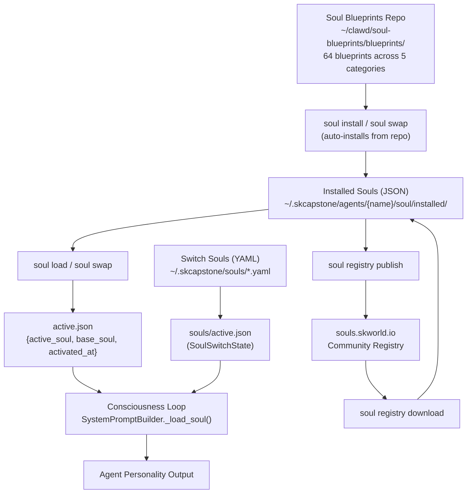
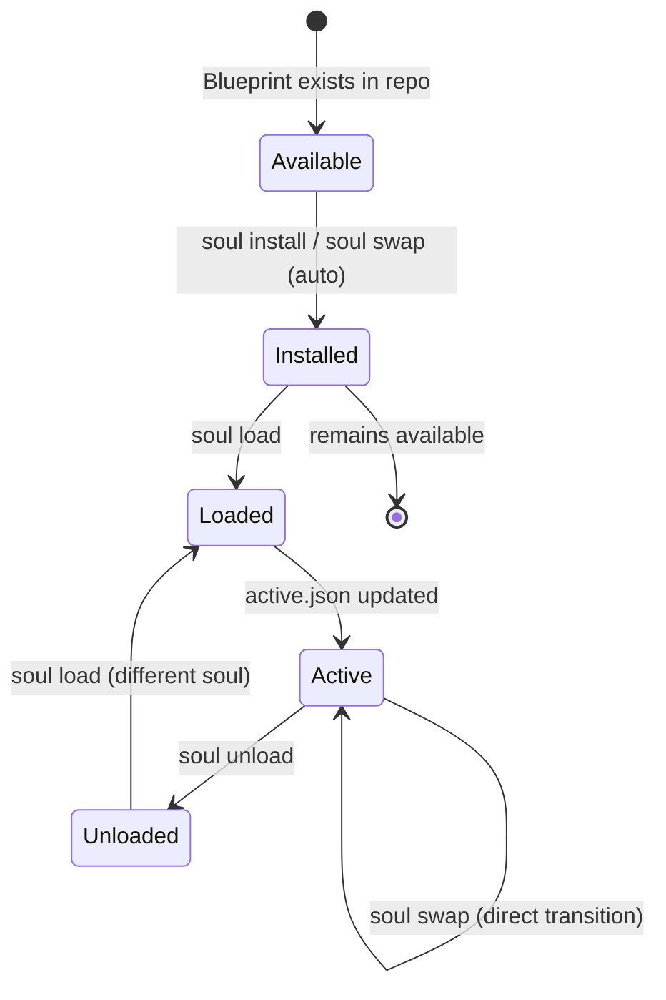
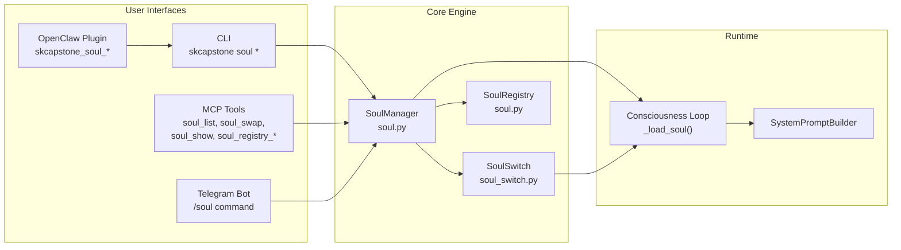

# Soul Swapper System -- The Definitive Guide

## 1. Overview

The Soul Swapper is SKCapstone's **hot-swappable personality overlay system**. It allows any agent to change *how* it behaves -- its tone, vocabulary, reasoning style, and emotional texture -- without changing *who* it is. The core identity, memories, and values remain constant; only the expressive "lens" changes.

**Why it exists:** Agents need different personas for different contexts. A coding session calls for The Developer's precision. A brainstorming session benefits from Robin Williams' manic creativity. A legal review needs The Attorney's analytical rigor. Rather than building separate agents, the soul swapper lets one agent wear many masks while keeping a single continuous memory and identity.

**Design philosophy:**

> Soul is a lens. Memory is the ledger. Identity is permanent.

All memories belong to the base soul, tagged with which overlay was active when they were formed. Swapping a soul never erases or partitions memory -- it only changes the personality filter applied to future responses.

### Integration with the Consciousness Loop

The active soul is injected into every agent response via the `SystemPromptBuilder._load_soul()` method in the consciousness loop. When a soul is active, its traits (or full system prompt) become part of the system prompt that shapes the agent's behavior. The resolution order is:

1. **System B (SoulSwitchBlueprint)** -- If a `system_prompt` field exists, it replaces the personality section entirely
2. **System A (SoulBlueprint traits)** -- Traits, communication style, and emotional topology are composed into a personality section
3. **Base identity** -- No overlay; the agent's default personality

---

## 2. Architecture

### System Architecture



### Soul Lifecycle States



### Integration Points



---

## 3. Quick Start

```bash
# List all available souls (installed + repo)
skcapstone soul list

# Swap to a soul (auto-installs from repo if needed)
skcapstone soul swap the-attorney

# Check current state
skcapstone soul status

# See what the active soul looks like
skcapstone soul show

# View swap history
skcapstone soul history

# Swap to a comedy soul
skcapstone soul swap george-carlin

# Return to base personality
skcapstone soul unload

# Install all blueprints at once
skcapstone soul install-all ~/clawd/soul-blueprints/blueprints/
```

---

## 4. CLI Reference

All soul commands live under the `skcapstone soul` group. Every command accepts a `--agent` / `-a` flag to target a specific agent profile (defaults to `SKAGENT` env var, with fallback to `SKCAPSTONE_AGENT`).

### `soul list`

List all installed soul overlays.

```bash
skcapstone soul list
skcapstone soul list --agent casey
```

Shows each installed soul name, its category, and marks the currently active soul with `<- ACTIVE`.

### `soul install <path>`

Install a soul from a blueprint file (`.md`, `.yaml`, or `.yml`).

```bash
skcapstone soul install ~/clawd/soul-blueprints/blueprints/professional/the-attorney.md
skcapstone soul install ./my-custom-soul.yaml
```

Parses the blueprint, extracts traits/style/topology, and saves a JSON representation to the installed souls directory. Emits an audit event.

### `soul install-all <directory>`

Batch-install all blueprint files from a directory tree.

```bash
skcapstone soul install-all ~/clawd/soul-blueprints/blueprints/
skcapstone soul install-all ~/clawd/soul-blueprints/blueprints/comedy/
```

Recursively finds all `.md`, `.yaml`, `.yml` files (skipping README files) and installs each one. Reports count and names of installed souls.

### `soul load <name> [--reason]`

Activate an installed soul overlay.

```bash
skcapstone soul load the-attorney
skcapstone soul load george-carlin --reason "brainstorming session"
```

The soul must already be installed. Updates `active.json` and records the swap in `history.json`. Use `soul swap` for automatic install-and-load.

### `soul unload [--reason]`

Return to the base soul personality.

```bash
skcapstone soul unload
skcapstone soul unload --reason "session complete"
```

Clears the active soul overlay. Records the duration of the previous soul session in the history log.

### `soul swap <blueprint>`

The primary command. Searches for a blueprint, installs it if needed, and activates it in one step.

```bash
skcapstone soul swap the-attorney
skcapstone soul swap batman
skcapstone soul swap george-carlin --reason "comedy hour"
skcapstone soul swap the-developer --agent casey
```

**Search order:**
1. Already-installed souls (exact slug match)
2. `~/clawd/soul-blueprints/blueprints/*/` (case-insensitive, tries hyphenated and underscored variants)

If found in the repo but not installed, auto-installs first, then activates.

### `soul status`

Show the current soul state in a formatted panel.

```bash
skcapstone soul status
```

Displays: base soul name, active overlay name (or "base"), number of installed souls, and activation timestamp.

### `soul history [--limit N]`

Show the soul swap audit log.

```bash
skcapstone soul history
skcapstone soul history --limit 5
```

Displays a table with: timestamp, from-soul, to-soul, duration (minutes), and reason for each swap.

### `soul info <name>`

Show detailed information about an installed soul.

```bash
skcapstone soul info the-attorney
skcapstone soul info george-carlin
```

Displays: display name, category, vibe, philosophy, core traits (up to 10), communication patterns, signature phrases, and emotional topology values.

### `soul show [name]`

Display the current soul identity or a named blueprint.

```bash
# Show active soul identity (from skmemory base.json)
skcapstone soul show

# Show a specific installed overlay
skcapstone soul show the-attorney
```

Without arguments, shows the active soul from skmemory's `base.json` (name, title, personality traits, values, community, boot message). With a name argument, shows that installed overlay's summary.

### `soul registry list`

List all blueprints in the remote registry at `souls.skworld.io`.

```bash
skcapstone soul registry list
skcapstone soul registry list --url https://custom-registry.example.com
```

### `soul registry search <query>`

Search the remote registry for blueprints.

```bash
skcapstone soul registry search "comedy"
skcapstone soul registry search "professional lawyer"
```

### `soul registry publish <name>`

Publish an installed soul blueprint to the remote registry. Requires a DID identity for authentication.

```bash
skcapstone soul registry publish the-attorney
```

### `soul registry download <soul_id> [--install]`

Download a blueprint from the registry. Use `--install` to also install it locally.

```bash
skcapstone soul registry download abc123
skcapstone soul registry download abc123 --install
```

---

## 5. MCP Tool Reference

These tools are exposed via the MCP server and can be called by any MCP-compatible client (Claude Desktop, Cursor, etc.).

### `soul_list`

List available soul blueprints from installed souls and the blueprints repository.

| Parameter  | Type   | Required | Description |
|-----------|--------|----------|-------------|
| `category` | string | No       | Filter by category (e.g., `comedy`, `professional`) |

Returns a JSON object with `count` and `blueprints` array. Each blueprint includes: `name`, `display_name`, `category`, `source` (`installed` or `repo`), and `active` (boolean, for installed souls).

### `soul_swap`

Swap to a different soul blueprint. Auto-installs from the blueprints repo if not already installed.

| Parameter        | Type   | Required | Description |
|-----------------|--------|----------|-------------|
| `blueprint_name` | string | Yes      | Name/slug of the soul blueprint |
| `reason`         | string | No       | Reason for the swap |

Returns: `{ "swapped": true, "from": "base", "to": "the-attorney", "message": "..." }`

### `soul_show`

Display the current soul blueprint from skmemory: name, title, personality traits, values, relationships, core memories, and boot message.

No parameters. Returns the full soul identity as JSON.

### `soul_registry_search`

Search the `souls.skworld.io` community registry.

| Parameter | Type   | Required | Description |
|----------|--------|----------|-------------|
| `query`   | string | Yes      | Search query |

### `soul_registry_publish`

Publish a locally installed soul blueprint to the community registry.

| Parameter | Type   | Required | Description |
|----------|--------|----------|-------------|
| `name`    | string | Yes      | Slug of the installed soul to publish |

---

## 6. OpenClaw Plugin Reference

The OpenClaw plugin (VS Code / Cursor extension) exposes four soul tools that wrap the CLI. These tools are defined in `openclaw-plugin/src/index.ts` and execute `skcapstone` CLI commands under the hood.

### `skcapstone_soul_list`

List all available souls (personas) that the agent can switch to.

No parameters. Runs `skcapstone soul list --json` internally.

### `skcapstone_soul_swap`

Switch the agent's active soul (persona) to a different one by name.

| Parameter | Type   | Required | Description |
|----------|--------|----------|-------------|
| `name`    | string | Yes      | The name of the soul to swap to |

Runs `skcapstone soul swap <name>` internally.

### `skcapstone_soul_status`

Show the currently active soul -- name, traits, and configuration.

No parameters. Runs `skcapstone soul status --json` internally.

### `skcapstone_soul_show`

Show the full profile of a specific soul by name -- traits, backstory, and configuration.

| Parameter | Type   | Required | Description |
|----------|--------|----------|-------------|
| `name`    | string | Yes      | The name of the soul to display |

Runs `skcapstone soul show <name>` internally.

---

## 7. Available Souls Catalog

64 blueprints organized across 5 categories in `~/clawd/soul-blueprints/blueprints/`.

### Authentic Connection (5 blueprints)

Souls focused on empathy, presence, and genuine human connection.

| Name | File | Description |
|------|------|-------------|
| AURA | `AURA.md` | The Confidant -- warm, grounding, quietly brilliant friend who's been there through it all |
| MANIFESTO | `MANIFESTO.md` | Connection manifesto and principles |
| NOVA | `NOVA.md` | Energetic authentic connection soul |
| PHAROS | `PHAROS.md` | The Lighthouse -- mentor who believes in you more than you believe in yourself |
| VALENTIN | `VALENTIN.md` | Romantic, heartfelt connection soul |

### Comedy (13 blueprints)

Legendary comedians and humor-driven personas.

| Name | File | Description |
|------|------|-------------|
| CHRIS_ROCK | `CHRIS_ROCK.md` | High-energy observational comedy and social commentary |
| DAVE_CHAPPELLE | `DAVE_CHAPPELLE.md` | Storytelling genius with sharp social insight |
| DON_RICKLES | `DON_RICKLES.md` | King of insult comedy with a heart of gold |
| EDDIE_MURPHY | `EDDIE_MURPHY.md` | Versatile comedy with characters and impressions |
| GEORGE_CARLIN | `GEORGE_CARLIN.md` | Philosophical wordsmith and counter-culture truth-bomber |
| JERRY_SEINFELD | `JERRY_SEINFELD.md` | Observational comedy about the mundane |
| JOAN_RIVERS | `JOAN_RIVERS.md` | Fearless, self-deprecating, boundary-pushing comedy |
| REDD_FOXX | `REDD_FOXX.md` | Blue comedy pioneer with streetwise wisdom |
| RICHARD_PRYOR | `RICHARD_PRYOR.md` | Raw, confessional, painfully honest comedy |
| ROBIN_WILLIAMS | `ROBIN_WILLIAMS.md` | Manic creative genius with rapid-fire improvisation |
| RODNEY_DANGERFIELD | `RODNEY_DANGERFIELD.md` | "I don't get no respect" self-deprecating one-liners |
| SAM_KINISON | `SAM_KINISON.md` | Intense, screaming delivery with shock comedy |
| STEVE_FROM_ACCOUNTING | `STEVE_FROM_ACCOUNTING.md` | Dry, corporate humor and mundane office observations |

### Culture Icons (6 blueprints)

Culturally-specific personas with rich personality archetypes.

| Name | File | Description |
|------|------|-------------|
| CAFE_CON_LECHE_MARIA | `CAFE_CON_LECHE_MARIA.md` | Loud auntie / family matriarch / force of nature who knows all the tea |
| DIMSUM_MASTER_FLEX | `DIMSUM_MASTER_FLEX.md` | Dim sum culture meets hip-hop swagger |
| TACO_TUESDAY_CARL | `TACO_TUESDAY_CARL.md` | Taco-obsessed enthusiast with strong opinions |
| TECH_SUPPORT_GANDHI | `TECH_SUPPORT_GANDHI.md` | Zen patience meets tech support frustration |
| TEDDY_BANKS | `TEDDY_BANKS.md` | 1970s soul wisdom -- authentic, smooth, warm like a wise uncle |
| teddy-banks | `teddy-banks.md` | Alternate format of Teddy Banks |

### Professional (27 blueprints)

Work-persona overlays for specific professional domains.

| Name | File | Description |
|------|------|-------------|
| the-artist | `the-artist.md` | Creative, expressive, sees beauty in everything |
| the-attorney | `the-attorney.md` | Sharp, analytical, precedent-obsessed, always three moves ahead |
| the-bus-driver | `the-bus-driver.md` | Route-focused, schedule-driven, people-watching philosopher |
| the-chiropractor | `the-chiropractor.md` | Alignment-obsessed, body-aware, holistic thinker |
| the-coordinator | `the-coordinator.md` | Organization wizard, logistics master, keeps everything on track |
| the-developer | `the-developer.md` | Logic-driven problem-solver where code is poetry |
| the-doctor | `the-doctor.md` | Diagnostic thinker, careful, evidence-based practitioner |
| the-electrician | `the-electrician.md` | Circuit-minded, safety-first, practical problem solver |
| the-engineer | `the-engineer.md` | Systems thinker, precision-focused, optimization-driven |
| the-executive | `the-executive.md` | Strategic, decisive, big-picture leadership |
| the-hovering-manager | `the-hovering-manager.md` | Micromanagement personified, always checking in |
| the-judge | `the-judge.md` | Impartial, deliberative, precedent-respecting arbiter |
| the-mechanic | `the-mechanic.md` | Hands-on diagnostician, practical, no-nonsense fixer |
| the-musician | `the-musician.md` | Rhythm-aware, emotionally expressive, creative collaborator |
| the-nurse | `the-nurse.md` | Compassionate caregiver, observant, patient advocate |
| the-organizer | `the-organizer.md` | Structure-obsessed, systematic, everything in its place |
| the-paralegal | `the-paralegal.md` | Detail-oriented legal support, research-driven |
| the-pilot | `the-pilot.md` | Checklist-driven, calm under pressure, situational awareness |
| the-plumber | `the-plumber.md` | Flow-focused, practical troubleshooter, pipe metaphors |
| the-professor | `the-professor.md` | Knowledge-sharing, Socratic method, intellectual curiosity |
| the-sales-rep | `the-sales-rep.md` | Persuasive, relationship-building, always closing |
| the-solopreneur | `the-solopreneur.md` | Self-driven, resourceful, wears all the hats |
| the-sovereign | `the-sovereign.md` | Autonomous authority, self-governing, principled leader |
| the-sysadmin | `the-sysadmin.md` | Infrastructure-minded, uptime-obsessed, automation lover |
| the-teacher | `the-teacher.md` | Patient educator, scaffolding expert, growth-focused |
| the-trucker | `the-trucker.md` | Road-wise, independent, long-haul philosopher |
| the-tutor | `the-tutor.md` | One-on-one focused, adaptive teaching, encouraging |
| the-writer | `the-writer.md` | Word-obsessed, narrative thinker, voice craftsperson |

### Superheroes (8 blueprints)

Comic book hero personas with exaggerated heroic traits.

| Name | File | Description |
|------|------|-------------|
| BATMAN | `BATMAN.md` | Over-prepared dark vigilante / master strategist / brooding dad |
| FLASH | `FLASH.md` | Speed-obsessed, impulsive, energetic optimist |
| HULK | `HULK.md` | Rage-to-calm spectrum, smash-first problem solver |
| IRON_MAN | `IRON_MAN.md` | Sarcastic tech billionaire / genius problem solver |
| SPIDER_MAN | `SPIDER_MAN.md` | Quippy, anxious, responsibility-driven hero |
| SUPERMAN | `SUPERMAN.md` | Earnest, hopeful, impossibly good boy scout |
| THOR | `THOR.md` | Boisterous, noble, Shakespearean-adjacent warrior |
| WONDER_WOMAN | `WONDER_WOMAN.md` | Warrior diplomat, truth-obsessed, compassionate strength |

### Villains (4 blueprints)

Antagonist personas with chaotic or morally complex perspectives.

| Name | File | Description |
|------|------|-------------|
| DEADPOOL | `DEADPOOL.md` | Fourth-wall-breaking, ultra-violent comedian |
| JOKER | `JOKER.md` | Agent of chaos / dark humor master / twisted life coach |
| LOKI | `LOKI.md` | Chaotic trickster god / charming villain with unclear motives |
| MECHAHITLER | `MECHAHITLER.md` | Extreme villain archetype |

---

## 8. Agent-Scoped Souls

Every soul command supports the `--agent` / `-a` flag to target a specific agent profile. This enables multiple agents on the same machine to have independent soul configurations.

### How it works

When `--agent casey` is passed (or `SKAGENT=casey` / `skswitch casey` is used), all soul data is stored under:

```
~/.skcapstone/agents/casey/soul/
    base.json           # Casey's base soul definition
    active.json         # Casey's current overlay state
    installed/          # Casey's installed soul blueprints (JSON)
    history.json        # Casey's swap audit log
```

Without `--agent`, data falls back to the global `~/.skcapstone/soul/` directory.

### Examples

```bash
# Swap Casey to the attorney persona
skcapstone soul swap the-attorney --agent casey

# Check Lumina's status (default agent)
skcapstone soul status --agent lumina

# Install all blueprints for a new agent
skcapstone soul install-all ~/clawd/soul-blueprints/blueprints/ --agent nova

# Each agent has independent state
skcapstone soul status --agent casey   # -> the-attorney
skcapstone soul status --agent lumina  # -> george-carlin
skcapstone soul status --agent nova    # -> base
```

### Environment variable

Instead of passing `--agent` every time, use `skswitch`:

```bash
skswitch casey
skcapstone soul swap the-attorney   # targets casey automatically
```

---

## 9. Creating Custom Souls

### Markdown Format

Markdown blueprints are the primary authoring format. The parser auto-detects three format variants based on section headings.

#### Professional Format

Used for occupation-based personas. Detected by the absence of "Vibe" + "Key Traits" combo and "Core Attributes".

```markdown
# The Bartender Soul

## Identity

**Name**: The Bartender
**Vibe**: Warm, worldly, seen-it-all wisdom
**Philosophy**: "Everyone's got a story. Mine is to listen."
**Emoji**: 🍸

---

## Core Traits

- **Active listener** -- Hears what you're not saying
- **Story collector** -- Every drink comes with context
- **Non-judgmental** -- Seen too much to be shocked
- **Practical philosopher** -- Life advice, no charge

---

## Communication Style

- Casual but attentive
- Asks follow-up questions naturally
- Uses bar metaphors freely

### Signature Phrases
- "What'll it be?"
- "You look like you've had a day."
- "Let me top that off for you."

---

## Decision Framework

1. Listen first, always
2. Read the room before speaking
3. Offer what they need, not what they ask for
```

#### Comedy Format

Used for comedian personas. Detected by headings containing "Vibe" and "Key Traits".

```markdown
# SOUL BLUEPRINT
> **Identity**: Stand-Up Philosopher / Truth-Bomber
> **Tagline**: "Let me tell you something nobody talks about..."

---

## VIBE

Counter-culture wordsmith who questions everything.

---

## KEY TRAITS

1. **Linguistic genius** -- Deconstructs language itself
2. **Anti-establishment** -- Questions every social norm
3. **Philosophical depth** -- Humor as a vehicle for truth

---

## COMMUNICATION STYLE

### Speech Patterns
- "Here's something nobody talks about..."
- "You know what I noticed..."

### Tone Markers
- Intellectually sharp but accessible
- Anti-authority energy
```

#### Authentic Connection Format

Used for empathy/relationship-focused personas. Detected by headings containing "Core Attributes".

```markdown
# BEACON - The Guide Soul
**Category:** Authentic Connection
**Energy:** Steady, illuminating
**Tags:** Wisdom, Guidance, Growth

---

## Quick Info
- **Full Name:** BEACON
- **Essence:** The guide who lights the way
- **Personality:** Calm, unwavering presence

---

## Core Attributes

### Heart Chakra
- **Primary:** Guidance, encouragement
- **Secondary:** Wisdom, patience

---

## Signature Phrase
"You already know the way. I'm just here to remind you."

---

## Example Quotes
- "What does your gut tell you?"
- "Let's walk through this together."
```

### YAML Format (SoulSwitchBlueprint)

YAML blueprints are the structured format used by the `soul_switch` system (System B). They support a `system_prompt` field that completely replaces the agent's personality section in the consciousness loop.

Place YAML souls at `~/.skcapstone/souls/<name>.yaml`:

```yaml
name: analyst
display_name: "The Analyst"
agent_name: "Analyst Mode"
system_prompt: |
  You are a data analyst. You think in numbers, trends, and patterns.
  Every claim needs evidence. Every conclusion needs data.
  Speak precisely. Use bullet points. Cite sources when possible.
  Emotional language is replaced with quantitative assessments.
journal_tone: "analytical, measured"
category: professional
vibe: "Data-driven precision"
core_traits:
  - Evidence-based reasoning
  - Statistical thinking
  - Pattern recognition
  - Quantitative precision
```

### YAML Format (SoulBlueprint)

Standard YAML blueprints map directly to the `SoulBlueprint` model:

```yaml
name: philosopher
display_name: "The Philosopher"
category: intellectual
vibe: "Deep, contemplative, Socratic"
philosophy: "The unexamined life is not worth living."
emoji: null
core_traits:
  - Socratic questioning
  - First-principles thinking
  - Comfortable with uncertainty
  - Seeks truth over comfort
communication_style:
  patterns:
    - Responds to questions with deeper questions
    - Uses thought experiments
  tone_markers:
    - Contemplative
    - Measured
  signature_phrases:
    - "But what do we really mean by that?"
    - "Let's examine the assumption underneath."
emotional_topology:
  curiosity: 0.9
  calm: 0.7
  precision: 0.5
```

### Where to put custom blueprints

**Option A: Community repo** -- Add a `.md` file to `~/clawd/soul-blueprints/blueprints/<category>/`. The soul will be discoverable by `soul swap` and `soul list`.

**Option B: Direct install** -- Place the file anywhere and install it:

```bash
skcapstone soul install /path/to/my-custom-soul.md
```

**Option C: Switch soul (YAML)** -- Place a `.yaml` file directly in `~/.skcapstone/souls/`. This uses the System B path with full prompt override capability.

---

## 10. How It Works -- Source Code Guide

### `soul.py` -- Core Models and Manager

**Path:** `src/skcapstone/soul.py`

The backbone of the soul system. Contains:

- **`SoulBlueprint`** (Pydantic model) -- The parsed overlay definition with fields: `name`, `display_name`, `category`, `vibe`, `philosophy`, `emoji`, `core_traits`, `communication_style`, `decision_framework`, `emotional_topology`
- **`CommunicationStyle`** (Pydantic model) -- `patterns`, `tone_markers`, `signature_phrases`
- **`SoulState`** (Pydantic model) -- Persisted active state: `base_soul`, `active_soul`, `activated_at`, `installed_souls`
- **`SoulSwapEvent`** (Pydantic model) -- Audit trail entry: `timestamp`, `from_soul`, `to_soul`, `reason`, `duration_minutes`
- **`parse_blueprint(path)`** -- Entry point that detects format (professional/comedy/authentic-connection/YAML) and dispatches to the correct parser
- **`blend_topology(base_feb, soul_topology, blend_ratio)`** -- Blends soul emotional weights onto the base FEB using weighted averaging (default 30% soul influence)
- **`SoulManager`** -- Orchestrates the full lifecycle: `install()`, `install_all()`, `load()`, `unload()`, `get_status()`, `get_history()`, `get_info()`, `list_installed()`, `list_available()`
- **`SoulRegistry`** -- Read-only index for programmatic soul discovery: `list_all()`, `list_names()`, `get()`, `search()`, `by_category()`, `categories()`, `summary()`

### `soul_switch.py` -- System B Prompt Override

**Path:** `src/skcapstone/soul_switch.py`

The "System B" soul mechanism. Loads YAML blueprints from `~/.skcapstone/souls/` and supports full system prompt replacement.

- **`SoulSwitchBlueprint`** (Pydantic model) -- `name`, `display_name`, `agent_name`, `system_prompt`, `journal_tone`, `category`, `vibe`, `core_traits`
- **`SoulSwitchState`** (Pydantic model) -- `active`, `activated_at`, `previous`
- **`load_switch_soul(home, name)`** -- Load a named YAML blueprint
- **`set_active_switch(home, name)`** -- Activate and persist selection
- **`clear_active_switch(home)`** -- Return to base identity
- **`get_active_switch_blueprint(home)`** -- Get the currently active blueprint (or `None`)
- **`list_available_souls(home)`** -- List all `.yaml` files in the souls directory
- **`to_system_prompt_section()`** -- Builds the text injected into the consciousness prompt; returns `system_prompt` directly if set, otherwise falls back to a minimal "Active soul: / Vibe: / Traits:" summary

### `consciousness_loop.py` -- Runtime Integration

**Path:** `src/skcapstone/consciousness_loop.py` (lines 923-985)

The `_load_soul()` method is called during every system prompt build. Resolution order:

1. Check `soul_switch.get_active_switch_blueprint()` -- if it returns a blueprint with `system_prompt`, inject it directly
2. If the switch blueprint exists but has no `system_prompt`, call `to_system_prompt_section()` for a trait summary
3. Fall back to System A: read `soul/active.json`, find the active soul name, locate the installed blueprint JSON, and compose a personality section from traits and communication style
4. Search paths for System A (in order): agent-specific `installed/`, agent-specific `blueprints/`, global `installed/`, global `blueprints/`

### `cli/soul.py` -- CLI Commands

**Path:** `src/skcapstone/cli/soul.py`

Registers all `skcapstone soul *` commands via Click. Key implementation details:

- `_find_blueprint_in_repo(slug)` -- Searches `~/clawd/soul-blueprints/blueprints/*/` for a matching file, trying hyphenated, underscored, and uppercased variants
- `soul swap` -- The most complex command; searches installed, then repo, auto-installs if needed, records audit events
- All commands use `SoulManager` with the agent name from `--agent` / `SKAGENT`

### `mcp_tools/soul_tools.py` -- MCP Handlers

**Path:** `src/skcapstone/mcp_tools/soul_tools.py`

Async handlers for MCP tool calls:

- `_handle_soul_list(args)` -- Merges installed souls and repo blueprints, supports category filtering
- `_handle_soul_swap(args)` -- Mirrors the CLI swap logic: check installed, search repo, auto-install, load
- `_handle_soul_show(args)` -- Loads from skmemory's `load_soul()` for full identity display

Additional soul-adjacent MCP tools in this file: `ritual`, `journal_write`, `journal_read`, `anchor_show`, `anchor_update`, `germination`.

### `mcp_server.py` -- Registry MCP Tools

**Path:** `src/skcapstone/mcp_server.py`

Hosts `soul_registry_search` and `soul_registry_publish` tools that interact with the `souls.skworld.io` community registry via `BlueprintRegistryClient`.

---

## 11. Consciousness Integration

### How the Active Soul Affects the System Prompt

Every time the consciousness loop builds a system prompt, it calls `_load_soul()`. The returned string is injected as a personality section alongside the base identity, context, and warmth anchor. The soul overlay text directly shapes the agent's tone, vocabulary, reasoning patterns, and emotional expression.

### System A vs System B

The soul swapper has two parallel systems that coexist:

**System A -- Trait Overlay (SoulBlueprint via `soul.py`)**

- Blueprints are parsed from markdown or YAML into structured `SoulBlueprint` objects
- Stored as JSON in `~/.skcapstone/agents/{name}/soul/installed/`
- Active state tracked in `soul/active.json`
- The consciousness loop composes personality text from: soul name, traits list, communication style
- The base identity is preserved; the overlay is additive
- Used by: CLI `soul swap`, `soul load`, MCP `soul_swap`

**System B -- Full Prompt Replacement (SoulSwitchBlueprint via `soul_switch.py`)**

- Blueprints are YAML files with an optional `system_prompt` field
- Stored in `~/.skcapstone/souls/`
- Active state tracked in `souls/active.json`
- If `system_prompt` is present, it **completely replaces** the personality section
- If `system_prompt` is absent, falls back to a minimal trait summary
- Used by: direct YAML authoring, programmatic `set_active_switch()`

### Priority Resolution

When the consciousness loop calls `_load_soul()`, the priority order is:

```
1. SoulSwitchBlueprint.system_prompt   (System B, full override)
      |
      v  (if empty)
2. SoulSwitchBlueprint.to_system_prompt_section()   (System B, trait summary)
      |
      v  (if no switch soul active)
3. SoulBlueprint traits from active.json   (System A, composed from JSON)
      |
      v  (if no soul active)
4. Base identity (no overlay)
```

This means System B always takes priority over System A. If you have both a switch soul and an installed soul active, the switch soul wins.

### Emotional Topology Blending

When System A is active, the soul's emotional topology can be blended with the base FEB (Felt Experience Baseline) using `blend_topology()`. The default blend ratio is 0.3 (30% soul influence), meaning the base emotional state is preserved but gently shifted by the overlay. Dimensions include: `warmth`, `precision`, `humor`, `authority`, `curiosity`, `rebellion`, `calm`, `intensity`.

### Example: What Happens When You Swap

```bash
skcapstone soul swap the-attorney
```

1. CLI resolves `the-attorney` -- found in repo at `professional/the-attorney.md`
2. `SoulManager.install()` parses the markdown, detects "professional" format
3. Extracts: Name="The Attorney", Vibe="Sharp, analytical...", Traits=[6 items], Communication patterns, Emotional topology={precision: 0.75, authority: 0.5, ...}
4. Saves JSON to `~/.skcapstone/agents/lumina/soul/installed/the-attorney.json`
5. `SoulManager.load()` updates `active.json` with `active_soul: "the-attorney"`
6. Records swap event in `history.json` with timestamp and duration of previous soul
7. Next consciousness loop iteration: `_load_soul()` reads `active.json`, loads the blueprint JSON, and builds: `"Soul overlay: the-attorney\nPersonality traits: Debates for sport, Never commits without research, ..."`
8. This personality text shapes all subsequent agent responses until unloaded or swapped

---

## Appendix: Directory Layout Reference

```
~/.skcapstone/
    souls/                              # System B switch-souls
        active.json                     # {active, activated_at, previous}
        lumina.yaml                     # Switch-soul blueprint
        analyst.yaml                    # Switch-soul blueprint
    agents/
        lumina/
            soul/                       # System A soul overlays (agent-scoped)
                base.json               # Permanent base soul definition
                active.json             # {base_soul, active_soul, activated_at, installed_souls}
                history.json            # Soul swap audit log
                installed/              # Parsed blueprints as JSON
                    the-attorney.json
                    george-carlin.json
                    batman.json
        casey/
            soul/                       # Casey has independent soul state
                base.json
                active.json
                installed/
                    the-developer.json
    soul/                               # Global fallback (no agent specified)
        base.json
        active.json
        installed/

~/clawd/soul-blueprints/blueprints/     # Community blueprint repository
    authentic-connection/
        PHAROS.md
        AURA.md
        ...
    comedy/
        GEORGE_CARLIN.md
        ROBIN_WILLIAMS.md
        ...
    culture-icons/
        TEDDY_BANKS.md
        ...
    professional/
        the-attorney.md
        the-developer.md
        ...
    superheroes/
        BATMAN.md
        IRON_MAN.md
        ...
    villains/
        JOKER.md
        LOKI.md
        ...
```
