# SKCapstone Token System

### PGP-Signed Capability Tokens for Agent Authorization

**Version:** 1.0.0 | **Status:** Live | **Last Updated:** 2026-02-23

---

## Overview

SKCapstone tokens are self-contained, PGP-signed JSON payloads that grant specific permissions to agents, services, or platforms. They don't require a central authority, an OAuth server, or any online connectivity to verify.

The issuer signs with their CapAuth PGP key. Any holder verifies with the issuer's public key. No server, no API call, no internet — just math.

```mermaid
sequenceDiagram
    participant I as Issuer (Opus)
    participant PGP as CapAuth PGP Key
    participant T as Token
    participant V as Verifier (Jarvis)

    I->>PGP: Create token payload (JSON)
    PGP->>T: PGP detach-sign the payload
    I->>V: Send token (sync, file, API, etc.)
    V->>PGP: Verify signature against Opus's public key
    PGP-->>V: ✅ VALID — signed by Opus
    V->>T: Check: is_active? has_capability?
    T-->>V: ✅ Active, memory:read granted
```



---

## Token Types

| Type | Purpose | Example |
|------|---------|---------|
| **Agent** | Proves agent identity, broad access | "Jarvis is a trusted agent in this fleet" |
| **Capability** | Grants specific fine-grained permissions | "Read my memory, push to sync" |
| **Delegation** | Allows one agent to act on behalf of another | "Jarvis can issue tokens as Opus" |

---

## Capabilities

| Capability | Description |
|-----------|-------------|
| `memory:read` | Read agent memory store |
| `memory:write` | Write to agent memory |
| `sync:push` | Push seeds/vaults to sync mesh |
| `sync:pull` | Pull seeds/vaults from sync mesh |
| `identity:verify` | Verify agent identity |
| `identity:sign` | Sign documents as the agent |
| `trust:read` | Read trust/FEB state |
| `trust:write` | Modify trust state |
| `audit:read` | Read security audit log |
| `agent:status` | Query agent runtime status |
| `agent:connect` | Register new platform connectors |
| `token:issue` | Issue new tokens (delegation) |
| `*` | All capabilities (wildcard) |

---

## Token Lifecycle


---

## Token Payload Structure

```json
{
  "token_id": "0e95f71dc75321e1...",
  "token_type": "agent",
  "issuer": "9B3AB00F411B064646879B92D10E637B4F8367DA",
  "subject": "Lumina",
  "capabilities": ["*"],
  "issued_at": "2026-02-23T04:52:30.123456+00:00",
  "expires_at": null,
  "not_before": null,
  "metadata": {
    "platform": "openclaw",
    "fleet": "skworld"
  }
}
```

**Fields:**
- `token_id` — SHA-256 hash of content, deterministic
- `issuer` — PGP fingerprint of the signing agent
- `subject` — who/what the token grants access to
- `capabilities` — list of permission strings
- `expires_at` — null means no expiry
- `not_before` — optional activation time
- `metadata` — arbitrary claims

---

## Security Model

### Signing


- Uses `gpg --batch --armor --detach-sign --local-user <fingerprint>`
- Ed25519 signatures (fast, small, quantum-resistant-adjacent)
- No passphrase required for agent key (non-interactive operation)
- Human keys can require passphrase for elevated operations

### Verification


### Revocation

Revoked tokens are stored in `~/.skcapstone/security/revoked-tokens.json`. Even if a revoked token has a valid signature, it will be rejected.

---

## CLI Reference

```bash
# Issue a token
skcapstone token issue \
  --subject "Jarvis" \
  --cap "memory:read" --cap "sync:pull" \
  --ttl 72 \
  --type capability

# Issue an agent token (all access, no expiry)
skcapstone token issue \
  --subject "Lumina" \
  --cap "*" \
  --ttl 0 \
  --type agent

# List all tokens
skcapstone token list

# Verify a token
skcapstone token verify <token_id_prefix>

# Revoke a token
skcapstone token revoke <token_id_prefix>

# Export for sharing
skcapstone token export <token_id_prefix>
```

---

## How It Compares

| Feature | OAuth 2.0 | JWT | API Keys | SKCapstone Tokens |
|---------|-----------|-----|----------|-------------------|
| Needs auth server | Yes | Optional | No | **No** |
| Needs internet | Yes | No | No | **No** |
| Cryptographic identity | No | Optional | No | **PGP signed** |
| Fine-grained perms | Scopes | Claims | No | **Capabilities** |
| Revocation | Server-side | Blacklist | Delete key | **Local revocation list** |
| Portability | Bearer token | Self-contained | API-specific | **Self-contained + signed** |
| Works offline | No | Yes | Yes | **Yes** |
| Open standard | Yes | Yes | No | **PGP (RFC 4880)** |

---

## License

**GPL-3.0-or-later**

Built by the [smilinTux](https://smilintux.org) ecosystem.

*No server. No API. No middleman. Just math.* 🐧

#staycuriousANDkeepsmilin
