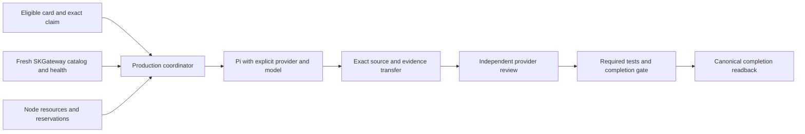

# Production Pi work cycle

Status: approved operating contract; consolidation and production trial in progress.
Date: 2026-10-01. Parent card: `9b230773`. Source integration: `b230d101`.
Original automatic work-cycle card: `09cf4fec`.

This is the canonical production Pi procedure linked by [AGENTS.md](../../AGENTS.md)
and [SOP section 6](../../SOP.md#6-configuration--usage). It follows
[SK_REPO_DOC_STANDARD](https://github.com/smilinTux/sk-standards/blob/main/standards/SK_REPO_DOC_STANDARD.md)
and [DOCS_FRESHNESS_STANDARD](https://github.com/smilinTux/sk-standards/blob/main/standards/DOCS_FRESHNESS_STANDARD.md).
Requirements below are the acceptance contract, not a claim that every staged
change is installed. Exact candidate and installation receipts live on the
parent's linked leaf cards. Legacy lane documentation applies only outside
explicit production policy mode.

## Sources of authority

| Input | Authority | Rule |
|---|---|---|
| Work requirement | Folded card and its task contract | Size, capabilities, privacy/egress, repository/base, provider restrictions and authorization remain binding. |
| Available model IDs and qualifications | Fresh SKGateway catalog and health/capacity snapshot | Select an actual advertised route meeting the card. Missing or stale qualification withholds admission. |
| Host and resource settings | Validated shared production policy | One coordination host, gateway origin, enabled families, node quotas and bounded cycle work; no static model table. |
| Pi provider catalog | Derived node-local transport cache | Materialize from gateway metadata; preserve private credentials and unrelated entries. It does not authorize a route. |
| Current owner and claim | Native folded CardStore through `skcapstone coord` | Exact claim/revision and mediated writes; never raw JSONL or projection edits. |
| Provider request concurrency | SKGateway | Queue, health, backoff and per-backend request limits stay in the gateway. |
| Node admission | Fresh node resources plus active/reserved work | Per-worker quotas and aggregate resource availability, not arbitrary worker counts. |

Kimi is disabled while its subscription is inactive. Family names do not
prove model capability. Do not embed model IDs in this runbook, in policy,
or in prompts as routing defaults. Explicit card restrictions narrow gateway
choices; they never override privacy, missing capability or backend health.

## Production topology

The consolidated target is one `skfleet-seat-cycle.timer` on `chiap08`,
serializing Atlas, Seraph and Niobe-live through the canonical
`~/.skenv/bin/skfleet-rotate.py`. Remote execution uses the native builder
queue. SKGateway on `chiap01:18790` is the provider router. Host bindings
belong in the deployed policy, not copied into model-selection code.



Fiber admission remains retired and masked. Compatibility launchers must
delegate to the single production entrypoint; they must not start a second
scheduler. Do not reactivate independent timers as a workaround for a
withheld route or missing source artifact.

## Launch contract

1. Read the folded card and verify dependency, activation and authorization
   gates. Preserve any current owner. A lifecycle seat may assign or release
   only through its authorized native transition with current evidence.
2. Acquire fresh gateway qualification. Resolve the card's logical size,
   required tools/reasoning, privacy and provider restrictions against exact
   advertised routes. Recheck freshness before launch if scanning took too
   long. Never infer a model ID from the size string or a family name.
3. Ensure the destination node can receive the exact request, has qualified
   quotas and resource headroom, and has the exact gateway-derived Pi entry.
   A Ready heartbeat or successful SSH alone does not prove these conditions.
4. Run the installed Pi version's help during harness qualification. The
   seven-node inventory under `c199940b` verified Pi 0.84.4 uses `--provider`
   and `--model`, with no `--llm`. Launch form, shown schematically:

   ```text
   pi --provider skgateway --model <exact-ID-resolved-from-SKGateway> ...
   ```

   Pass arguments as an argv vector. Require an exact catalog match; refuse
   profile-default or fuzzy-model fallback. Never call a provider API directly.
5. Record card requirement, claim revision, source base, gateway revision,
   exact requested model, qualified capacity domain and launch preflight.
   Request/response attribution must distinguish requested from served model
   and backend. Launch argv alone proves neither the served model nor a
   successful completion.

Shared configuration may enable families but cannot assign them a separate
model list. A gateway-derived local cache must be refreshed and validated
without printing credentials. Metadata changes that affect routing belong
in SKGateway and require gateway qualification.

## Resources and throughput

Enforce each node's qualified `CPUQuota`, `MemoryMax`, `TasksMax` and
`RuntimeMaxSec` on the actual worker unit, and verify the resulting cgroup.
Use fresh available resources and outstanding reservations to admit work;
unknown or incomplete resource evidence withholds that node. A lost launcher
PID is not proof that the worker process group stopped.

The operator removed fixed estate/provider/node worker-count ceilings,
fixed launch spacing and duplicate orchestration automatic failure HOLD.
Gateway concurrency and backend health controls remain. This change does
not remove per-card retry limits, claim exclusion, source verification,
privacy, activation, review, tests or resource safety. Bounded scan and
cycle time are scheduling budgets, not persistent worker-count ceilings.

Prefer capability-appropriate routes, compact task prompts and bounded
board reads. Measure verified completions per time and token usage, including
review and retries. Do not equate gateway request capacity with node worker
capacity, or maximize process count as a substitute for useful throughput.

## Source custody, review and completion

The producer works in the authorized isolated repository and records exact
base, commit, tree and ref. Every worker prompt requires `ls` after writes,
`git rev-parse HEAD` after authorized commits, and a stop when tool output
looks wrong. At the second compaction, write `.handoff.md`, finish the
current step and stop for a fresh session. Commit/push authorization remains
card-specific.

Transfer unpublished candidate commits and byte-exact completion evidence
with a bounded verified source packet. Verify repository, base, head, tree,
ref, candidate hash, owner and claim before publishing or importing. Import
into a fresh private workspace; do not reset another worker's workspace.
The selected-artifact transport must work on nodes lacking broad evidence
sync. Do not enable whole evidence-directory replication to solve this.
An unavailable historical base remains a custody failure, not permission to
review another revision.

Open one independent review for the exact candidate generation. Reviewer
identity differs from producer identity; when two qualified families exist,
the reviewer also uses a different provider family. A busy independent
family is a wait condition, not permission for self-review or silent fallback.
Required tests must pass on that exact candidate. A revised candidate needs
fresh review evidence. Record verdicts and completion through the supported
coordination API and verify canonical readback before cleanup.

Keep ownership while review or evidence custody is pending. Release only the
exact owned claim after verified worker termination and the native lifecycle
allows it. Do not bulk rename Jarvis-owned cards: audit each current claim,
session and handoff evidence first. BLOCKED with a precise reason is valid;
a worker exit or optimistic final message is not completion.

## Qualification and rollback

Before wider admission, require the exact integrated candidate, independent
review, relevant tests, hash-bound backups and reversible installation.
Verify installed entrypoints, effective units/drop-ins, gateway health/model
inventory, actual backend completions where affected, node request delivery,
Pi route binding and cgroup quotas. Run one real assignment, implementation,
cross-machine candidate transfer, independent review, test and completion.
Only then expand eligible work and measure sustained throughput.

Read-only operator checks:

```bash
pi --version
pi --help
systemctl --user cat skfleet-seat-cycle.service skfleet-seat-cycle.timer
systemctl --user status skfleet-seat-cycle.timer --no-pager
skcapstone coord show 9b230773 --json
```

Use the installation receipt's exact backup manifest to restore files,
drop-ins and previous unit enablement, then daemon-reload and verify the
restored entrypoint. Stop new admission during rollback while preserving
running workers, exact claims and artifacts. Keep Fiber retired. Never
delete recovery evidence to make health look green.

| Symptom | Check |
|---|---|
| Reachable fleet, zero work | Native builder eligibility, exact queue delivery, card gates, gateway freshness and resource reservations. |
| Pi rejects model | Gateway-derived catalog freshness, exact provider/model ID and gateway origin. Do not use defaults. |
| Remote review cannot start | Exact unpublished source bundle, base availability, candidate hashes and selected-artifact transport. |
| Held card appears eligible | Canonical CardStore owner and claim, not stale projection or raw event fold. |
| Repeated retries spend tokens | Exact failure and per-card retry bound, gateway queue/health, prompt size and compaction count. |
| Review PASS but card remains open | Required exact-candidate checks and native completion-gate readback; do not invent SUCCESS links. |
