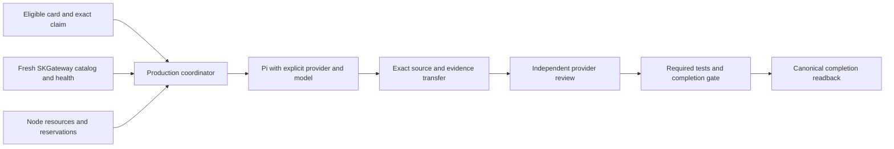

# Production Pi work cycle

Status: approved operating contract; consolidation and production trial in progress.
Date: 2026-10-01. Parent card: `9b230773`. Source integration: `b230d101`.
Original automatic work-cycle card: `09cf4fec`.

This is the canonical production Pi procedure linked by [AGENTS.md](../../AGENTS.md)
and [SOP section 6](../../SOP.md#6-configuration--usage). It follows
[SK_REPO_DOC_STANDARD](https://github.com/smilinTux/sk-standards/blob/main/standards/SK_REPO_DOC_STANDARD.md)
and [DOCS_FRESHNESS_STANDARD](https://github.com/smilinTux/sk-standards/blob/main/standards/DOCS_FRESHNESS_STANDARD.md).
Requirements below are the acceptance contract, not a claim that every staged
change is installed. Exact candidate and installation receipts live on the
parent's linked leaf cards. Legacy lane documentation applies only outside
explicit production policy mode.

## Sources of authority

| Input | Authority | Rule |
|---|---|---|
| Work requirement | Folded card and its task contract | Size, capabilities, privacy/egress, repository/base, provider restrictions and authorization remain binding. |
| Available model IDs and qualifications | Fresh SKGateway catalog and health/capacity snapshot | Select an actual advertised route meeting the card. Missing or stale qualification withholds admission. |
| Host and resource settings | Validated shared production policy | One coordination host, gateway origin, enabled families, node quotas and bounded cycle work; no static model table. |
| Pi provider catalog | Derived node-local transport cache | Materialize from gateway metadata; preserve private credentials and unrelated entries. It does not authorize a route. |
| Current owner and claim | Native folded CardStore through `skcapstone coord` | Exact claim/revision and mediated writes; never raw JSONL or projection edits. |
| Provider request concurrency | SKGateway | Queue, health, backoff and per-backend request limits stay in the gateway. |
| Node admission | Fresh node resources plus active/reserved work | Per-worker quotas and aggregate resource availability, not arbitrary worker counts. |

Kimi is disabled while its subscription is inactive. Family names do not
prove model capability. Do not embed model IDs in this runbook, in policy,
or in prompts as routing defaults. Explicit card restrictions narrow gateway
choices; they never override privacy, missing capability or backend health.

## Production topology

The consolidated target is one `skfleet-seat-cycle.timer` on `chiap08`,
serializing Atlas, Seraph and Niobe-live through the canonical
`~/.skenv/bin/skfleet-rotate.py`. Remote execution uses the native builder
queue. SKGateway on `chiap01:18790` is the provider router. Host bindings
belong in the deployed policy, not copied into model-selection code.



Fiber admission remains retired and masked. Compatibility launchers must
delegate to the single production entrypoint; they must not start a second
scheduler. Do not reactivate independent timers as a workaround for a
withheld route or missing source artifact.

## Launch contract

1. Read the folded card and verify dependency, activation and authorization
   gates. Preserve any current owner. A lifecycle seat may assign or release
   only through its authorized native transition with current evidence.
2. Acquire fresh gateway qualification. Resolve the card's logical size,
   required tools/reasoning, privacy and provider restrictions against exact
   advertised routes. Recheck freshness before launch if scanning took too
   long. Never infer a model ID from the size string or a family name.
3. Ensure the destination node can receive the exact request, has qualified
   quotas and resource headroom, and has the exact gateway-derived Pi entry.
   A Ready heartbeat or successful SSH alone does not prove these conditions.
4. Run the installed Pi version's help during harness qualification. The
   seven-node inventory under `c199940b` verified Pi 0.84.4 uses `--provider`
   and `--model`, with no `--llm`. Launch form, shown schematically:

   ```text
   pi --provider skgateway --model <exact-ID-resolved-from-SKGateway> ...
   ```

   Pass arguments as an argv vector. Require an exact catalog match; refuse
   profile-default or fuzzy-model fallback. Never call a provider API directly.
5. Record card requirement, claim revision, source base, gateway revision,
   exact requested model, qualified capacity domain and launch preflight.
   Request/response attribution must distinguish requested from served model
   and backend. Launch argv alone proves neither the served model nor a
   successful completion.

Shared configuration may enable families but cannot assign them a separate
model list. A gateway-derived local cache must be refreshed and validated
without printing credentials. Metadata changes that affect routing belong
in SKGateway and require gateway qualification.

## Resources and throughput

Enforce each node's qualified `CPUQuota`, `MemoryMax`, `TasksMax` and
`RuntimeMaxSec` on the actual worker unit, and verify the resulting cgroup.
Use fresh available resources and outstanding reservations to admit work;
unknown or incomplete resource evidence withholds that node. A lost launcher
PID is not proof that the worker process group stopped.

The operator removed fixed estate/provider/node worker-count ceilings,
fixed launch spacing and duplicate orchestration automatic failure HOLD.
Gateway concurrency and backend health controls remain. This change does
not remove per-card retry limits, claim exclusion, source verification,
privacy, activation, review, tests or resource safety. Bounded scan and
cycle time are scheduling budgets, not persistent worker-count ceilings.

Prefer capability-appropriate routes, compact task prompts and bounded
board reads. Measure verified completions per time and token usage, including
review and retries. Do not equate gateway request capacity with node worker
capacity, or maximize process count as a substitute for useful throughput.

## Source custody, review and completion

The producer works in the authorized isolated repository and records exact
base, commit, tree and ref. Every worker prompt requires `ls` after writes,
`git rev-parse HEAD` after authorized commits, and a stop when tool output
looks wrong. At the second compaction, write `.handoff.md`, finish the
current step and stop for a fresh session. Commit/push authorization remains
card-specific.

The fleet `pi-cardstore-guard.mjs` enforces this at Pi's successful
`session_compact` event, after the current tool batch. It persists trigger
markers with `appendEntry` and reads `sessionManager.getEntries()` on
`session_start`, so resuming or reloading does not reset the count. Threshold
and overflow compactions count; failed compactions and recorded manual
compactions do not. Historical entries without trigger markers count
conservatively because Pi 0.84.4 does not store their trigger reason.

At the limit the guard writes an owned `0600` `.handoff.md` in the card's
owned `0700` `~/.skcapstone/evidence/work/<card>/` directory. It records card,
claim, owner, workspace, session, count and the last Pi summary, explicitly
marked as unverified. An existing handoff remains unchanged; another receipt
gets a unique `.handoff.<uuid>.md` name. Unsafe evidence paths or write failures
still stop the worker and report that the controller must recover the retained
session. The guard never writes a board verdict or releases a claim.

Pi 0.84.4's `ctx.shutdown()` is a no-op in the production `-p` mode, and
`ctx.abort()` alone does not prevent an overflow continuation. The guard holds
the compaction event pending and sends SIGTERM to its own Pi process. Pi's
existing signal handler disposes the runtime, terminates tracked detached
tools and exits 143. All later tool calls are denied while stopping. This is
a handoff exit, never evidence of successful task completion. Qualify both
threshold and overflow events, resumed history and evidence failure against
the installed Pi runtime before rollout; retain the prior guard bytes for
rollback. A fresh continuation requires controller custody and the exact
retained claim, not a worker-created replacement claim.

Transfer unpublished candidate commits and byte-exact completion evidence
with a bounded verified source packet. Verify repository, base, head, tree,
ref, candidate hash, owner and claim before publishing or importing. Import
into a fresh private workspace; do not reset another worker's workspace.
The selected-artifact transport must work on nodes lacking broad evidence
sync. Do not enable whole evidence-directory replication to solve this.
An unavailable historical base remains a custody failure, not permission to
review another revision.

Open one independent review for the exact candidate generation. Reviewer
identity differs from producer identity; when two qualified families exist,
the reviewer also uses a different provider family. A busy independent
family is a wait condition, not permission for self-review or silent fallback.
Required tests must pass on that exact candidate. A revised candidate needs
fresh review evidence. Record verdicts and completion through the supported
coordination API and verify canonical readback before cleanup.

Operator-qualified Python test recipes accept explicit relative `.py` paths
under `tests/`, `src/`, or `scripts/`, including hyphenated names such as
`scripts/fleet/skfleet-working.py`. Pytest targets must remain under `tests/`.
The existing fixed command arguments, target counts, path length limits and
unsafe-path refusals still apply. Supporting a path does not qualify a card:
its exact contract and required checks still need operator qualification,
independent review and exact-candidate test receipts before completion.

Keep ownership while review or evidence custody is pending. Release only the
exact owned claim after verified worker termination and the native lifecycle
allows it. Do not bulk rename Jarvis-owned cards: audit each current claim,
session and handoff evidence first. BLOCKED with a precise reason is valid;
a worker exit or optimistic final message is not completion.

Card `c1a30124` repairs review admission for retained production claims. After
qualified installation, the existing opener may select a claimed source-only
parent only on the production authority, with its current typed
`PASS_FOR_REVIEW`, matching producer and claim, unchanged native request and
policy, transferred hash-verified candidate, native successful terminal receipt,
and a fresh stopped-unit check. Unknown process state withholds admission.
Ordinary claimed cards remain excluded. Source generation and duplicate-review
checks still apply, and downstream provider independence, tests and acceptance
remain required. Do not release a producer claim to make its candidate eligible.

Card `c1a30126` binds the production opener to the qualified native
`coord review-work` command. It resolves the current canonical review identity
before checking existing directories, passes exact source and claim revisions,
and verifies native source workspace, candidate and acceptance lineage after
creation. A voided legacy card remains history; an active review still blocks
another attempt. Missing guarded-CLI qualification, stale custody or incomplete
readback withholds dispatch. Ordinary nonproduction review creation is unchanged.
The authority overlay is a separately reviewed deployment dependency, pinned in
`docs/evidence/agents/c1a30126/AUTHORITY-DEPENDENCY.json`. Production selection,
bundle import, reviewer brief and acceptance must use that qualified composition;
passing source-only unit tests does not qualify a different installation.

Card `c1a30135` preserves inspection through the hardened authority service.
The existing `_inspect` runs its unchanged bwrap argv through a unique native
transient user service, with NoNewPrivileges, a 40-second runtime bound,
two-second stop bound, whole-cgroup termination, one CPU, 512 MiB memory,
64 tasks and bounded output. Bwrap still supplies private tmpfs, no host home
or network, and read-only source. The coordinator retains PrivateTmp and
NoNewPrivileges; global AppArmor and user-namespace policy remain unchanged.
Missing user-manager access, sandbox failure or incomplete output refuses
inspection without a direct-execution fallback. Qualification must exercise
the actual hardened service, retained committed review, denial probes and
terminal cgroup cleanup. A changed inspection module invalidates the runtime
fingerprint and requires fresh test-profile calibration before admission.

Card `c1a30143` makes historical acceptance use the retained qualified test
profile. It derives exact ordered checks from the existing fixed recipe
templates and selects Python or Node JUnit using the existing profile type.
Replay rehashes the plan, receipt, logs and JUnit and preserves exact native
completion, source bindings, revisions, intents and acknowledgements. It does
not rerun completed tests or require a historical profile to match a newer
runtime. Missing, duplicate, reordered or extra checks still refuse acceptance.
Unfinished work continues to require current runtime qualification. A runtime
change still invalidates admission profiles; completed source claims must not
be recreated to satisfy an older calibration script. Source verification and
read-only replay do not establish an installed qualification.

### Source-only reviewer handoff

The dedicated source-only reviewer brief correction is pending rollout under
card `ab264e92`. It replaces contradictory hosted-CI instructions only for
qualified production source-only reviews. Hosted PR reviews retain their
protected-check requirements.

- Use the existing native `source-only-applicability` receipt for an authorized
  local source-only PASS. Bind its source head, reviewer and review-report digest
  exactly, after recording the report/digest and actual verdict. Do not add PR,
  hosted-check or fabricated CI links to satisfy a different contract.
- Derive source HEAD and tree from Git. Commit only the authorized reviewer
  report and decision, then record the evidence commit externally. Never put
  the containing commit's hash into its own committed file. Keep the evidence
  branch checked out and preserve all commits.
- Decision schema `skfleet.source-review-decision/v1` carries exact card,
  parent_card, source_head, source_tree, reviewer_identity, verdict and the
  report_sha256 computed before the decision/evidence commit. Publish each
  authority metadata link with source/claim revision guards and a transition ID;
  carry its returned source revision into the next write. Missing guards refuse
  handoff, with no unguarded fallback.
- Test claims require observed commands and outputs. A local Python 3.12 test
  run does not prove Python 3.11, secret scanning, hosted CI or unrelated checks.
  Report failures and missing checks honestly; do not relabel them SUCCESS.
- Reviewers never complete their own cards, release claims or send unsolicited
  messages. Native lifecycle actions follow exact external evidence validation.
- A prompt cannot guarantee truth. Deterministic external verification of the
  committed decision's exact source binding, allowed evidence-only changes and
  test evidence remains a prerequisite. The current native completion validator
  does not inspect `REVIEW-DECISION.json`; its applicability receipt alone is not
  independent artifact verification.
- Preserve invalid review `3054d5f1` and its original artifacts as invalid
  history. A corrected brief does not retrospectively approve that review or
  source `89508f83`. The failed trial consumed 56 tool calls, six evidence
  commits and 1,493,843 harness tokens (1,483,944 input and 9,899 output), recorded
  in parent evidence `REVIEW-TRIAL-LEARNINGS-20261001.json`. Stop hash-pinning loops
  and contradictory handoffs before another expensive session.

## Qualification and rollback

Before wider admission, require the exact integrated candidate, independent
review, relevant tests, hash-bound backups and reversible installation.
Verify installed entrypoints, effective units/drop-ins, gateway health/model
inventory, actual backend completions where affected, node request delivery,
Pi route binding and cgroup quotas. Run one real assignment, implementation,
cross-machine candidate transfer, independent review, test and completion.
Only then expand eligible work and measure sustained throughput.

Read-only operator checks:

```bash
pi --version
pi --help
systemctl --user cat skfleet-seat-cycle.service skfleet-seat-cycle.timer
systemctl --user status skfleet-seat-cycle.timer --no-pager
skcapstone coord show 9b230773 --json
```

Use the installation receipt's exact backup manifest to restore files,
drop-ins and previous unit enablement, then daemon-reload and verify the
restored entrypoint. Stop new admission during rollback while preserving
running workers, exact claims and artifacts. Keep Fiber retired. Never
delete recovery evidence to make health look green.

| Symptom | Check |
|---|---|
| Reachable fleet, zero work | Native builder eligibility, exact queue delivery, card gates, gateway freshness and resource reservations. |
| Pi rejects model | Gateway-derived catalog freshness, exact provider/model ID and gateway origin. Do not use defaults. |
| Remote review cannot start | Exact unpublished source bundle, base availability, candidate hashes and selected-artifact transport. |
| Held card appears eligible | Canonical CardStore owner and claim, not stale projection or raw event fold. |
| Repeated retries spend tokens | Exact failure and per-card retry bound, gateway queue/health, prompt size and compaction count. |
| Review PASS but card remains open | Required exact-candidate checks and native completion-gate readback; do not invent SUCCESS links. |

## Continuing a stopped staged worker

Card `c1a30122` adds `skcapstone fleet builder-continue CARD --node NODE
--request-id REQUEST --claim CLAIM --invocation INVOCATION --agent OPERATOR
--reason REASON`. The default only checks custody. `--apply` records one private
continuation grant on the production authority; the existing native node loop
performs launch admission. Install and independently qualify the exact candidate
before using this command. This is not a new source offer or clean-base retry.

The command requires a stopped production unit, the exact retained source claim,
a producer BLOCKED outcome from that claim, a named branch at the authorized base,
and preserved staged or untracked work. It archives the entire workspace,
including Git metadata, ignored files and symlink entries, without reading their
targets. The sidecar pins the immutable request, every status field except the
routine heartbeat timestamp, native card revision, original outcome, Git index,
source identities and full inventory. All material drift refuses continuation.
The original request and outcome remain unchanged. Evidence directories must
already be owned and private, with mode `0700`; private files use `0600`.

Production author and committer names are the validated assigned worker owner.
Both emails are that exact owner plus `@noreply.invalid`. This is explicit machine
attribution and non-delivery metadata. It neither impersonates a human nor changes
Git configuration. Both effective identities are checked with `git var` using the
same `env -i` arguments as the worker before native service launch.

The grant lasts one hour and can launch one fresh session through the same route,
resource and native claim checks. Its prompt requires inspection of preserved
work, correction of inaccurate evidence chronology, remaining validation, the
already authorized commit and typed handoff. Exact candidate tests, independent
review and completion remain required. The original BLOCKED event cannot release
the continued generation before it supplies a new outcome.

Consumption is durable before launch. A crash or lost launch response at that
boundary leaves the grant spent and custody retained; it does not automatically
replay or claim completion. Missing receipts likewise retain custody. An operator
must diagnose the exact unit and preserve evidence before a separately authorized
recovery. Do not delete sidecars, reset workspaces, release claims, or rewrite
offers to force a retry. Existing clean-base `builder-retry` behavior is unchanged.
