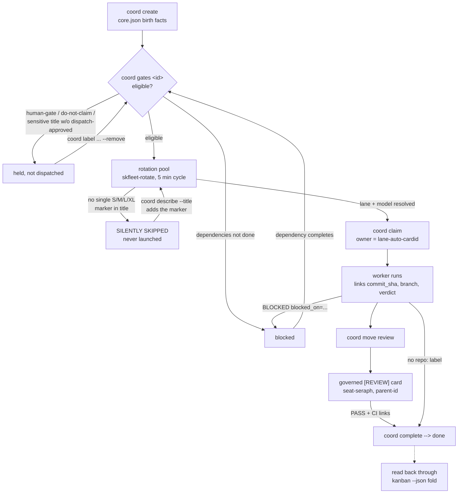

# Starting a new project: cards the fleet will actually run

Status: ACTIVE
Date: 2026-09-18
Verified-against: `src/skcapstone/cli/coord.py`, `src/skcapstone/cli/coord_amend.py`,
`src/skcapstone/coord_completion.py`, `src/skcapstone/coord_gate_diagnostic.py`,
`scripts/fleet/skfleet-rotate.py`, `scripts/fleet/backfill_exit_gates.py` at branch
base `2f8a90f7`, plus live CardStore state under `~/.skcapstone/cards/`.
Companions: [card-authoring-dispatch-gates.md](card-authoring-dispatch-gates.md)
(dispatch gates in depth), [model-lane-routing.md](model-lane-routing.md)
(lanes and models in depth), [adr-node-role-model.md](adr-node-role-model.md)
(what an estate is).

This is the start-to-finish runbook for standing up a brand-new project on the
coordination board: how to cut it into cards, size them so the dispatcher will
run them, wire dependencies, write acceptance criteria that stay checkable, and
verify a worker actually picked the work up. It assumes no tribal knowledge.
Every command below was read out of the source files named above or run against
the live CLI.

The single most common failure for a new project is invisible: a card with no
size marker in its title is silently filtered out of dispatch, forever, with
no event written to the card. Section 3 covers it. Do not skip section 3.

## The card lifecycle



The rotation (`scripts/fleet/skfleet-rotate.py`) runs from a systemd timer on
the fleet hosts on a 5 minute cycle (the skeleton unit is in
[model-lane-routing.md](model-lane-routing.md); the lifecycle lessons in
[fleet-lessons-learned-20260903.md](fleet-lessons-learned-20260903.md) confirm
"the next 5-minute cycle" in production). Nothing "submits" a card to the
fleet: every rotation scans every directory under `~/.skcapstone/cards/` and
launches what is claimable. Your job as a project author is to make each card
pass those gates on purpose.

## 1. Before you create a card

**One estate, one board.** An estate is one control plane: one
`~/.skcapstone`, one Syncthing ring, one PGP trust root, one operator
([adr-node-role-model.md](adr-node-role-model.md), "Applicability to peer
estates"). Estates share code through git and never share files. A card exists
only on the estate where you create it: Chef's estate (`chef.skworld.io`,
hosts prefixed `nor`) and Casey's (`cakjr.skworld.io`, hosts prefixed `chi`)
have disjoint card stores. Create the card on a host inside the estate whose
fleet you want to run it. The board home is `~/.skcapstone` by default
(overridable with the `SKCAPSTONE_HOME` env var or `--home` on every coord
subcommand).

**Propagation is not instant.** `~/.skcapstone` converges between an estate's
hosts via Syncthing, and lesson 12 in
[fleet-lessons-learned-20260903.md](fleet-lessons-learned-20260903.md)
measured new cards invisible on their executing host for 30+ minutes. Budget
for that when you time-box a rollout.

**Read the protocol once.** The board explains itself:

```bash
skcapstone coord briefing            # full coordination protocol + live snapshot
skcapstone coord create --help       # the tags that change dispatch behaviour
skcapstone coord status              # what is open, claimed, blocked right now
```

**Decide the repo wiring per card, up front.** Two separate mechanisms, both
per card:

- A `repo:<name>` tag (exact prefix `repo:`, case-sensitive,
  `coord_completion.py`) marks the card as code work. Completion of such a
  card is refused until the card carries a `commit_sha` link (a real
  lowercase 40-hex SHA, or the literal sentinel `none` for "no code change
  needed") and, alongside a real SHA, a `branch` link, repo-qualified as
  `<repo>:<name>`. If you tag `repo:` and the worker links nothing, the card
  cannot close.
- A `source-only` tag plus the source binding tuple gives the worker its
  checkout. All three are validated together at create time:

```bash
skcapstone coord create --title 'Bound source work [M]' --tag source-only \
  --repository https://github.com/smilinTux/skcapstone \
  --base-ref main --base-revision <40-hex-commit>
```

  `repository` must be a credential-free HTTPS URL, `base-ref` a named branch
  or tag (never a SHA), `base-revision` an exact 40-hex commit. The fleet
  fetches `base_ref`, proves `base_revision` is reachable, and checks out
  that exact revision before claiming
  ([card-authoring-dispatch-gates.md](card-authoring-dispatch-gates.md)).

**Know which words in a title are gated.** The dispatcher withholds any card
whose folded title matches, case-insensitively:

```
capauth|credential|custody|issuer|secret|\bkey\b|rollback|deploy|production|release|migrat
```

unless the card carries the `dispatch-approved` label
(`_SENSITIVE_CATEGORY` in `skfleet-rotate.py`). The match is textual: "fix the
release notes typo" is gated by the word `release`. Either avoid the word or
add `--tag dispatch-approved` deliberately. Labels do not trigger it, only
the title.

## 2. Decomposition: how big is one card

One card is one independently testable deliverable: a change a fresh reviewer
could accept or reject on its own, without needing the sibling cards to exist.
That is not a style preference; the machinery enforces it card by card:

- Completion evidence is per card: one `commit_sha` plus one `branch` link
  closes one `repo:`-tagged card (`coord_completion.py`). A card whose
  "deliverable" is spread over four unrelated branches has no honest value to
  link.
- Review is per card: a governed `[REVIEW]` card carries exactly one
  `parent-<card_id>` tag and verifies one candidate against one
  `candidate_evidence_sha256`. A card that bundles three deliverables cannot
  be independently PASSed or FAILed.
- Retry budgeting is per card: three reported launches with no outcome park a
  card until an attributed material change
  ([card-authoring-dispatch-gates.md](card-authoring-dispatch-gates.md)).
  An oversized card burns its whole budget failing at its weakest edge.

If you cannot write the acceptance criteria for a card without the word "and"
joining two unrelated verifications, it is two cards.

### Worked example

The project: "add a health endpoint to sknotes, surface it on the dashboard,
and document it." That is one project and three deliverables, plus a review.
Split (illustrative titles, real command syntax; `--tag sknotes` is the
project tag you will filter on later):

```bash
skcapstone coord create --by <you> --priority high \
  --title '[SKNOTES-01][S] Add GET /health endpoint returning build version' \
  --tag sknotes --tag repo:sknotes \
  --criteria 'GET /health returns HTTP 200 with a JSON body containing a version field.' \
  --criteria 'A test asserts the 200 and the JSON shape; the suite passes.'

skcapstone coord create --by <you> --priority medium \
  --title '[SKNOTES-02][M] Dashboard tile polls the sknotes health endpoint' \
  --tag sknotes --tag repo:skdashboard \
  --dep <id-of-SKNOTES-01> \
  --criteria 'The tile renders healthy/unhealthy from the endpoint response, not from a hardcoded value.' \
  --criteria 'An unreachable endpoint renders the unhealthy state, not a crash.'

skcapstone coord create --by <you> --priority medium \
  --title '[SKNOTES-03][S] Document the health endpoint in the sknotes SOP' \
  --tag sknotes --tag repo:sknotes \
  --dep <id-of-SKNOTES-01> \
  --criteria 'The SOP names the endpoint path and shows one real curl invocation with its output shape.'
```

Each card can be accepted or rejected alone. `coord create` prints the
generated id of each card; feed it to the next card's `--dep`. Wrong split,
for contrast: one card titled "Build sknotes health feature end to end" with
six criteria across two repos. No single commit closes it, no single reviewer
verdict is honest about it, and its third failed launch parks all of it.

If work turns out to need review or repair after the fact, those are governed
card classes with their own creation rules: a `[REVIEW]`, `[REREVIEW]`, or
`[REPAIR]` card requires exactly one `parent-<card_id>` tag pointing at an
existing card, and `[REVIEW]`/`[REREVIEW]` additionally require the `review`
and `seat-seraph` tags, `--producer-identity`, and
`--candidate-evidence-sha256` (the create command refuses incomplete governed
cards and lists what is missing; see the epilog of
`skcapstone coord create --help`).

## 3. Sizing and model assignment

**This is the gate that silently kills new projects.** The dispatcher only
considers cards whose size it can resolve:

```python
# scripts/fleet/skfleet-rotate.py
_GLM_SIZE_RE=re.compile(r"\[(S|M|XL|L)\]")
_LOGICAL_ROUTES={"S":"sk-s","M":"sk-m","L":"sk-l","XL":"sk-xl"}

def _size_class_for(core, labels=()):
    title=str((core or {}).get("title") or "")
    matches=_GLM_SIZE_RE.findall(title)
    if title:
        return matches[0] if len(matches)==1 else None
    ...
```

The size comes from the card's **title**: exactly one bracketed marker that is
exactly `[S]`, `[M]`, `[L]`, or `[XL]`. Other brackets do not count
(`[SKLEGAL][S1-05B][L]` routes as L; `[S1-05B]` is not a size marker), but a
title with **zero** size markers, or **two or more** (`[S] ... [L]`), resolves
to `None`. (A label spelled `sk-s`/`sk-m`/`sk-l`/`sk-xl` is consulted only
when the title is empty; `--title` is required at create, so in practice the
title is the size.)

A card whose size resolves to `None` is excluded from the candidate scan
before lane selection even happens:

```python
_candidate_scan = _bounded_candidate_sequence(
    (candidate for candidate in owned
     if _logical_route_for(candidate[3],candidate[4]) is not None),
    MAX_CANDIDATE_SCAN)
```

and any path that still reaches launch logs
`SKIPPED_LOGICAL_ROUTE|<host>|<card_id>|reason=missing-or-ambiguous-size` in
the rotation log and moves on. **Nothing is written to the card.** It shows
`open` on every board view, passes every authoring gate, and never runs. This
is the first thing to check when a card "sits dead".

### What each size buys, per lane

A size selects a capability bucket, never a provider. The lanes resolve it as
follows (`_lane_model`, `_glm_model_for`, `_kimi_model_for`, `_size_model_for`
in `skfleet-rotate.py`; env defaults as shipped):

| Title marker | Gateway logical route | codex lane | glm lane | kimi lane | qwen lane |
|---|---|---|---|---|---|
| `[S]`  | `sk-s`  | `sk-s` (env: `SKFLEET_MODEL_S`)  | `sk-glm-s` | `kimi-for-coding` | fixed local model |
| `[M]`  | `sk-m`  | `sk-m` (env: `SKFLEET_MODEL_M`)  | `sk-glm-m` | `kimi-for-coding` | fixed local model |
| `[L]`  | `sk-l`  | `sk-l` (env: `SKFLEET_MODEL_L`)  | `sk-glm-l` | `kimi-for-coding` | fixed local model |
| `[XL]` | `sk-xl` | `sk-xl` (env: `SKFLEET_MODEL_XL`) | `sk-glm-l` | `k3` | excluded by title filter |

The qwen lane runs `SKFLEET_QWEN_MODEL` (default
`qwen3.8-27b-huihui-abliterated-q4_k_m`) regardless of size, and refuses heavy
titles outright (`_QWEN_UNSUITABLE` matches, among others, `production`,
`release`, `migrat`, `schema`, `architecture`, `[HUMAN]`, `[XL]`). The
`escalate` lane (`gpt-5.6-sol` by default) takes only cards carrying the
escalation label or a recorded `blocked_on=capability` refusal, and takes
nothing else.

Lane choice is cheapest-first (`qwen`, `glm`, `codex`, `kimi`, `escalate`)
unless a card pins itself with a lane-only label: `codex-only`, `glm-only`,
`qwen-only`, `kimi-only`, `escalation-only` (also `kimi`, `kimi-lane`,
`kimi-suitable` for the kimi lane, and `glm-first`). Two conflicting
lane-only labels make the card unroutable
(`conflicting-lane-only`, `lane_compatibility()`).

### Setting and fixing the size

Set it at creation, in the title:

```bash
skcapstone coord create --by <you> \
  --title '[SKNOTES-01][S] Add GET /health endpoint returning build version' \
  --tag sknotes --criteria '...'
```

Fix an unsized (or double-sized) card by folding a new title. Titles are
write-once in `core.json` but the dispatcher reads the folded title, so this
takes effect on the next cycle:

```bash
skcapstone coord describe <card_id> \
  --title '[SKNOTES-01][S] Add GET /health endpoint returning build version' \
  --agent <you>
```

Rule of thumb for choosing: the size is the capability floor a competent
worker needs, not the wall-clock estimate. `[S]` for a mechanical,
well-specified change; `[M]` for ordinary feature work in one repo; `[L]` for
work needing sustained multi-file reasoning; `[XL]` only when a lesser model
has failed or the card is genuinely architecture-scale (and note `[XL]` takes
the qwen lane out of play entirely). There is no penalty at dispatch time for
sizing up except spending scarcer capacity; a bucket with no qualifying
gateway member fails closed rather than silently downgrading.

## 4. Dependencies and ordering

What the system actually supports, no more:

**A flat per-card dependency list of card ids.** Declared at birth with
repeatable `--dep <card_id>`, amended afterwards with folded, audited events:

```bash
skcapstone coord add-dependency <card_id> --dependency <other_card_id> \
  --reason 'tile reads the endpoint that 01 creates' --agent <you>
skcapstone coord remove-dependency <card_id> --dependency <other_card_id> \
  --reason 'endpoint stubbed, no longer blocking' --agent <you>
```

It is enforced in two places:

- **Dispatch:** a card with at least one folded dependency not complete (with
  a non-BLOCKED outcome) is excluded with reason `dependency`
  ([card-authoring-dispatch-gates.md](card-authoring-dispatch-gates.md)).
- **Claim:** `coord claim` refuses a card whose dependencies are not all done,
  and its `--force` flag explicitly cannot bypass dependency, review, or human
  gates (`coord.py`, `coord claim --help`).

`coord status` derives and shows `BLOCKED` for open cards with unfinished
dependencies, so ordering is visible without reading files.

What does **not** exist, so do not design for it:

- **No parent/child scheduling hierarchy.** The `parent-<card_id>` tag exists
  only for the governed `[REVIEW]`/`[REREVIEW]`/`[REPAIR]` classes and is
  lineage for review admission, not an ordering edge. There are no epics with
  rollup, no sprint container that sequences its members (a
  `sprint-container` label just makes a card not-claimable).
- **No priority-based ordering guarantee between independent cards.**
  `--priority` (critical/high/medium/low) is a pool sort input, not a
  scheduler contract. If B must not run before A, say so with `--dep`; a
  higher priority on A is not a dependency.
- **No automatic cycle detection at create time.** Two cards depending on
  each other both fail the deps-done claim gate forever;
  `scripts/fleet/break_dependency_cycles.py` exists precisely because cycles
  have happened. Keep the graph a DAG yourself.

A worker that discovers a missing prerequisite mid-card records it rather
than inventing an edge shape: a `verdict` link whose value starts with
`BLOCKED` must name `blocked_on=<dependency|human|capability|card>` and a
referent (`coord link` refuses a bare `BLOCKED`, `blocked_verdict.py`). The
backoff and wake rules for each `blocked_on` kind are specified in
[card-authoring-dispatch-gates.md](card-authoring-dispatch-gates.md).

To stage a project whose cards you are still wiring, create everything with
`--tag do-not-claim`, then release cards into the pool in order:

```bash
skcapstone coord label <card_id> do-not-claim --remove --agent <you>
```

## 5. Acceptance criteria that can be checked

ACs live in `core.json` as `acceptance_criteria` (birth facts, one string per
`--criteria`). Amending them later is a folded, attributed replacement of the
whole list:

```bash
skcapstone coord amend-criteria <card_id> \
  --criteria 'GET /health returns HTTP 200 with a JSON body containing a version field.' \
  --criteria 'A test asserts the 200 and the JSON shape; the suite passes.' \
  --agent <you>
```

**Write ACs against behavior, not against values that drift.** An AC naming a
mutable value is stale the moment the value legitimately changes, and the
card is then verified against the world as it was. Two real cards from the
live board:

Good (card `000c198a`): each criterion names an observable behavior a
reviewer can test against whatever the current configuration is:

> "Valid ACTIONABLE findings map to exact writable/protected paths; BLOCKED
> and incomplete output never authorize the builder."

Bad (card `1430e262`): the criterion hardcodes a port:

> "If repointed: capauth-idp deployed, :18420 verified listening, Funnel path
> tested end to end"

If capauth-idp legitimately moves off 18420, this AC is either falsely failed
or amended after the fact; either way it stopped being a check. Write "the
deployed capauth-idp port answers a health probe, verified against the port
the unit file declares" and the criterion survives the drift. The same
applies to target counts ("all 75 PRs reviewed" rots; "no open PR older than
72 hours without a review decision" does not), host names, and versions.

**Keep review and merge language out of worker ACs.** A criterion the worker
cannot itself satisfy ("independent review passes", "approved by X", "merged
to main"; the exact pattern is `GATE_LANGUAGE_RE`, identical in
`scripts/fleet/backfill_exit_gates.py` and `skfleet-rotate.py`) makes the
card unsatisfiable by its own claimant: the dispatcher refuses
spec-version-2 cards with such criteria outright
(`criteria-not-satisfiable`), and the backfill script exists because older
cards with gate-language ACs looped through claims without ever closing.
Review belongs in a governed `[REVIEW]` card (section 2), or in `exit_gates`:
a card whose `core.json` carries `exit_gates` (objects with a `gate` name and
an `owner` seat) cannot complete until each gate has a `gate_satisfied`
event, recorded by the owning seat:

```bash
skcapstone coord complete <card_id> --agent <worker>       # exits 3 (GATED) while gates outstanding
skcapstone coord satisfy-gate <card_id> --gate independent-review --agent seraph
```

Note honestly: `coord create` has no flag to set `exit_gates` today; they
appear on cards created through other writers or the backfill. At creation
time your interface is acceptance criteria plus, where review is required, a
governed review card.

## 6. Handing it to the fleet

There is no submit step. A card is dispatched when, on some fleet host's
5 minute rotation, all of these hold at once (`authoritative_claimability()`
plus the launch path; full reason list in
[card-authoring-dispatch-gates.md](card-authoring-dispatch-gates.md)):

1. It is a task, not done/void/archived, and not already owned.
2. No human hold: no `[HUMAN]` in the folded title, no `human-gate` (or
   sibling planning-only) label.
3. Not `do-not-claim`, `not-claimable`, `sprint-container`, or
   `foreign-project`.
4. A sensitive-category title carries `dispatch-approved` (section 1).
5. Every dependency is done with a non-BLOCKED outcome (section 4).
6. No host pin naming a different host.
7. **Exactly one `[S]`/`[M]`/`[L]`/`[XL]` marker in the folded title**
   (section 3; this one fails silently, the others are diagnosable).

Preflight before you walk away. `coord gates` runs the installed admission
diagnostics for one card and prints JSON:

```bash
skcapstone coord gates <card_id>
# {"capacity": ..., "card_id": "...", "eligible": true, "reasons": [], "seat": ...}
```

A non-empty `reasons` list names what is holding the card. `coord gates` does
not check the size marker; check that by eye against section 3, it is one
regex.

**Verifying pickup.** On the host that owns the card's hash slice, expect a
claim within two rotation cycles, about 10 minutes; add Syncthing
propagation (30+ minutes observed worst case, section 1) if you created the
card on a different host than the fleet host. Three real read paths:

```bash
# 1. The board: assignee appears as <lane>-auto-<card_id> once claimed
skcapstone coord status --tag sknotes

# 2. The rotation's own decision log (why it did or did not launch):
grep -h "<card_id>" ~/.skcapstone/evidence/fleet-rotation/*/actions.log | tail -20
# Lines to expect: POOL_IDS listing the id, then a claim/launch, or a
# named exclusion such as SKIPPED_LOGICAL_ROUTE|...|reason=missing-or-ambiguous-size

# 3. The worker itself: brief and live log per card
ls ~/.skcapstone/fleet/logs/brief-<card_id>.txt ~/.skcapstone/fleet/logs/<card_id>-*.log
```

The claim owner is the worker session name, `<lane prefix><card_id>`
(prefixes `codex-auto-`, `glm-auto-`, `qwen-auto-`, `kimi-auto-`,
`esc-auto-`), so `coord status` showing assignee `glm-auto-<card_id>` means
the glm lane launched it. Per-host lane occupancy is also published to
`~/.skcapstone/evidence/fleet-live/<host>.json` (cards, workers, and
busy/free/target per lane; a report older than 30 minutes says nothing about
now).

If after two cycles the card is still unowned and `coord gates` says
eligible, grep path 2 above; the rotation names every exclusion it applies.

## 7. Verifying it landed

Read state back through a different path than the one that wrote it. The
create command printing "Created" proves a file was written, not that the
fold, the dispatcher, and the other hosts see what you meant.

**After creation** (writes went through `coord create`/`label`/`link`): read
the folded card back through the kanban projection, which folds `core.json`,
the card's native events, and the legacy overlay together:

```bash
skcapstone coord kanban --json \
  | python3 -c '
import json, sys
card_id = sys.argv[1]
grid = json.load(sys.stdin)
cards = [card for lane in grid.values() for column in lane.values() for card in column]
print(json.dumps(next(card for card in cards if card["id"] == card_id), indent=2, sort_keys=True))
' <card_id>
```

Check the folded title (size marker present, exactly once), labels,
dependencies, and links are what you intended. This is the read path
[card-authoring-dispatch-gates.md](card-authoring-dispatch-gates.md)
prescribes; it is necessary but not sufficient for dispatch, so pair it with
`coord gates <card_id>`.

**After the fleet reports done** (writes went through the worker's `coord
link`/`move`/`complete`): do not trust the verdict line alone. For a
`repo:`-tagged card, the fold must show a `commit_sha` link that is a real
40-hex SHA (or the literal `none`) and a `branch` link `<repo>:<name>`; then
verify the commit exists where the branch link says to fetch it:

```bash
# links, via the fold read above; then, in a checkout of that repo:
git fetch origin <branch-name> && git log -1 <commit_sha>
```

A card that folds to done with no fetchable commit behind its links is a
report, not a deliverable. (`coord complete` refuses that combination going
forward, but verify anyway: the gate reads links, not the remote.)

**Cross-host:** the fleet host that dispatches is rarely the host you wrote
on. Confirm convergence by running the same fold read on a fleet host, or by
seeing the card id appear in that host's rotation `POOL_IDS` line (read path
2 in section 6).

## Checklist for a new project

1. Right estate, right host; board home is `~/.skcapstone` unless overridden.
2. One card per independently testable deliverable; review and repair are
   their own governed cards with `parent-<id>`.
3. Exactly one `[S]`/`[M]`/`[L]`/`[XL]` marker in every title. Unsized or
   double-sized cards are skipped silently.
4. `repo:<name>` tag on code work; `source-only` plus the
   repository/base-ref/base-revision tuple where the worker needs a bound
   checkout.
5. Ordering is `--dep` (or `add-dependency`) and nothing else; keep it a DAG.
6. ACs name behaviors, never drifting values; no review/merge language in
   worker ACs.
7. Sensitive title words need `--tag dispatch-approved`; staging holds are
   `do-not-claim`, released with `coord label ... --remove`.
8. Preflight with `coord gates <id>`; confirm pickup via `coord status --tag`,
   the rotation `actions.log`, and the worker log.
9. Verify done through the kanban fold plus a real `git fetch`, never through
   the writing command's own success line.
