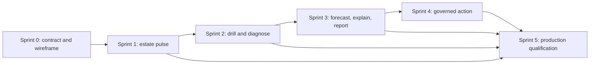

# SK control plane breadth-first sprint plan

Date: 2026-08-23
Status: Proposed for human review
Epic: `6f7fd828`
Architecture card: `9442b3b3`

## Product outcome

Deliver a useful visual control plane early, with one honest signal from every
major estate silo. Add depth only after users can see the whole estate, identify
exceptions, and reach evidence quickly.

The plan assumes two-week sprints after a short architecture Sprint 0. Sprint
labels express dependency order and demonstration goals, not calendar promises.
Capacity is pulled only when a leaf card is eligible and explicitly claimed.

## Delivery rules

1. Breadth before depth. Each first increment crosses the full estate.
2. Decisions before dashboards. The default page prioritizes human decisions,
   exceptions, change, and missing evidence.
3. Unknown stays visible. Missing, stale, partial, failed, and not applicable
   are separate from zero and healthy.
4. One metric contract. UI, reports, agents, MCP, Atlas, and SKOS use the same
   versioned projections.
5. Owners remain authoritative. SKDashboard reads bounded projections and routes
   commands to owner APIs.
6. AI explains evidence. It does not calculate canonical metrics or execute a
   reporting suggestion.
7. No individual productivity ranking. Measures stay at appropriate team,
   product, service, portfolio, or estate scope.
8. Each sprint ends in a reviewable demo and a frozen evidence pack.

## Estate coverage map

| Silo | Authoritative source | Sprint 1 high-level signal | Sprint 2 depth | Later capability |
|---|---|---|---|---|
| Portfolio and projects | SKCapstone and skcoord | Outcome confidence, investment at risk, dependency pressure | Objective and benefit trends, decision latency, cost of delay | Scenario comparison and portfolio report |
| Agile flow | skcoord card store | WIP, aging, throughput, blocked count, forecast range | Cycle percentiles, flow efficiency, churn, rollover, CFD | Probabilistic forecast and retro pack |
| ITIL and SRE | SKCapstone ITIL | Open risk, service pressure, change health, error-budget state | MTTA, MTTR, recurrence, change lead time, PIR and KEDB effectiveness | Service review and governed change handoff |
| Engineering delivery | CI, release, repository, and service observations | DORA direction and quality alert | Lead time, deployment frequency, recovery, failure, rework | Release risk explanation |
| Architecture | CMDB, ADR, dependency, SKPerf observations | Drift, unsupported dependency, capacity pressure | Blast radius, lifecycle, technical debt, benchmark regression | What-if and change-impact analysis |
| Fleet | SKCapstone Fleet | Expected, reporting, stale, and unavailable nodes | Collector, service, package, and configuration drilldown | Qualified remediation preview |
| AI and models | SKCounter, SKGateway, evaluations | Accepted outcomes, queue health, usage, denial, evaluation, cost confidence | Lane, model, client, provider, node, cache, latency, quality | Route comparison and budget forecast |
| Economy | SKCounter cost estimates and SKJoule | Estimated cost, budget state, Joule state shown separately | Unit cost per accepted outcome, pricing revision, transfer history | Budget scenario and monthly report |
| Governance | CapAuth, policy, audit, data-quality registry | Denials, policy outage, stale sources, reconciliation gaps | Coverage, lineage, metric definitions, access review | Audit pack and approval workflow |
| Legal platform | SKLegal policy-filtered aggregate | Matter-free global program status only | Tenant or Matter detail only after policy and membership | Governed Matter report in SKLegal workspace |
| Corpus pipeline | HammerTime approved aggregate and SKPerf | Release and pipeline health only | Approved aggregate throughput and regression | No Inbox access from SKDashboard |
| Operator and shell | Atlas, SKOS, SKWorld | Conditions, action readiness, navigation health | Ledger, manifest, audience, degraded-state evidence | Governed command preview and dispatch |

## Sprint sequence

Planning-only sprint containers now exist on the SKCapstone board:

| Sprint | Container card |
|---:|---|
| 0 | `84f763ac` |
| 1 | `4747a506` |
| 2 | `973b802f` |
| 3 | `ef218eb9` |
| 4 | `e3cef4b4` |
| 5 | `7aad8af1` |

They remain non-claimable. Human architecture gate `9508b8fd`, independent
review `d0edbff1`, and board confirmation `d79100a7` protect the transition to
implementation.

### Sprint 0: North star, truth contract, and visual direction

Goal: agree on what the control plane means before freezing its API.

Demo:

- Standalone estate-pulse wireframe with synthetic data
- Cross-estate scope bar, decision queue, AI brief, high-level tiles, silo pulse,
  forecast, and data-quality panel
- Metric result, report snapshot, and insight proposal schemas
- `/api/v1` OpenAPI baseline
- Ownership, threat, compatibility, and deprecation decision record

Exit gate:

- Human accepts or requests changes against exact artifact hashes.
- No production API, deployment, or external integration is authorized by this
  sprint.

Mapped work:

- Existing SKCP-00, `9442b3b3`
- New human review gate and optional independent architecture review
- Board duplicate and orphan-dependency reconciliation plan

### Sprint 1: Estate pulse across every silo

Goal: ship a truthful read-only overview before building deep workspaces.

Demo:

- One `Now` page backed by bounded adapters
- Persistent scope, time, baseline, and freshness controls
- Human decision queue and material-change brief
- Portfolio, flow, ITIL, DORA, architecture, AI, fleet, economy, and governance
  high-level signals
- Source coverage with current, stale, partial, unavailable, unknown, and not
  applicable states
- One-click drill target from every signal, even if the target is a simple
  evidence table in this sprint

Exit gate:

- No source failure renders as green or zero.
- Every number includes owner, definition version, scope, window, watermark,
  sample size where relevant, and evidence link.
- Initial page and API latency budgets pass on synthetic estate fixtures.

Mapped existing work:

- SKCP-01 read API, `d12b8951`
- SKDashboard AI Usage, `f0d2f784`
- SKCounter foundation, `6386225a`, only as an authoritative aggregate source

New leaf packages:

- Metric registry and deterministic calculation engine
- Portfolio, flow, ITIL, engineering, architecture, and governance adapters
- Breadth-first `Now` workspace
- Data-quality and reconciliation strip
- Synthetic full-estate fixture pack

### Sprint 2: Drill, diagnose, and compare

Goal: turn high-level exceptions into evidence without losing scope.

Demo:

- Saved views, deep links, cross-filtering, and keyboard command palette
- Portfolio and delivery workspace with outcomes, dependencies, age, cycle
  percentiles, blocked time, flow efficiency, and forecast inputs
- Reliability workspace with service levels, error budgets, ITIL trends,
  recurrence, change health, and PIR evidence
- Architecture workspace with topology, drift, blast radius, ADR status,
  lifecycle, technical debt, capacity, and SKPerf regressions
- AI and economy workspace with separate measurement lanes, evaluation quality,
  accepted outcomes, queue, latency, cache, denial, estimated cost, and Joule
  state
- Governance workspace with lineage, metric definitions, access decisions,
  missing acceptance criteria, orphan dependencies, and source reconciliation

Exit gate:

- Common drill paths require at most two interactions.
- Every chart has a table equivalent and preserves scope in its deep link.
- Percentiles, denominators, samples, exclusions, and comparisons are visible.

New leaf packages:

- Unified scope, saved-view, and cross-filter contract
- Portfolio and flow drilldown
- ITIL and SRE drilldown
- DORA and architecture drilldown
- AI, SKCounter, SKPerf, and economy drilldown
- Governance and data-quality center

### Sprint 3: Forecast, explain, and report

Goal: help a project manager or architect understand what changed, what is
likely, and what evidence supports the conclusion.

Demo:

- Historical-throughput Monte Carlo forecast with ranges and calibration
- Dependency and critical-path explanation
- Anomaly and material-change detection
- Read-only AI questions that return typed evidence-linked proposals or abstain
- AI conclusions and ranked recommendations against versioned best practices,
  with confidence, counter-indicators, alternatives, expected impact, and risk
- Daily, weekly, sprint, monthly service, monthly AI and economy, quarterly, and
  ad hoc immutable report snapshots
- Report comparison against an explicit baseline
- Read-only generated client and MCP resources over the same contracts

Exit gate:

- Numeric AI claims link to metric results and deterministic calculations.
- Recommendations identify the exact practice, evidence, uncertainty, expected
  impact range, risk, alternative, and precondition that support them.
- Forecasts show range, method, history window, exclusions, and calibration.
- Reports reproduce from recorded metric definitions and source watermarks.
- AI abstains when evidence or policy is insufficient.

New leaf packages:

- Probabilistic forecast and calibration service
- Governed insight query and evaluation suite
- Evidence-to-decision recommendation and outcome-learning service
- Immutable report snapshot engine
- Report subscriptions and exports, disabled until policy approval
- Read-only agent client and MCP adapter

### Sprint 4: Governed decisions and integrations

Goal: convert an accepted insight into a separately reviewed, least-privilege
action path.

Demo:

- CapAuth identities, scopes, policy decisions, expiry, revocation, and denial
- Typed command preview with expected version, blast radius, verification, and
  rollback
- One click from an AI recommendation to a deterministic authorization preview,
  followed by one explicit approval click when all policy gates pass
- Idempotent owner-routed command and immutable receipt
- Signed SKWorld discovery profile
- Atlas condition and action-ledger integration
- SKOS shell navigation, scoped authentication, deep links, and degraded states
- Agent client command extension with no generic proxy or shell route

Exit gate:

- Reporting conversation cannot execute an action.
- A changed target or parameter invalidates the authorization-preview hash.
- Every command maps to one owner operation and one least-privilege scope.
- Denial, replay, timeout, duplicate, stale, partial, and rollback cases remain
  visible.

Mapped existing work:

- SKCP-02 CapAuth policy, `94cbf19a`
- SKCP-03 command API, `e6326000`
- One canonical SKCP-04 client card after duplicate reconciliation
- SKCP-07 discovery profile, `f0c63c2a`
- SKCP-08 Atlas integration, `aa92aa71`
- SKCP-09 SKOS integration, `b6555a2e`

### Sprint 5: Production qualification and continuous improvement

Goal: operate the full control plane safely and prove the user experience.

Demo:

- Canonical tailnet-only deployment with CMDB registration, health, metrics,
  alerting, restart, incident, upgrade, and rollback evidence
- Full-estate synthetic qualification with missing and conflicting evidence
- Browser accessibility, keyboard, responsive, contrast, reduced motion, and
  visual-regression evidence
- Performance, cache, rate, cursor, SSE resume, and backpressure evidence
- Human and agent contract parity
- Metric quality review, forecast calibration review, and UX task analytics

Exit gate:

- Human accepts the exact qualified release.
- Unsupported routes fail closed.
- Production rollback restores the last qualified state.
- All completed dependencies and evidence are linked to the canonical SKCP-10
  qualification card.

Mapped existing work:

- SKCP-05 canonical endpoint, `2906747c`
- SKCounter central collector and fleet rollout, `bd537b9f` and `b403597a`
- Canonical SKCP-10 qualification, `9936350d`

## Proposed leaf-card catalog

The board now contains these immutable cards so the full dependency shape is
visible during human review. Implementation cards depend on the human gate and
independent review directly or through their predecessors. Their presence does
not authorize claiming or implementation.

| Code | Card | Size | Sprint | Outcome | Dependencies |
|---|---|---:|---:|---|---|
| SKCP-00H | `9508b8fd` | Human | 0 | Approve exact ADR, contracts, sprint plan, and wireframe hashes | Candidate review package |
| SKCP-00R | `d0edbff1` | M | 0 | Independently challenge ownership, security, metrics, and AI boundary | SKCP-00 |
| SKCP-00B | `d79100a7` | Human | 0 | Confirm canonical active client and qualification cards | SKCP-00 |
| SKCP-11 | `9e88de5c` | M | 1 | Versioned metric registry and deterministic calculation fixtures | SKCP-00H, SKCP-00R |
| SKCP-12 | `804f14de` | L | 1 | Bounded cross-estate read adapters and source watermarks | SKCP-00H, SKCP-00R |
| SKCP-13 | `c6828b8a` | L | 1 | Live breadth-first `Now` workspace across every silo | SKCP-01, SKCP-11, SKCP-12, SKCP-14, SKCP-15 |
| SKCP-14 | `5026359d` | M | 1 | Data-quality, truth-state, and reconciliation strip | SKCP-11, SKCP-12 |
| SKCP-15 | `08f4cdcb` | M | 1 | Synthetic full-estate fixture and golden metric pack | SKCP-11 |
| SKCP-20 | `b7ada8b9` | M | 2 | Unified scope, saved views, deep links, and cross-filtering | SKCP-13 |
| SKCP-21 | `5ee56779` | L | 2 | Portfolio, project, Agile flow, dependency, and forecast-input workspace | SKCP-12, SKCP-20 |
| SKCP-22 | `da097cbb` | L | 2 | ITIL, service-level, error-budget, change, PIR, and KEDB workspace | SKCP-12, SKCP-20 |
| SKCP-23 | `866ffaac` | L | 2 | DORA, CMDB, architecture, SKPerf, capacity, and drift workspace | SKCP-12, SKCP-20 |
| SKCP-24 | `77d6bae0` | L | 2 | AI outcome, SKCounter, SKGateway, evaluation, cost, and Joule workspace | SKCP-12, SKCP-20 |
| SKCP-25 | `b548a77a` | M | 2 | Governance, metric lineage, policy, and data-quality center | SKCP-14, SKCP-20 |
| SKCP-30 | `169028ce` | L | 3 | Monte Carlo forecast, dependency simulation, and calibration | SKCP-15, SKCP-21 |
| SKCP-31 | `f080f150` | L | 3 | Governed read-only AI insight query and evaluation suite | SKCP-20 through SKCP-25 |
| SKCP-31A | `efa9bee8` | L | 3 | Best-practice recommendation, impact, alternatives, and outcome-learning service | SKCP-31 |
| SKCP-32 | `38731952` | L | 3 | Immutable report snapshots, comparison, and reproducibility | SKCP-11, SKCP-20 |
| SKCP-33 | `631f90bf` | M | 3 | Policy-gated report subscriptions and exports | SKCP-32, SKCP-02 |
| SKCP-34 | `5858a34f` | M | 3 | Read-only typed client and MCP resources | SKCP-01, SKCP-32 |
| SKCP-40 | `008bd490` | M | 4 | Command client extension after canonical SKCP-04 confirmation | SKCP-03, SKCP-34, SKCP-00B |
| SKCP-41 | `cae1eaef` | L | 4 | Deterministic action preview, exact-hash authorization, and recommendation receipt loop | SKCP-02, SKCP-03, SKCP-31A, SKCP-40 |
| SKCP-50 | `83a8c40b` | L | 5 | Browser accessibility, task-time, visual, and responsive qualification | SKCP-13, SKCP-20 through SKCP-25 |
| SKCP-51 | `2d02b6ed` | M | 5 | API performance, cursor, cache, stream, and backpressure qualification | SKCP-01, SKCP-12, SKCP-32 |
| SKCP-52 | `ecf1148c` | M | 5 | Metric governance, forecast calibration, and UX continuous-review runbook | SKCP-30, SKCP-31A, SKCP-50 |

## Metric families by role

### Project manager lens

- Objectives, benefits, current value, unrealized value, investment, and cost of
  delay
- WIP, throughput, work-item age, cycle-time percentiles, blocked time, flow
  efficiency, churn, rollover, and sprint-goal result
- Remaining-work forecast range, dependency confidence, milestone risk, and
  decision latency
- Risk exposure, issue age, change effect, stakeholder decision queue, and data
  quality

### Architect lens

- Service health, service levels, error budgets, incident recurrence, and change
  health
- DORA lead time, deployment frequency, failed-deployment recovery, change
  failure, and deployment rework at service scope
- CMDB coverage, topology drift, unsupported dependencies, blast radius, ADR
  freshness, technical-debt exposure, capacity, and SKPerf regression
- Model-route availability, evaluation quality, queue pressure, tool failures,
  denied operations, and cost per accepted outcome

### Executive and portfolio lens

- Outcome confidence, value trend, investment at risk, service risk, forecast
  range, major dependency, and decisions required
- No raw activity ranking and no single composite score without its component
  metrics and weighting definition

## Report catalog

| Report | Default audience | Core question |
|---|---|---|
| Daily operations | Operator, architect | What requires attention today? |
| Weekly portfolio | Owner, project manager | What changed, what is at risk, and what decisions are needed? |
| Sprint or flow review | Delivery team | How did work flow and what should change next? |
| Monthly service | Service owner, architect | Are service levels, incidents, changes, and error budgets healthy? |
| Monthly AI and economy | Owner, model and platform leads | Are AI outcomes, quality, usage, and costs controlled? |
| Quarterly strategy | Owner, portfolio | Are investments producing outcomes and where should capacity move? |
| Ad hoc evidence pack | Authorized reviewer | What exact metrics and evidence support this question? |

## Dependency shape

## Definition of ready

A leaf card is ready only when:

- Dependencies are complete.
- Authoritative owner and source contract are named.
- Protected-data classification and CapAuth boundary are explicit.
- Metric definitions, truth states, and fixtures are identified.
- Acceptance includes failure, stale, partial, unavailable, and rollback paths.
- UX outcome and evidence path are stated.
- The exact repository and test boundary are named.

## Definition of done

Every leaf card supplies:

- Files changed
- Exact tests and results
- Acceptance evidence and source watermarks
- Known limitations
- Migration or rollback evidence when data or deployment changes
- Accessibility evidence for UI changes
- Security and protected-data evidence for boundary changes
- Linked SKCapstone update

## WIP and sequencing policy

- At most one architecture contract card and one UI composition card are active
  at a time.
- Each specialist workspace may proceed in parallel only after the common scope,
  metric, and truth-state contracts are frozen.
- A sprint container is planning-only and must never be claimed as
  implementation work.
- Expedite is reserved for a verified production incident or security boundary,
  not schedule pressure.
- Incomplete work does not silently roll over. It is re-estimated with the reason
  and changed evidence recorded.

## Board reconciliation required before implementation

1. Jarvis archived duplicate SKCP-04 `5ae27468` and obsolete SKCP-06
   `f3672bc4` on 2026-08-23. Human card `d79100a7` confirms that active SKCP-04
   `8b0ad975` and active SKCP-10 `9936350d` are canonical or requests an exact
   correction.
2. Preserve both archived records and their audit history. Do not bind new work
   to their archived or missing dependencies.
3. Confirm SKCP-01 dependency on the current AI Usage card and avoid binding new
   work to legacy IDs.
4. Sprint labels and planning-only sprint containers are present for review and
   do not authorize implementation.
5. Do not claim the epic or sprint containers.

## Human decisions requested

1. Accept Sprint 1 as a cross-estate pulse, even though its specialist views are
   intentionally shallow.
2. Accept `Now` as the default workspace, with decisions and exceptions above
   scorecards.
3. Accept six delivery stages and the proposed leaf-card catalog.
4. Accept separate human review and independent architecture review gates.
5. Confirm active SKCP-04 `8b0ad975` and SKCP-10 `9936350d` as canonical after
   the older duplicate and qualification cards were archived.
6. Choose whether scheduled report delivery remains disabled until Sprint 4
   CapAuth policy, as recommended.
7. Accept the recommended two-stage pattern: one click to review the prepared
   authorization preview and one explicit click to approve and queue it.
