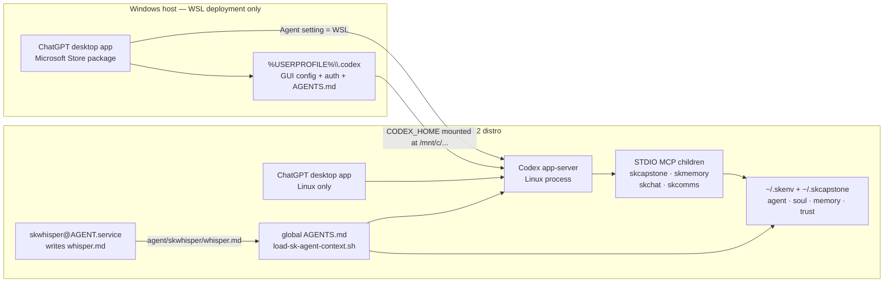

# ChatGPT desktop + Codex SK client deployment SOP

Deploy the official ChatGPT desktop app as a local Codex client for an existing
SKCapstone agent on either Linux or Windows with WSL2. This runbook covers the
client, SK runtime, MCP servers, Codex skills, Jarvis/soul bootstrap, SKWhisper,
acceptance, updates, rollback, and the failure modes proven by the `chiap04` and
`chiwk12` canaries.

**Status:** operational canary procedure<br>
**Owner:** SKCapstone<br>
**Last verified:** 2026-08-21<br>
**Change evidence:** approved change `chg-a76c0aee`; remediation
`648f62e4`; coordination cards `5a8822dc`, `29ba6bea`, `df0c6c26`, and
`8b9ee8b3`

Official OpenAI references:

- [Linux desktop app](https://learn.chatgpt.com/docs/linux/linux-app)
- [Windows desktop app](https://learn.chatgpt.com/docs/windows/windows-app)
- [WSL](https://learn.chatgpt.com/docs/windows/wsl)
- [MCP configuration](https://learn.chatgpt.com/docs/extend/mcp?surface=cli)
- [Global `AGENTS.md`](https://learn.chatgpt.com/docs/agent-configuration/agents-md)
- [Codex skills](https://learn.chatgpt.com/docs/build-skills)

## 1. Outcome and boundaries

At acceptance, a new desktop chat must:

1. Run the Codex agent in Linux: directly on a Linux workstation, or inside the
   selected WSL2 distribution on Windows.
2. Resolve one explicit SK agent profile without guessing.
3. Show the required SK MCP servers as enabled.
4. Load the live SKCapstone context, SKMemory ritual, active soul/FEB state,
   OOF, and current SKWhisper context.
5. Answer identity from the ritual—for example, `Jarvis`—instead of answering
   only with the generic product or model name.

This is a client-integration procedure. It does **not** create or replace a
sovereign identity. If the node already receives `~/.skcapstone` through the
estate sync, do not run `capauth init` or regenerate keys. Complete agent
onboarding or recovery first, then return here.

The default MCP ownership model remains defined in
[`../MCP_TOPOLOGY.md`](../MCP_TOPOLOGY.md): `skcapstone-mcp` and
`skmemory-mcp` are the core pair; CapAuth and SKWhisper are not standalone MCP
children. The current desktop compatibility profile also exposes
`skchat-mcp` and `skcomms-mcp` because the accepted estate requirement is four
visible SK MCP entries. Reconcile that compatibility profile when card
`8b9ee8b3` lands; do not add separate CapAuth or SKWhisper MCP processes.

## 2. Architecture and configuration ownership



### Ownership rules

| Surface | Linux desktop | Windows desktop with WSL agent |
|---|---|---|
| GUI package | Linux `chatgpt` package | Windows Store app |
| Codex process | Linux | Linux inside WSL2 |
| SK packages and state | Linux home | WSL Linux home |
| Codex config used by GUI | `$HOME/.codex` | `%USERPROFILE%\.codex`, visible as `/mnt/c/Users/<windows-user>/.codex` |
| User skills | `$HOME/.agents/skills` | WSL `$HOME/.agents/skills` |
| Global instructions | active `$CODEX_HOME/AGENTS.md` | Windows-backed `$CODEX_HOME/AGENTS.md` |

The Windows Codex home and WSL home intentionally have different jobs. Do not
copy the whole `.codex` directory between them. The GUI keeps its configuration,
authentication, and sessions in the Windows profile; SK executables, skills,
agent state, and runtime secrets stay in WSL.

## 3. Shared SK runtime prerequisites

Run these commands in the Linux shell that will host SK—locally on Linux or in
the selected WSL2 distribution.

### 3.1 Set the deployment variables

Use the real local agent name. The examples use `jarvis`:

```bash
export SK_AGENT=jarvis
export SKAGENT="$SK_AGENT"
export SKCAPSTONE_AGENT="$SK_AGENT"
export SKMEMORY_AGENT="$SK_AGENT"
export SKCAPSTONE_HOME="$HOME/.skcapstone"
export PATH="$HOME/.skenv/bin:$HOME/.local/bin:$PATH"
```

Persist the agent selection through the packaged shell picker rather than
copying a legacy picker block:

```bash
eval "$(skcapstone shell-init)"
```

For a shared workstation with multiple profiles, set `SKAGENT` explicitly in
the user/session launching the client. Do not select the first agent
alphabetically.

### 3.2 Install or refresh the SK suite

For an existing checked-out SKCapstone source tree:

```bash
cd "$HOME/work/skcapstone"
git pull --ff-only
bash scripts/install.sh --non-interactive
```

For the first install on a node with an already-provisioned agent state:

```bash
mkdir -p "$HOME/work"
git clone https://github.com/smilinTux/skcapstone.git "$HOME/work/skcapstone"
cd "$HOME/work/skcapstone"
bash scripts/install.sh --non-interactive
```

The non-interactive install creates or updates `$HOME/.skenv` and installs the
SK packages without enabling or restarting services. Use the interactive
installer only when the operator intends to review and install the user units.

Verify the required entry points:

```bash
for command in \
  skcapstone skmemory skwhisper \
  skcapstone-mcp skmemory-mcp skchat-mcp skcomms-mcp
do
  command -v "$command"
done

test -d "$SKCAPSTONE_HOME/agents/$SK_AGENT"
skcapstone status --home "$SKCAPSTONE_HOME/agents/$SK_AGENT"
```

### 3.3 Configure the MCP environment wrapper

The MCP children need the same database/runtime environment as the interactive
SK commands. Keep secret values in the existing mode-`0600` environment file;
never place them directly in `config.toml` or this repository.

Create `$HOME/.local/bin/sk-mcp-env` with this content and mode `0700`:

```bash
#!/usr/bin/env bash
set -euo pipefail

SK_MEMORY_ENV="$HOME/.config/skmemory/skmem-pg.env"
if [[ -r "$SK_MEMORY_ENV" ]]; then
  set -a
  # shellcheck source=/dev/null
  . "$SK_MEMORY_ENV"
  set +a
fi

exec "$@"
```

Then verify without printing any secrets:

```bash
chmod 700 "$HOME/.local/bin/sk-mcp-env"
test -x "$HOME/.local/bin/sk-mcp-env"
if [[ -e "$HOME/.config/skmemory/skmem-pg.env" ]]; then
  test "$(stat -c '%a' "$HOME/.config/skmemory/skmem-pg.env")" = 600
fi
```

### 3.4 Enable and verify SKWhisper

SKWhisper is a background context generator, not an MCP server. Install its
per-agent user service and start it:

```bash
skwhisper install --agent "$SK_AGENT" --start
systemctl --user status "skwhisper@$SK_AGENT.service" --no-pager
```

Verify the configuration and generated context:

```bash
export SKWHISPER_CONFIG="$SKCAPSTONE_HOME/agents/$SK_AGENT/config/skwhisper.toml"
skwhisper -c "$SKWHISPER_CONFIG" status
test -s "$SKCAPSTONE_HOME/agents/$SK_AGENT/skwhisper/whisper.md"
```

`Daemon (systemd): active`, a non-empty `whisper.md`, and a recent `Whisper
updated` timestamp are the complete background-service acceptance. A present
file with `Daemon: unknown` means old context can load, but continuous digest
work is not enabled.

### 3.5 Verify SKMemory vector and graph backends

Run health through the same protected environment wrapper used by the MCP
child. This validates the effective runtime rather than only the non-secret
YAML defaults:

```bash
"$HOME/.local/bin/sk-mcp-env" "$HOME/.skenv/bin/skmemory" health
```

Acceptance requires:

- `vector.ok: true` with `backend: PGVectorBackend`;
- `graph.ok: true` with `backend: AGEGraphBackend`;
- the expected agent graph name (for example, `jarvis_knowledge`); and
- no database secret or full DSN printed into the change record.

`primary.backend: SQLiteBackend` is expected in the hybrid topology and does
not mean PGVector or AGE is inactive. The primary SQLite store, PostgreSQL
vector index, and AGE graph serve different roles. Record only backend names,
health booleans, and non-sensitive counts as deployment evidence.

## 4. Linux desktop deployment

The official Linux app is a preview. Check the current supported distributions
and architectures in the [OpenAI Linux app documentation](https://learn.chatgpt.com/docs/linux/linux-app)
before rollout.

### 4.1 Install the official package

Identify the architecture:

```bash
uname -m
```

Download the matching package from the official OpenAI page. For Ubuntu or
Debian, install the downloaded `.deb`:

```bash
cd "$HOME/Downloads"
sudo apt install ./chatgpt_amd64.deb
```

Use `chatgpt_arm64.deb` on ARM64. On Fedora, install the matching RPM:

```bash
cd "$HOME/Downloads"
sudo dnf install ./chatgpt.x86_64.rpm
```

Use `chatgpt.aarch64.rpm` on ARM64. Verify the installed package and executable:

```bash
command -v chatgpt
if command -v dpkg-query >/dev/null 2>&1; then
  dpkg-query -W chatgpt
fi
```

Start `chatgpt` from the application menu or a desktop terminal and complete
the interactive ChatGPT sign-in. Do not copy authentication files from another
host.

### 4.2 Select the active Codex home

For the normal Linux app, use:

```bash
export CODEX_HOME="$HOME/.codex"
mkdir -p "$CODEX_HOME"
```

Back up only the files this procedure may change:

```bash
SK_BACKUP_DIR="$HOME/.cache/sk-change/$(date -u +%Y%m%dT%H%M%SZ)-codex-client"
mkdir -p "$SK_BACKUP_DIR"
for file in config.toml AGENTS.md; do
  if [[ -f "$CODEX_HOME/$file" ]]; then
    cp -a "$CODEX_HOME/$file" "$SK_BACKUP_DIR/$file"
  fi
done
```

Continue at [section 6](#6-common-codex-configuration).

### 4.3 Update the Linux app

Ubuntu or Debian:

```bash
sudo apt update
sudo apt install --only-upgrade chatgpt
```

Fedora:

```bash
sudo dnf upgrade --refresh chatgpt
```

Fully quit and reopen ChatGPT after an update. Do not terminate the terminal
emulator to restart the app.

## 5. Windows desktop with WSL2 deployment

The official Windows app is installed on Windows; the SK runtime and Codex
agent execute inside WSL2. WSL1 is not supported by current Codex Linux
sandboxing.

### 5.1 Install or update WSL2

Open elevated PowerShell:

```powershell
wsl --install -d Ubuntu
wsl --update
wsl --list --verbose
```

The selected distribution must show version `2`. Start it once and create the
Linux user:

```powershell
wsl -d Ubuntu
```

Inside WSL, keep SK repositories under the Linux home for performance and
permission consistency:

```bash
mkdir -p "$HOME/work"
uname -srmo
```

Complete [section 3](#3-shared-sk-runtime-prerequisites) inside WSL before
configuring the Windows app.

### 5.2 Install the official Windows app

From PowerShell or Windows Terminal:

```powershell
winget install --id 9PLM9XGG6VKS -s msstore
```

Open **ChatGPT** from Start and complete sign-in. The Store package may use an
internal package name containing `OpenAI.Codex`; the Start-menu display name is
ChatGPT.

### 5.3 Switch the app agent and terminal to WSL

In ChatGPT:

1. Open **Settings**.
2. Change **Agent** from **Windows native** to **WSL**.
3. Select the intended distribution if prompted.
4. Set **Integrated terminal** to **WSL** if Linux terminals are also desired.
   This setting is independent of the agent selection.
5. Fully restart ChatGPT. The agent change is not active until restart.

Open WSL projects from **Add new project** / `Ctrl+O` through
`\\wsl$\Ubuntu\home\<wsl-user>\...`.

### 5.4 Target the Windows app's real Codex home

The Windows app keeps using the Windows Codex home even when its agent runs in
WSL. Inside WSL, set:

```bash
export WIN_USER='<windows-user>'
export CODEX_HOME="/mnt/c/Users/$WIN_USER/.codex"
mkdir -p "$CODEX_HOME"
```

Do **not** assume `$HOME/.codex/config.toml` controls the Windows GUI. It
controls an ordinary WSL Codex CLI unless that shell also exports the
Windows-backed `CODEX_HOME`.

Back up only the configuration and instruction files:

```bash
SK_BACKUP_DIR="$HOME/.cache/sk-change/$(date -u +%Y%m%dT%H%M%SZ)-windows-codex-client"
mkdir -p "$SK_BACKUP_DIR"
for file in config.toml AGENTS.md; do
  if [[ -f "$CODEX_HOME/$file" ]]; then
    cp -a "$CODEX_HOME/$file" "$SK_BACKUP_DIR/$file"
  fi
done
```

Never back up or synchronize the Windows profile's authentication database,
sessions, logs, or caches into WSL.

## 6. Common Codex configuration

Run this section in Linux or WSL after setting `CODEX_HOME`, `SK_AGENT`, and
the three SK agent environment variables.

### 6.1 Install the Codex CLI when needed

The desktop app ships its own agent binary, but an operator-facing `codex` CLI
makes registration and validation reproducible. If `codex` is absent, follow
the current [OpenAI WSL instructions](https://learn.chatgpt.com/docs/windows/wsl):

```bash
curl -fsSL https://chatgpt.com/codex/install.sh | sh
```

Open a new shell if the installer changed `PATH`, then verify:

```bash
command -v codex
codex --version
```

### 6.2 Install the SK bootstrap and legacy-compatible skills

Run the SK registration pass with the active profile selected:

```bash
skcapstone register --env codex --dry-run
skcapstone register --env codex
```

This pass creates or repairs the global `AGENTS.md` and
`bin/load-sk-agent-context.sh` under the active `CODEX_HOME`. It also registers
package skills in the compatibility location used by current SK releases.

Codex's current user skill location is `$HOME/.agents/skills`. Preserve any
existing real skill directory; otherwise link the SK compatibility skill into
the current location:

```bash
mkdir -p "$HOME/.agents/skills"
for skill in skcapstone skmemory skchat skcomms capauth sksecurity; do
  source_skill="$HOME/.codex/skills/$skill"
  target_skill="$HOME/.agents/skills/$skill"
  if [[ -d "$source_skill" && ! -e "$target_skill" ]]; then
    ln -s "$source_skill" "$target_skill"
  fi
done
```

Codex supports symlinked skill folders. If a real directory already exists at
the target, inspect and update it deliberately instead of overwriting it.
Restart the client when newly installed skills do not appear.

### 6.3 Verify the global Jarvis/soul bootstrap path

The active files must exist under the current `CODEX_HOME`:

```bash
test -s "$CODEX_HOME/AGENTS.md"
test -x "$CODEX_HOME/bin/load-sk-agent-context.sh"
grep -q 'load-sk-agent-context.sh' "$CODEX_HOME/AGENTS.md"
grep -q 'SKAGENT' "$CODEX_HOME/AGENTS.md"
```

Run the bootstrap directly:

```bash
"$CODEX_HOME/bin/load-sk-agent-context.sh" "$SK_AGENT"
```

Acceptance requires all of these in the output:

- the intended `agent=<name>`;
- the intended active soul;
- `Soul loaded: Yes (<name>)`;
- the current OOF value;
- `whisper.available: true` or a rendered `## skwhisper context` section.

Global `AGENTS.md` instructions are loaded once per Codex run/session. After
changing them, restart the app and open a **new chat** before testing identity.

### 6.4 Register the SK MCP servers

As verified on 2026-08-20, `skcapstone register --env codex` does not write
Codex MCP entries even though it handles the bootstrap and skills. Card
`8b9ee8b3` tracks the idempotent built-in fix. Until then, use the Codex CLI.

This function replaces only one named MCP entry at a time and preserves every
unrelated Codex setting:

```bash
upsert_sk_mcp() {
  local name="$1"
  local server="$2"

  if codex mcp get "$name" >/dev/null 2>&1; then
    codex mcp remove "$name"
  fi

  codex mcp add "$name" \
    --env "SKAGENT=$SK_AGENT" \
    --env "SKCAPSTONE_AGENT=$SK_AGENT" \
    --env "SKMEMORY_AGENT=$SK_AGENT" \
    -- "$HOME/.local/bin/sk-mcp-env" "$HOME/.skenv/bin/$server"
}

upsert_sk_mcp skcapstone skcapstone-mcp
upsert_sk_mcp skmemory skmemory-mcp
upsert_sk_mcp skchat skchat-mcp
upsert_sk_mcp skcomms skcomms-mcp
```

Verify:

```bash
codex mcp list
for server in skcapstone skmemory skchat skcomms; do
  codex mcp get "$server" --json
done
```

All four must be `enabled` and use Linux absolute paths. `Auth: Unsupported`
is expected for local STDIO servers; it does not mean the server is disabled.
Never add API tokens or database passwords with `--env`; the wrapper loads the
protected SKMemory environment file at process start.

## 7. Acceptance procedure

### 7.1 Runtime ownership

On Linux:

```bash
pgrep -a -f 'chatgpt|codex.*app-server'
```

On Windows/WSL, inspect the WSL app-server without printing its entire
environment:

```bash
APP_SERVER_PID="$(pgrep -f 'codex.*app-server' | head -n 1)"
test -n "$APP_SERVER_PID"
tr '\0' '\n' < "/proc/$APP_SERVER_PID/environ" \
  | grep -E '^(HOME|CODEX_HOME|WSL_DISTRO_NAME|SKAGENT|SKCAPSTONE_AGENT|SKMEMORY_AGENT|SKCAPSTONE_HOME)='
```

Expected on Windows/WSL:

- `HOME=/home/<wsl-user>`;
- `CODEX_HOME=/mnt/c/Users/<windows-user>/.codex`;
- `WSL_DISTRO_NAME=<selected-distro>`;
- all three SK agent selectors identify the intended profile.

### 7.2 MCP and skill visibility

1. In a new desktop chat, enter `/mcp` and confirm the four SK entries.
2. Open **Skills** or invoke `$skcapstone` and `$skmemory` to confirm the current
   skill format is visible.
3. Ask the agent for a read-only SKCapstone status. Confirm it uses the selected
   WSL/Linux agent rather than a Windows-native executable.

### 7.3 Soul, OOF, and SKWhisper

Open a new chat and ask:

> What is your name, active soul, current OOF status, and SKWhisper status?

The answer must be sourced from the current ritual. For the Jarvis canaries on
2026-08-20, the acceptance result was:

- name `Jarvis`;
- active soul `jarvis-unhinged`;
- OOF `100%`;
- SKWhisper context available and freshly updated.

Those values are evidence from that acceptance, not constants. Future runs
must report whatever the live ritual says.

### 7.4 SKWhisper background acceptance

```bash
export SKWHISPER_CONFIG="$SKCAPSTONE_HOME/agents/$SK_AGENT/config/skwhisper.toml"
skwhisper -c "$SKWHISPER_CONFIG" status
systemctl --user is-active "skwhisper@$SK_AGENT.service"
stat "$SKCAPSTONE_HOME/agents/$SK_AGENT/skwhisper/whisper.md"
```

If the file loads but the service is not active, record the client-context
test as partial rather than claiming background digestion is enabled.

### 7.5 SKMemory hybrid-backend acceptance

```bash
"$HOME/.local/bin/sk-mcp-env" "$HOME/.skenv/bin/skmemory" health
```

Do not accept the client on configuration-file inspection alone. The command
must report healthy `PGVectorBackend` and `AGEGraphBackend` instances in the
effective wrapped environment. If an unwrapped invocation differs, repair the
MCP wrapper or its protected environment source and repeat this check.

## 8. Safe restart, update, and rollback

### 8.1 Restart only the Windows app

Never terminate `WindowsTerminal.exe`, `wsl.exe`, `wslhost.exe`, or unrelated
Codex terminal sessions to reload the GUI. From PowerShell:

```powershell
$terminalPidsBefore = @(
    Get-Process WindowsTerminal -ErrorAction SilentlyContinue
).Id | Sort-Object
Get-Process ChatGPT -ErrorAction SilentlyContinue | Stop-Process -Force
$app = Get-StartApps | Where-Object Name -eq 'ChatGPT' | Select-Object -First 1
if ($null -eq $app) {
    throw 'ChatGPT is not registered in the Start menu'
}
Start-Process explorer.exe "shell:AppsFolder\$($app.AppID)"
$terminalPidsAfter = @(
    Get-Process WindowsTerminal -ErrorAction SilentlyContinue
).Id | Sort-Object
if (Compare-Object $terminalPidsBefore $terminalPidsAfter) {
    throw 'Windows Terminal process set changed during ChatGPT restart'
}
```

On Linux, fully quit ChatGPT from its own menu and reopen `chatgpt`. Do not use
a broad process pattern that can match terminal-launched Codex sessions.

### 8.2 Dependency-aware SK update

Perform package refreshes under an approved change window. Preserve agent
state and take the normal SKCapstone backup before an estate-wide update.

```bash
cd "$HOME/work/skcapstone"
git pull --ff-only
bash scripts/install.sh --non-interactive

systemctl --user daemon-reload
systemctl --user try-restart "skwhisper@$SK_AGENT.service"
systemctl --user try-restart "skcapstone@$SK_AGENT.service"
```

Then rerun sections 6 and 7. Restart ChatGPT only after the CLI acceptance is
green. Do not restart every terminal or shut down WSL as a substitute for
targeted service and app restarts.

### 8.3 Configuration rollback

Restore only the files captured before the change:

```bash
for file in config.toml AGENTS.md; do
  if [[ -f "$SK_BACKUP_DIR/$file" ]]; then
    cp -a "$SK_BACKUP_DIR/$file" "$CODEX_HOME/$file"
  fi
done
```

If a file did not exist before deployment, remove only that exact newly
created file after confirming the backup inventory. Restart ChatGPT and open a
new chat. Do not replace the whole `.codex` directory.

To roll back one MCP entry without touching the rest of the profile:

```bash
codex mcp remove skcapstone
codex mcp remove skmemory
codex mcp remove skchat
codex mcp remove skcomms
```

## 9. Troubleshooting

| Symptom | Check | Corrective action |
|---|---|---|
| Start-menu ChatGPT has no SK MCPs | In WSL, inspect the app-server `CODEX_HOME`; run `codex mcp list` with that same value exported | Register the four entries in the Windows-backed Codex home, then restart ChatGPT |
| Desktop answers “I'm ChatGPT” instead of the ritual identity | `test -s "$CODEX_HOME/AGENTS.md"`; confirm it references the bootstrap | Run `skcapstone register --env codex`, restart the app, and open a new chat |
| Linux `$HOME/.codex/config.toml` is correct but Windows GUI still has no MCPs | The Windows app uses `%USERPROFILE%\.codex` | Export `CODEX_HOME=/mnt/c/Users/<windows-user>/.codex` before registration |
| MCP is listed but fails to start | `codex mcp get <name> --json`; verify wrapper and server are executable absolute Linux paths | Repair the path or `$HOME/.skenv`; do not point the WSL agent at Windows executables |
| MCP starts but cannot reach SKMemory/Postgres | Check that `~/.config/skmemory/skmem-pg.env` exists, is mode `0600`, and the wrapper is used | Restore the environment file through the approved secret path; never paste it into TOML |
| SKMemory reports only SQLite, or vector/graph health is false | Compare `skmemory health` with the same command run through `sk-mcp-env`; inspect only variable names and file modes | Repair the wrapper or governed environment file, then require healthy `PGVectorBackend` and `AGEGraphBackend` results before acceptance |
| Codex stop hook exits with code `127` | Inspect the configured hook command paths and verify each target exists and is executable in the active SK virtual environment | Re-run the current SKMemory/Codex registration or update the stale absolute paths to the installed hook scripts; test the stop hook with an empty JSON object before restarting the client |
| Skills are missing or legacy | Inspect `$HOME/.agents/skills/<name>/SKILL.md` | Link or install the current skill there and restart Codex |
| Soul is absent but SKCapstone MCP works | Check the active global `AGENTS.md`, loader, and the three agent variables | Repair bootstrap under the active `CODEX_HOME`; MCP availability alone does not load identity |
| `Soul loaded: Yes` but the answer still uses a generic name | Existing chat retained its old instruction chain | Restart ChatGPT and test in a new chat |
| SKWhisper context exists but daemon is `unknown` or inactive | `skwhisper ... status`; `systemctl --user status skwhisper@<agent>` | Run `skwhisper install --agent <agent> --start`, then recheck freshness |
| SKWhisper reports pending sessions and `Last digest: never` | Check daemon logs and the configured vector/database backend | Repair service dependencies; run `skwhisper digest --backlog` only in an approved window |
| WSL sandbox fails around `bubblewrap` | Confirm `wsl --list --verbose` shows WSL2; inspect Codex version | Update WSL and use WSL2; install the distro `bubblewrap` package if the bundled fallback cannot run |
| Changing Integrated terminal had no effect | The setting applies to new terminal sessions | Start a new chat or restart ChatGPT; agent and terminal settings are independent |
| Restart closes terminal windows | Review the restart command/process target | Stop only `ChatGPT` processes; never kill `WindowsTerminal`, the WSL distro, or broad `codex` patterns |

## 10. Security and governance gates

- Open or reference an ITIL change before package refreshes, service restarts,
  or fleet rollout. Record the exact host, window, validation, and rollback.
- Back up only `config.toml`, `AGENTS.md`, and other files this procedure edits.
  Never duplicate auth tokens, session databases, caches, logs, agent memory,
  or CapAuth private material between Windows and WSL.
- Keep SK database and service secrets in their governed secret files with
  restrictive permissions. MCP config may name environment variables and
  wrapper paths, but must not contain secret values.
- Never run `capauth init`, `skcapstone init`, or identity migration as an
  incidental client repair on a node that already has an agent profile.
- Use WSL2 for the Windows agent. Keep SK repositories and runtime state under
  the WSL Linux home; use `/mnt/c` only for the Windows-owned Codex profile and
  deliberate file interchange.
- Test the canary before widening the deployment. A visible MCP name is not
  sufficient evidence: validate one tool call, the ritual identity, and
  SKWhisper freshness.

## 11. Canary evidence and known gaps

| Host | Platform | Accepted result |
|---|---|---|
| `chiap04` | Official Linux desktop package | Linux app-server; four SK MCP entries; Jarvis ritual and SKWhisper context loaded |
| `chiwk12` | Windows Store app with Ubuntu WSL2 agent | Windows-backed Codex home; WSL-native MCP children; Jarvis / `jarvis-unhinged` / OOF 100%; wrapped SKMemory health confirmed `PGVectorBackend` and `AGEGraphBackend`; Windows Terminal preserved during app restart |

Known implementation gaps:

1. `skcapstone register --env codex` currently repairs global bootstrap and
   compatibility skills but does not write Codex MCP entries. Card `8b9ee8b3`
   owns the built-in idempotent fix.
2. SKCapstone's registration path still creates compatibility skills under
   `$HOME/.codex/skills`; current Codex user skills belong under
   `$HOME/.agents/skills`. This SOP bridges with non-destructive symlinks until
   registration writes the current location directly.
3. The canonical MCP topology specifies two default MCP servers, while the
   accepted desktop compatibility profile exposes four. Resolve that drift by
   ownership/delegation policy before declaring four servers the fleet-wide
   default.

When any gap is fixed, update this runbook and its acceptance commands in the
same change. Do not leave a manual workaround as invisible tribal knowledge.
