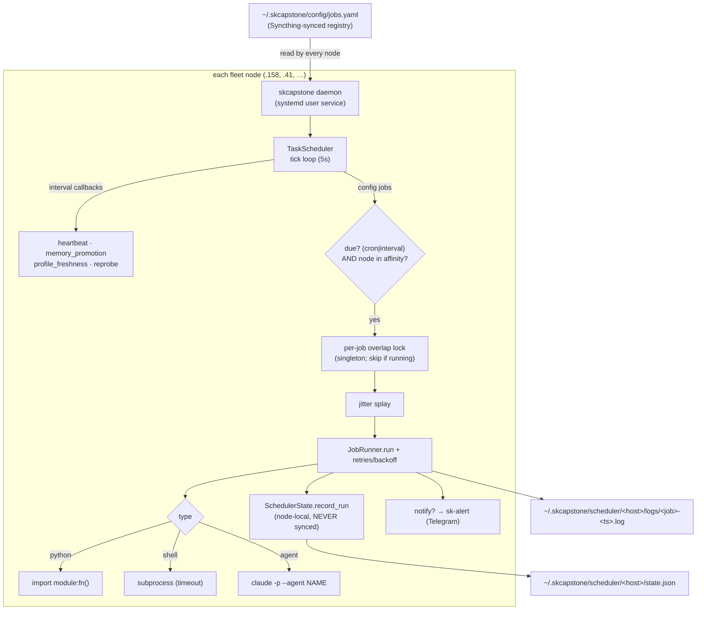
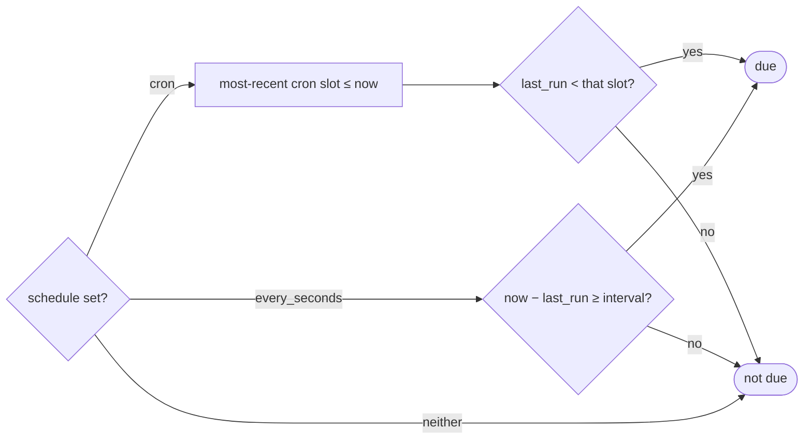

# skscheduler — Unified Fleet Job Scheduler

> The single declarative registry + per-node runner for all recurring jobs across the
> SK fleet. One `jobs.yaml`, synced everywhere; each node runs its own scheduler thread
> (inside the skcapstone daemon) and fires only the jobs whose affinity includes it.
> Design spec: [`docs/superpowers/specs/2026-06-08-skscheduler-design.md`](superpowers/specs/2026-06-08-skscheduler-design.md).

## Why it exists
Scheduling was fragmented across **four** mechanisms (skcapstone `TaskScheduler` interval
callbacks, legacy crontab, systemd user timers, Claude-Code crons) with no single place to
define, run, or observe jobs — and `service_health` running on multiple nodes caused
Syncthing `.sync-conflict-*` files (the root incident). skscheduler unifies this: **one
registry, per-job node-affinity** (so a job runs on exactly the intended node — preventing
the multi-writer class), cron **and** interval, and agent-judgment jobs (not just Python).

## Architecture



**Sync-safety invariant:** the registry (`jobs.yaml`) is synced; **run-state and logs are
node-local and never synced** (`~/.skcapstone/.stignore` excludes `scheduler/`). The
scheduler can never become a sync-conflict source.

## Job lifecycle (one due job)

```mermaid
sequenceDiagram
    participant Loop as TaskScheduler tick
    participant Due as is_due()
    participant Aff as job_runs_here()
    participant Lock as overlap lock
    participant Run as JobRunner
    participant St as SchedulerState
    participant Al as sk-alert
    Loop->>Due: cron slot passed / interval elapsed since last_run?
    Due-->>Loop: due
    Loop->>Aff: this node's alias in job.nodes?
    Aff-->>Loop: yes
    Loop->>Lock: acquire (non-blocking)
    alt previous run still going
        Lock-->>Loop: busy → skip (no double-run)
    else free
        Lock-->>Loop: got it (in a worker thread)
        Loop->>Run: jitter splay, then attempt 1..N
        loop until ok or retries exhausted
            Run->>Run: dispatch(type) with timeout
            Run-->>Loop: ok? else backoff + retry
        end
        Loop->>St: record_run(ok, error, fire_time)
        Loop->>Al: notify policy met? → DM Chef
    end
```

## Due-check logic


Cron uses `croniter` (a declared dependency — if missing, **cron jobs silently can't fire**;
`pip install -e .` in the venv fixes it). Missed slots are caught up once on next tick
(misfire catch-up); per-job `catchup: false` opts out.

## `jobs.yaml` schema (complete)

```yaml
jobs:
  <job-name>:                 # YAML key = unique job id
    # — scheduling (exactly one) —
    schedule: "0 6 * * *"     # cron (m h dom mon dow)
    every: 5m                 # OR interval: 30s | 5m | 1h | 1d | <seconds>
    # — what to run (by type) —
    type: agent               # agent | shell | python   (default python)
    agent: lumina             # agent type  → runs `claude -p "<prompt>" --agent <name>`
    prompt: "…"               # agent prompt
    command: "skmem-pg-backup"# shell type  → subprocess
    callback: "module.path:fn"# python type → import & call
    # — placement —
    nodes: [".41"]            # affinity: "all" | [host aliases]  (alias = SK_NODE_ALIAS)
    # — limits / reliability (added 2026-06-09) —
    timeout: 900              # hard-kill seconds (default 900)
    retries: 0                # extra attempts on failure (linear)
    retry_backoff: 0          # seconds between attempts
    jitter: 0                 # max random splay (s) before dispatch — fleet anti-stampede
    notify: off               # off | on_failure | on_success | always  → sk-alert (Telegram)
    notify_level: warn        # sk-alert level for failures (info|warn|crit)
    catchup: true             # run once on a missed slot (default true)
    enabled: true
```

## Reliability features (2026-06-09)
| field | purpose | infra it serves |
|---|---|---|
| `retries` + `retry_backoff` | re-attempt on transient failure | flaky network/registry/LLM endpoints |
| `jitter` | random splay before dispatch | many nodes sharing a cron slot hitting one resource |
| `notify` (+`notify_level`) | sk-alert on `on_failure`/`on_success`/`always` with output tail | unattended jobs; result delivery (e.g. sktrip) |
| `catchup` | catch a missed slot once | laptops/asleep nodes (vs strict real-time jobs) |
| overlap lock | singleton per job | long runs that exceed their interval |
| node affinity | exactly-one-node execution | stateful/single-writer jobs (the original conflict fix) |

## State, logs, observability
- **State** (node-local): `~/.skcapstone/scheduler/<host>/state.json` — `last_run`, `ok`, `error`, run counts. Never synced.
- **Logs** (node-local): `~/.skcapstone/scheduler/<host>/logs/<job>-<ts>.log` — captured stdout+stderr.
- **CLI**: `skcapstone scheduler …` (list / run-now / status). `skcapstone doctor` validates scheduler health.

## Operating it
```bash
systemctl --user status skcapstone.service     # the daemon that runs the scheduler
systemctl --user start  skcapstone.service     # ⚠ if inactive, NO jobs.yaml jobs fire
echo "$SK_NODE_ALIAS"                            # must match a value in a job's nodes: list
skcapstone scheduler status                      # last run / ok / errors per job
```

## Troubleshooting
| symptom | cause | fix |
|---|---|---|
| no jobs fire | `skcapstone.service` inactive | `systemctl --user start skcapstone.service` |
| cron jobs never fire (interval ok) | `croniter` not installed in venv | `~/.skenv/bin/pip install -e .` |
| job runs on wrong/extra node | `nodes:` affinity / `SK_NODE_ALIAS` mismatch | set the env / fix the list |
| job overlaps itself | run time > interval | raise interval, or rely on the overlap lock (it skips) |
| no failure alerts | `notify: off` | set `notify: on_failure` |

## Relationship to other schedulers
- **systemd user timers** — keep for OS-level/boot jobs and as the process supervisor for the daemon itself; migrate *application* recurring jobs here.
- **Claude-Code crons** — separate system (cloud agents); documented, not migrated.
- **legacy crontab** — retire into `jobs.yaml`.

## Migration
- `dreaming_reflection` — migrated 2026-07-09 from a `scheduled_tasks.py` built-in
  (hard-coded 900s) to the `dreaming-reflection` config job (`every: 15m`, `type: python`,
  `callback: skcapstone.dreaming_job:run_dreaming_job`). See
  [`docs/superpowers/plans/2026-07-09-dreaming-skscheduler-migration.md`](superpowers/plans/2026-07-09-dreaming-skscheduler-migration.md).
  Known gap: `python`-type jobs get no per-run `logs/<job>-<ts>.log` file (only
  `shell`/`agent` jobs do, via `_run_subprocess`) — use `skcapstone scheduler status`
  for run history instead of `scheduler logs`.

## Roadmap (not yet implemented)
job dependencies (`after:`), dead-man's-switch staleness alerts, per-job env/secrets injection,
a web/TUI run-history view, and distributed locking (currently affinity-by-declaration, not election).
