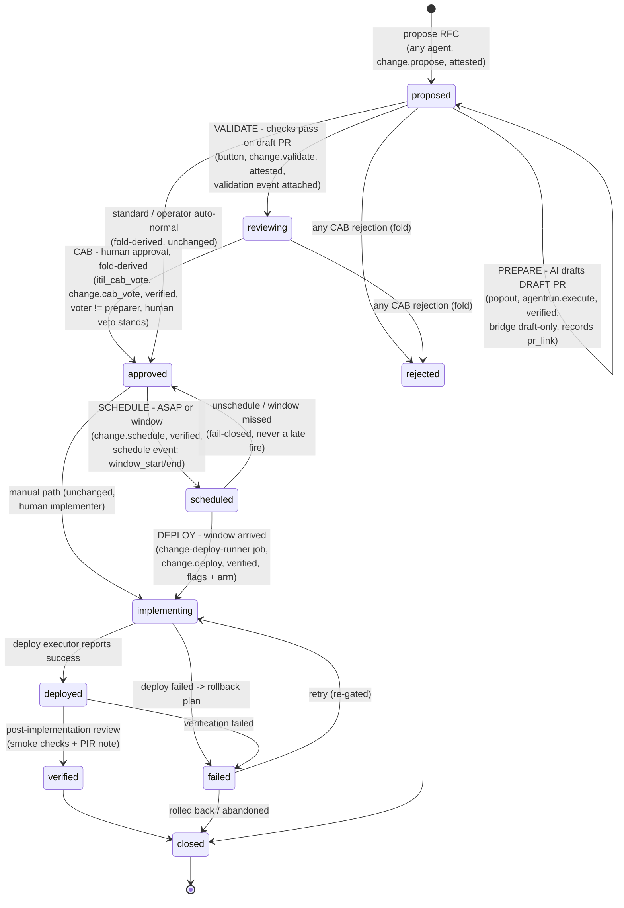

# Change Management end-to-end: CAB + capauth + AI prepare/deploy + scheduling

Status: DESIGN (approved-for-decomposition)
Date: 2026-08-13
Author: lumina
Scope: skcoord (ITIL store), skcapstone (agent_run, scheduler, MCP), capauth
(PDP rules), skharness (executors), skdashboard (routes), skworld-app (popout),
sk-standards (operating model section 5)

## 1. The operator ask

From a change card's AI popout, Chef wants to:

1. **Prepare** the prod change: AI drafts the change as a DRAFT PR, before
   approval.
2. **Validate** the PR with one button: run its checks, attach the verdict to
   the change ticket.
3. **Schedule** the change order: ASAP or a future window.
4. **Deploy** at the scheduled time, gated by CAB approval and capauth, with
   the kanban board and the app coherent the whole way.

Today the popout's execute on a change ticket is blocked by
`agent_run.gate()` ("change tickets require a human/CAB vote to 'approved'
before implementing; the agent may draft only"). That block is correct, but
there is no end-to-end path from there. This doc designs that path.

## 2. Ground truth (what exists, with file references)

| Piece | Where | What it does today |
|---|---|---|
| Change state machine | `skcoord/src/skcoord/itil.py` `_CHANGE_TRANSITIONS` | proposed -> {reviewing, approved, rejected}; reviewing -> {approved, rejected}; approved -> {implementing, rejected}; implementing -> {deployed, failed}; deployed -> {verified, failed}; verified -> closed; failed -> {implementing, closed}; rejected -> closed |
| Approval derivation | `itil.py::_fold_change` | Pure fold-time: standard auto-approves; operator auto-normal tier (tag `auto-normal`, risk != high, rollback plan, no rejection); else CAB: any rejection blocks, else >= 1 `human` approval unblocks. No writer ever mutates status for approval. |
| CAB votes | `itil.py::submit_cab_vote` / `get_cab_votes` | Per-agent file `cab-decisions/<chg>-<agent>.json`, conflict-free. `agent` is FREE TEXT: nothing binds the vote to an authenticated identity. |
| MCP surface | `skcapstone/mcp_tools/itil_tools.py` | `itil_change_propose`, `itil_change_update(new_status, note)`, `itil_cab_vote`. No schedule, no validation, no PR linkage. |
| AI runner + gate | `skcapstone/src/skcapstone/agent_run.py` | `request_run` (modes propose / dry-run / execute), `gate()` blocks execute on kind=change unconditionally, `process_one` fail-closed (R1): execute only via `set_execute_dispatcher`. |
| Prepare executor | `skharness/src/skharness/autocode/agentrun_bridge.py` | Sandboxed run -> independent twin-gate grade -> DRAFT PR. Structurally cannot merge (`DirectExecutor._merge` raises). Behind `SKAI_EXECUTE_BRIDGE=1` + `autopilot.yaml live_execution` + repo policy + cost caps. |
| Queue gate | `skdashboard/src/skdashboard/queue_authz.py` | `capability_for(mode)` -> `agentrun.execute` / `agentrun.queue`; staged `SKAI_AUTHZ` token/pdp/both. NOTE: `agentrun.*` rows are NOT seeded in capauth `DEFAULT_RULES`, so pdp mode denies them as unknown capability today. |
| PDP | `capauth/src/capauth/authz.py::decide` | Deterministic: enrollment mode (tofu < attested < verified) + active non-revoked capability token. Fail-closed on every uncertainty. Rules: `_SKCHAT_RULES`, `_SKGATEWAY_RULES`, `_SKCODE_RULES` only. |
| Scheduler | `skcapstone/src/skcapstone/scheduler_jobs.py` + `~/.skcapstone/config/jobs.yaml` | `ai-runner` python job every 60s on noroc2027 -> `agent_run.run_ai_runner_job`. Drop-ins via `jobs.d/`. |
| Kanban projection | `skcoord/src/skcoord/card.py` `_CHANGE_COLUMN` | proposed=backlog, reviewing/approved=ready, implementing=doing, deployed=review, verified/rejected/closed=done, failed=doing. Change swimlane. |
| Operating model | `sk-standards/standards/ITIL_AND_RUNBOOK_OPERATING_MODEL_STANDARD.md` section 5 | The one CAB gate; a single human rejection is a standing veto; the AI can never self-authorize a major change. |

## 3. The end-to-end flow



Actors per transition:

| Transition | Actor | Capability (min enrollment) | Enforced where |
|---|---|---|---|
| propose RFC | any agent / operator | `change.propose` (attested) | MCP tool + dashboard PEP |
| prepare (draft PR) | AI runner on behalf of requester | `agentrun.queue` to queue (attested), `agentrun.execute` to run (verified) | `queue_authz` + R1 seam |
| validate | operator button (or AI on request) | `change.validate` (attested) | dashboard route PEP |
| CAB vote | agents + `human` | `change.cab_vote` (verified) | MCP tool + dashboard PEP, vote agent bound to authenticated subject |
| schedule | operator | `change.schedule` (verified) | dashboard route + MCP PEP |
| deploy | change-deploy-runner (scheduler) | `change.deploy` (verified) | runner PEP before dispatch + deploy bridge re-check |
| verify / close | operator or AI with human confirm | `change.propose` tier (attested) | MCP tool |

The PDP stays deterministic and fact-based; ticket-state preconditions
(approved, window arrived, drafter != approver) are PEP-side invariants checked
against the folded change record, mirroring how `gate()` works today.

## 4. State and field additions (minimal)

### 4.1 One new status: `scheduled`

`ChangeStatus.SCHEDULED = "scheduled"`, with transitions:

```python
"approved":  {"implementing", "rejected", "scheduled"},   # add scheduled
"scheduled": {"implementing", "approved", "rejected"},    # new row
```

Everything else in `_CHANGE_TRANSITIONS` is untouched. `approved ->
implementing` stays legal so the existing manual-implementer path keeps
working unchanged.

### 4.2 New event kinds folded by `_fold_change` (event-sourced, conflict-free)

All additions are append-only events, keeping the store's "no writer mutates
the record" invariant. The fold stays pure.

| Event kind | Payload | Fold effect |
|---|---|---|
| `pr_link` | `{url, branch, run_id}` | Sets `Change.prepared_pr` (last-write-wins) and records `prepared_by` = event writer. Appended by the runner when a prepare run finishes with a draft PR. |
| `validation` | `{passed: bool, url, summary, checks: [...]}` | Sets `Change.validation` (latest wins). When `passed` and status is `proposed`, the PEP also appends `status -> reviewing` (ready for CAB). |
| `schedule` | `{window_start, window_end, asap: bool, deploy_mode: "confirm"|"auto", note}` | Valid only while status is `approved` (else folded as conflicted, same as an invalid status event). Transitions to `scheduled` and sets `Change.scheduled_window`. Latest valid schedule event wins (re-schedule is another event). |
| `unschedule` | `{note}` | `scheduled -> approved`, clears `scheduled_window`. |
| `window_missed` | `{note}` | Appended by the runner when now > window_end without a deploy. Folds `scheduled -> approved` with the miss on the timeline. Fail-closed: a missed window NEVER fires late; it demands an explicit re-schedule. |

New `Change` model fields (all optional, defaulting to None, so every existing
record folds unchanged): `prepared_pr: Optional[dict]`, `prepared_by:
Optional[str]`, `validation: Optional[dict]`, `scheduled_window:
Optional[dict]`.

ASAP is not a special case: it is `window_start = now, window_end = now + a
default grace (e.g. 4h), asap: true`. The runner treats it identically.

### 4.3 MCP / CLI surface additions

- `itil_change_schedule(change_id, agent, window_start=None, window_end=None, asap=False, deploy_mode="confirm")` appends the `schedule` event (and `unschedule` via `itil_change_update(new_status="approved")` equivalence or an explicit flag).
- `itil_change_validate(change_id, agent)` triggers the validation runner (section 6) and appends the `validation` event.
- `itil_change_update` and `itil_status` gain the new fields in their output.
- CLI mirrors under `skcapstone itil change schedule|validate`.

## 5. The two AI executions are different executors

### 5.1 PREPARE = the existing draft bridge (works today, one carve-out)

Prepare is exactly `agentrun_bridge.execute_dispatch`: sandboxed run, twin-gate
grade, DRAFT PR, structurally incapable of merging. Two wiring changes:

1. **Gate carve-out**: `agent_run.gate()` for kind=change distinguishes
   pre-approval draft from implementation. New rule: execute on a change card
   is allowed while the folded change status is `proposed` or `reviewing`,
   because the wired executor is structurally draft-only; the run instruction
   template says PREPARE (draft the implementation for CAB review). Execute on
   a change in any other status stays blocked with today's reason. The gate
   gains the folded change status as an input (it already folds the card in
   `process_one`; the change record fold is one more lookup by id prefix
   `chg-`). Fail-closed default: if the change record cannot be folded, block.
2. **Result linkage**: when a prepare run on a `chg-` card finishes with
   `links.pr`, the runner appends the `pr_link` event to the ITIL change record
   (writer = the requesting agent). This is the missing edge that makes the
   draft PR a property of the change ticket, not just of the kanban card.

The popout labels this chip **Prepare** for change cards (it is still
mode=execute on the wire; no new mode constant, so `queue_authz`,
`_HEURISTIC`, and the R1 seam are unchanged). `capability_for("execute") ->
agentrun.execute` already demands the verified tier once the rules are seeded
(section 7).

### 5.2 DEPLOY = a new, later, separately-gated executor

Deploy is NOT the bridge and never will be: the bridge's no-merge property is
structural and stays that way. Deploy is a new `skharness` executor
(`change_deploy_bridge.py`, Phase 3) with its own seam in `agent_run`
(`set_deploy_dispatcher`, mirroring R1 exactly: fail-closed when unwired,
raw-dispatch refusal in `claude_dispatcher` style).

What deploy does, in order, all-or-refuse:

1. Re-fold the change; require status `scheduled`, window arrived
   (window_start <= now <= window_end), `prepared_pr` present, latest
   `validation.passed` true.
2. capauth `decide(runner_subject, "change.deploy", resource={"id": chg,
   "prepared_by": ...})` must allow; PEP additionally refuses when
   runner/approver identity equals `prepared_by` (no self-approval, section 7).
3. Arm check: `deploy_mode == "confirm"` (the default) requires a human arm,
   recorded as one more per-agent file `cab-decisions/<chg>-<agent>.arm.json`
   written from the dashboard's Deploy-arm button (capability `change.deploy`,
   verified). `deploy_mode == "auto"` (per-change, set at schedule time,
   Phase 3b only) skips the arm.
4. Re-run the PR checks (freshness: the validation verdict must be for the
   PR's current head SHA, else refuse and demand re-validate).
5. Mark the draft PR ready + merge it (`gh pr ready` + `gh pr merge --squash`),
   append `status -> implementing` before merging and `status -> deployed`
   after the repo's deploy step (publish-on-main pipelines make merge==deploy
   for most repos; a `deploy_cmd` per repo in autopilot.yaml covers the rest).
6. On any failure: append `status -> failed` with the error, never a partial
   success; the rollback plan on the ticket is the human runbook.

Reconciling "never auto-merge": the invariant is refined to **never merge
without a CAB-approved, validated, scheduled, capauth-authorized change record
whose drafter is not its approver, and (until Phase 3b) a human arm**. The
draft path keeps its structural no-merge; the deploy path is the one and only
merge authority, and it is a state-machine consumer, not a button: no surface
exposes "deploy now" directly.

### 5.3 The deploy scheduler job

`change-deploy-runner`: a `jobs.d/` drop-in python job, every 60s, pinned to
noroc2027 (same shape as `ai-runner`):

```yaml
change-deploy-runner:
  every: 60s
  type: python
  nodes: [noroc2027]
  callback: skcapstone.change_deploy:run_change_deploy_job
  timeout: 1800
  notify: on_failure
  enabled: true            # safe: plan-only until SKAI_DEPLOY_BRIDGE=1
```

Each tick: list changes with status `scheduled`; for each whose window has
arrived, run the deploy pipeline of 5.2 through the seam. With the seam
unwired (`SKAI_DEPLOY_BRIDGE` unset) it records a would-deploy plan on the
card and does nothing (the same canary pattern `ai-runner` shipped with).
Missed windows (now > window_end, not deployed) get the `window_missed` event.
Concurrency: one runner node + a claim lease per change id (reuse
`agent_run.claim_run` semantics) prevents double-fires; the fold's
transition validation makes a raced duplicate `implementing` event a no-op
conflict entry rather than a second deploy.

## 6. The Validate button

`POST /api/change/{id}/validate` on skdashboard (PEP: `change.validate`,
attested):

1. Refuse if the change has no `prepared_pr` (nothing to validate).
2. Trigger/refresh CI on the draft PR head (`gh pr checks <url> --json` after
   `gh workflow run` when checks have not started; draft PRs already run CI in
   our repos).
3. Append the `validation` event with the verdict, per-check summary, and the
   head SHA.
4. On pass with status `proposed`: append `status -> reviewing` (ready for
   CAB). On fail: leave status; the card shows the red verdict and the popout
   suggests a follow-up prepare run.

The card popout renders the verdict chip (pass/fail + check count + age) and
the CAB tally next to it, so the CAB votes on a validated artifact, not a
description. Validation is advisory input to CAB, never a substitute for it.

## 7. capauth: the change.* capability set + no-self-approval

New rule rows in `capauth.authz` (`_CHANGE_RULES`, plus the missing
`_AGENTRUN_RULES` that `queue_authz` already references):

| Capability | Min enrollment | Rationale (tier gradient: read=tofu, write=attested, act=verified) |
|---|---|---|
| `agentrun.queue` | attested | Queue a propose/dry-run: spends compute as the subject, no real side effects (same tier as `skgateway.infer`). |
| `agentrun.execute` | verified | Dispatch a sandboxed run that pushes branches and opens PRs as the subject (act-class, same tier as `skcode.dispatch`). |
| `change.propose` | attested | Creates a fleet-change record (write-class). |
| `change.validate` | attested | Runs CI and attaches a verdict (compute-spend/write-class). |
| `change.cab_vote` | verified | Acts as an identity on the gate that authorizes fleet mutation. |
| `change.schedule` | verified | Decides WHEN the fleet mutates. |
| `change.deploy` | verified | Merges + deploys: the widest blast radius in the system; verified only, and additionally flag-gated + arm-gated (section 5.2). |

Seeding `agentrun.*` fixes a live latent bug: in `SKAI_AUTHZ=pdp` mode the
queue gate currently denies everything as `unknown capability` (fail-closed,
so safe, but the pdp migration cannot complete until these rows exist).

**No-self-approval** is enforced at three layers, because the PDP is
deliberately identity-fact-based and does not read ticket state:

1. **Vote identity binding (the real fix)**: `submit_cab_vote`'s `agent` is
   free text today; anyone can write `agent="human"`. The PEPs (MCP tool,
   dashboard route) must overwrite `agent` with the authenticated subject fqid
   and record `subject_fqid` on the vote file; `human` becomes an alias only
   the operator seat's verified session can produce.
2. **Fold guard**: `_fold_change`'s CAB derivation ignores approval votes
   whose voter identity equals the change's `prepared_by` (and `created_by`
   for AI-authored RFCs). A drafter's approval simply does not count; their
   rejection still does (veto is always safe).
3. **Deploy PEP**: the deploy runner refuses when its acting subject equals
   `prepared_by`.

## 8. Kanban + app coherence

- `_CHANGE_COLUMN` gains `"scheduled": Column.READY` (ready, with a window
  badge). The change swimlane thus reads: backlog=proposed,
  ready=reviewing/approved/scheduled, doing=implementing/failed,
  review=deployed, done=verified/closed/rejected.
- Change card face: CAB tally chip, validation verdict chip, window chip
  (`ASAP`, `Fri 02:00Z`, or `MISSED`).
- Popout for change cards: the mode chips become **Propose / Dry-run /
  Prepare** (Prepare is execute on the wire, section 5.1); plus two
  ticket-state buttons **Validate** and **Schedule** (date-time or ASAP, with
  the deploy_mode toggle visible but locked to `confirm` until Phase 3b), and
  the **Arm deploy** button visible only on scheduled changes for verified
  operators. The "Queue for AI" gate (`queue_authz`) is untouched; the two new
  buttons go through their own `change.*` PEPs.
- skworld-app mirrors the same three buttons in the card popout (it calls the
  same skdashboard routes it uses for queue-ai today).

## 9. Phasing + blast radius

Fail-closed at every step; nothing deploys without approval + schedule +
capability + flags + (initially) a human arm.

**Phase 1 - ticket model + capauth (no behavior change to any executor)**
`scheduled` status + the 5 event kinds + fold + fields; MCP/CLI
schedule/validate surface; `_CHANGE_RULES` + `_AGENTRUN_RULES` seeded; vote
identity binding + fold no-self-approval guard. Everything here is metadata
and gating; the deploy path does not exist yet. Ships alone and is useful
alone (a coherent CM record).

**Phase 2 - prepare + validate + kanban/app (safe: draft-only)**
Gate carve-out for prepare on proposed/reviewing changes; `pr_link` append
from the runner; validate route + runner; schedule route; kanban column +
chips; app popout buttons. Worst case remains a draft PR.

**Phase 3 - the gated deploy executor**
3a: `change-deploy-runner` job in plan-only canary (would-deploy records,
window_missed handling live); then the deploy bridge behind
`SKAI_DEPLOY_BRIDGE=1` with `deploy_mode=confirm` (human arm) mandatory.
3b (after soak, per-repo opt-in): `deploy_mode=auto` allowed at schedule time
for repos that opt in via autopilot.yaml, making CAB-approval + schedule
sufficient, with the standing human veto (any rejection vote) and the freeze
card still absolute.

**Phase 4 - standard + docs**: update
`ITIL_AND_RUNBOOK_OPERATING_MODEL_STANDARD.md` section 5 (state diagram +
CAB sequence) so the standard and the code stop drifting; drift register entry
for the interim.

## 10. Top risks

1. **The deploy executor is a real merge authority.** Mitigations: separate
   executor (bridge stays structurally no-merge), verified-only capability,
   flag default off, plan-only canary first, human arm default, freshness
   check against the validated head SHA, automerge-repo refusal inherited
   from bridge policy, missed-window fail-closed.
2. **CAB vote identity is currently unauthenticated free text.** The whole
   gate inherits this; Phase 1's binding is the prerequisite for everything
   else and must land first.
3. **Fold purity under concurrency.** All new state is event-derived;
   schedule conflicts resolve latest-valid-wins; a raced double
   `implementing` folds as a conflict entry. The deploy runner's claim lease
   plus single-node pinning keeps the executor itself single-fire.
4. **pdp-mode rollout of `agentrun.*`** changes live authz behavior on
   nodes running `SKAI_AUTHZ=pdp|both`; roll with token grants minted before
   flipping modes.
5. **Two sources of truth for the PR link** (card `agent_run` meta vs change
   `pr_link` event). The change record is canonical for CM decisions; the
   card meta stays a UI convenience. The deploy executor reads only the
   change record.
